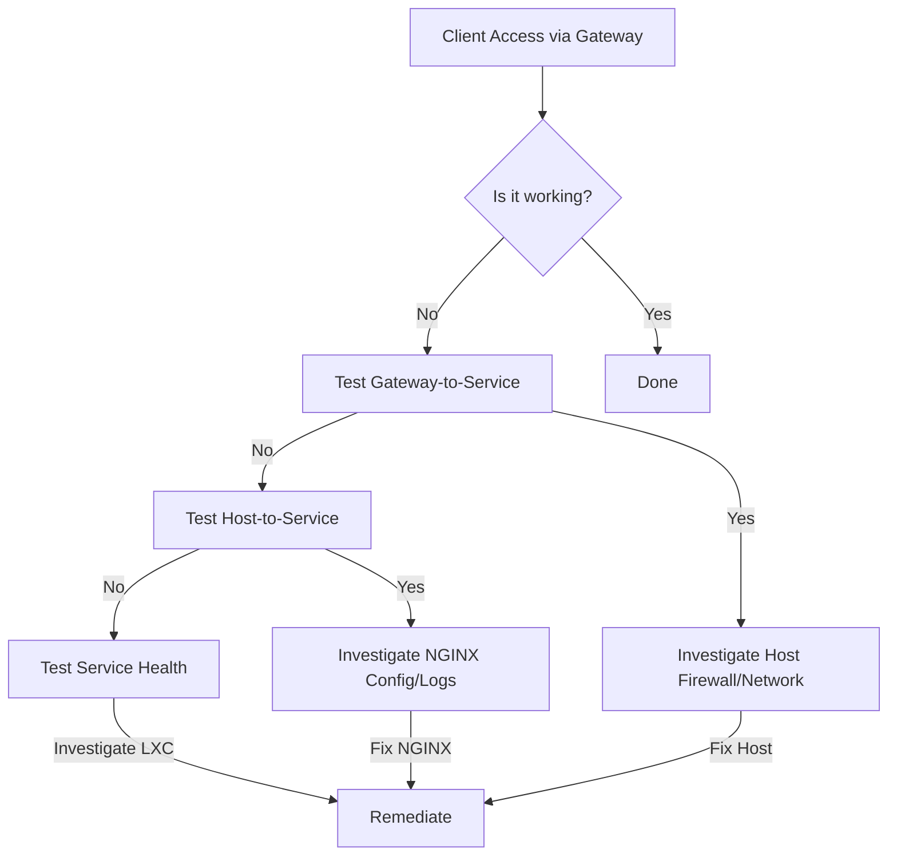

# Service Diagnostic and Remediation Plan

This document outlines a multi-layered strategy for diagnosing and remediating service outages within the Phoenix Hypervisor ecosystem.

## 1. Diagnostic Principles

The core principle is to test the system from the inside out. When a service is unavailable from the client's perspective, we will follow a step-by-step process to pinpoint the exact location of the failure.



## 2. Diagnostic Toolkit

### 2.1. Service Health Scripts (to be run inside the LXC)

A simple shell script can be created for each service to check its status.

**Example (`check_ollama.sh`):**
```bash
#!/bin/bash
# check_ollama.sh

# Check if the process is running
if ! pgrep -f ollama > /dev/null; then
    echo "Error: Ollama process is not running."
    exit 1
fi

# Check if the API is responsive
if ! curl --fail --silent http://localhost:11434/ > /dev/null; then
    echo "Error: Ollama API is not responding."
    exit 1
fi

echo "Success: Ollama is healthy."
exit 0
```

### 2.2. Host-Level Checks (to be run on the Proxmox host)

*   **Ping:** `ping <lxc_ip>`
*   **Port Check:** `nc -zv <lxc_ip> <service_port>`
*   **API Check:** `curl http://<lxc_ip>:<port>/health`

### 2.3. NGINX Health Checks (to be configured in NGINX)

This provides automated, proactive monitoring of backend services.

**Example NGINX Configuration:**
```nginx
upstream n8n_backend {
    server 10.0.0.154:5678;

    # Add a health check
    health_check;
}

server {
    # ...
    location / {
        proxy_pass http://n8n_backend;
        # ...
    }
}
```

## 3. Remediation Workflow

1.  **Client reports an issue:** User cannot access a service (e.g., n8n).
2.  **Check NGINX Health Status:** NGINX provides a status page for health checks. This is the first place to look.
3.  **If NGINX marks the service as down:**
    *   SSH into the **Proxmox Host**.
    *   Run **Host-Level Checks** against the service's LXC.
    *   **If Host-Level Checks fail:**
        *   SSH into the **LXC Container**.
        *   Run the **Service Health Script**.
        *   Investigate the service logs (`journalctl`, application logs) within the LXC.
    *   **If Host-Level Checks succeed:**
        *   The issue is likely between the NGINX container and the service container. Check firewall rules and NGINX logs.
4.  **If NGINX marks the service as up:**
    *   The issue is likely between the client and NGINX. Check client-side network configuration, DNS, and any firewalls between the client and the gateway.

This structured approach will allow us to quickly and efficiently diagnose and resolve any service availability issues.