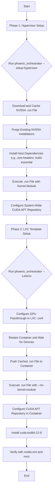

# NVIDIA and CUDA Installation Guide

## 1. Overview

This document provides the authoritative, step-by-step guide for installing and configuring NVIDIA drivers and the CUDA Toolkit across the Phoenix Hypervisor environment. It covers the initial setup on the Proxmox host and the subsequent user-space installation within LXC containers, ensuring a consistent and reliable GPU-accelerated environment.

## 2. Architectural Principles

-   **Single Source of Truth:** The NVIDIA driver version is dictated by the `.run` file URL specified in `phoenix_hypervisor_config.json`. This file is the single source of truth.
-   **Host-Kernel, Container-Userspace:** The Proxmox host is responsible for installing the complete driver stack, including the kernel module. LXC containers install only the user-space components, which must match the host's kernel driver version.
-   **Idempotency:** All scripts must be safely re-runnable. They should detect the current state and only perform actions if necessary.
-   **Efficiency through Templating:** A base container template is configured with the NVIDIA drivers and CUDA. Subsequent containers are cloned from this template to avoid redundant, time-consuming installations.

## 3. Installation Workflow

The installation process is divided into two main stages: hypervisor setup and LXC container setup.

### 3.1. Phase 1: Hypervisor Setup (`--setup-hypervisor`)

This phase prepares the Proxmox host.

**Script:** `usr/local/phoenix_hypervisor/bin/hypervisor_setup/hypervisor_feature_install_nvidia.sh`

**Steps:**

1.  **Download and Cache `.run` File:**
    -   The script reads the `runfile_url` from `phoenix_hypervisor_config.json`.
    -   It downloads the specified NVIDIA `.run` file to a shared cache directory: `/usr/local/phoenix_hypervisor/cache`. This ensures the same installer is used for the host and all containers.

2.  **Purge Existing Installations:**
    -   To ensure a clean slate, the script aggressively removes any existing NVIDIA packages, DKMS modules, and related configuration files.

3.  **Install Host Dependencies:**
    -   The script installs packages required to build the kernel module, including `pve-headers`, `build-essential`, and `dkms`.

4.  **Execute `.run` File:**
    -   The script executes the cached `.run` file. The flags used are for a full installation, including the kernel module.

5.  **Configure CUDA Repository:**
    -   The script configures the official NVIDIA CUDA `apt` repository on the host. This is used to install the `cuda-toolkit-12-8` package system-wide.

### 3.2. Phase 2: LXC Container Template Setup (`--LetsGo`)

This phase configures a specific LXC container, which will then be used as a template.

**Script:** `usr/local/phoenix_hypervisor/bin/lxc_setup/phoenix_hypervisor_feature_install_nvidia.sh`

**Steps:**

1.  **Configure GPU Passthrough:**
    -   The `configure_host_gpu_passthrough` function reads the `gpu_assignment` from `phoenix_lxc_configs.json`.
    -   It modifies the container's configuration file (e.g., `/etc/pve/lxc/901.conf`) to add `lxc.mount.entry` lines for the specified `/dev/nvidia*` devices and `lxc.cgroup2.devices.allow` rules.

2.  **Restart and Wait:**
    -   The container is restarted to apply the new hardware passthrough settings.
    -   Crucially, the script then calls the `wait_for_nvidia_device` function, which pauses execution until the `/dev/nvidia0` device node is present inside the container. This resolves the timing-related failures.

3.  **Push and Execute `.run` File:**
    -   The script pushes the cached `.run` file from `/usr/local/phoenix_hypervisor/cache` to a temporary location inside the container (e.g., `/tmp`).
    -   It then executes the `.run` file with flags appropriate for a user-space-only installation, most importantly `--no-kernel-module`.

4.  **Configure CUDA Repository:**
    -   The `ensure_nvidia_repo_is_configured` function is called to add the NVIDIA CUDA `apt` repository inside the container. **This is the function that is currently failing and needs remediation.**

5.  **Install CUDA Toolkit:**
    -   The script installs the `cuda-toolkit-12-8` package using `apt-get`.

6.  **Verification:**
    -   The script runs `nvidia-smi` and `/usr/local/cuda/bin/nvcc --version` inside the container to confirm that both the user-space driver and the CUDA toolkit are installed and functioning correctly.

## 4. Path to Remediation

The primary point of failure is the `ensure_nvidia_repo_is_configured` function in `phoenix_hypervisor_common_utils.sh`. The immediate next step is to correct this function based on the principles outlined in this guide. The function must be robust enough to handle cases where the repository configuration file does not yet exist, and it must correctly execute commands within the container's context.