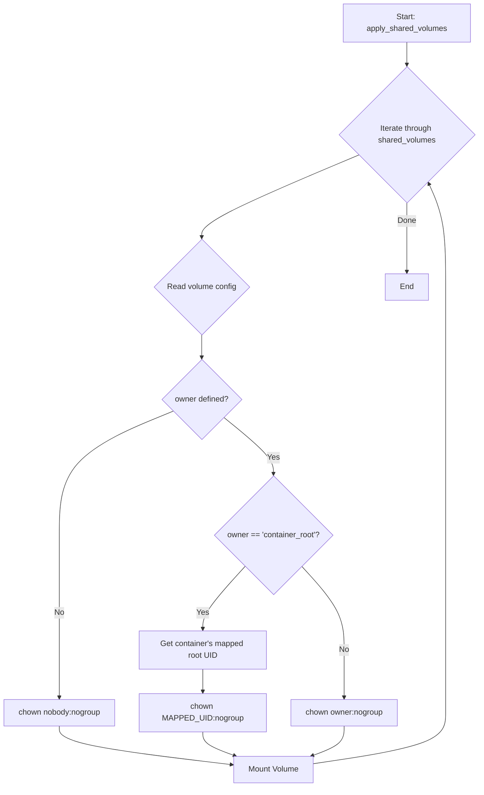

# Shared Volume Permissions Strategy

## 1. Executive Summary

This document outlines a new, system-wide strategy for managing permissions on shared volumes mounted into unprivileged LXC containers within the Phoenix Hypervisor environment. The current approach of statically setting ownership to `nobody:nogroup` is inadequate, causing write-permission failures for containerized processes running as root.

The proposed solution is to implement a **dynamic UID/GID mapping system**. This strategy will programmatically determine the correct host-level UID/GID for each container and apply it to the corresponding shared volume directories. This approach is secure, scalable, and aligns with the project's "Configuration as Code" principles.

## 2. Root Cause Analysis

The fundamental issue is a user and group ID mismatch between the Proxmox host and the unprivileged LXC containers. In an unprivileged container, the root user (UID 0) is mapped to a high-numbered, non-root UID on the host (e.g., 100000). The current `phoenix_orchestrator.sh` script hardcodes the ownership of all shared volumes to `nobody:nogroup` on the host, which does not grant write access to the container's mapped root user.

## 3. Evaluated Solutions

### 3.1. Using `pct set` with ACLs

- **Description**: This approach involves using Access Control Lists (ACLs) to grant permissions to specific users or groups on the host.
- **Pros**: Granular control over permissions.
- **Cons**: Complex to manage, not easily automated, and can become difficult to audit at scale.

### 3.2. Standardized User/Group Mapping

- **Description**: This involves creating a standardized mapping of users and groups between the host and all containers.
- **Pros**: Simple to understand.
- **Cons**: Inflexible, requires manual configuration for each new container, and does not scale well.

### 3.3. Dynamic UID/GID Mapping (Chosen Solution)

- **Description**: This strategy involves programmatically determining the mapped root UID for each container and setting the ownership of the shared volume to that UID.
- **Pros**:
    - **Fully Automated**: No manual intervention is required.
    - **Scalable**: Works for any number of containers.
    - **Secure**: Permissions are scoped to the specific container.
    - **Maintainable**: The logic is centralized in the `phoenix_orchestrator.sh` script.
- **Cons**: Requires a more sophisticated implementation in the orchestrator script.

## 4. New Architectural Strategy

The new strategy is to enhance the `phoenix_orchestrator.sh` script to dynamically manage shared volume permissions. This will be achieved by:

1.  **Introducing an `owner` property** to the `shared_volumes` definition in `phoenix_hypervisor_config.json`. This will allow for explicit ownership control.
2.  **Modifying the `apply_shared_volumes` function** in `phoenix_orchestrator.sh` to read this new property and apply ownership accordingly.
3.  **Implementing a helper function** to determine the mapped root UID for a given container.

### Workflow Diagram



## 5. Implementation Plan

### Step 1: Update `phoenix_hypervisor_config.json`

A new `owner` property will be added to the `shared_volumes` objects. This property will accept either a specific username or the special value `container_root`.

**Example:**

```json
"shared_volumes": {
    "vllm_models": {
        "host_path": "/mnt/pve/fastData/shared-bulk-data/vllm_models",
        "owner": "container_root",
        "mounts": {
            "950": "/vllm_models",
            "951": "/vllm_models"
        }
    }
}
```

### Step 2: Update `phoenix_hypervisor_config.schema.json`

The schema will be updated to include the new optional `owner` property in the `shared_volumes` definition.

### Step 3: Modify `phoenix_orchestrator.sh`

The `apply_shared_volumes` function will be rewritten to implement the new ownership logic.

**Key Changes:**

1.  **Read the `owner` property** from the volume's configuration.
2.  **If `owner` is `container_root`**:
    -   Iterate through each container (`ctid`) that mounts the volume.
    -   Call a new function, `get_container_mapped_root_uid`, to get the host-level UID.
    -   Execute `chown -R MAPPED_UID:nogroup` on the `host_path`.
3.  **If `owner` is a specific username**:
    -   Execute `chown -R <owner>:nogroup` on the `host_path`.
4.  **If `owner` is not defined**:
    -   Default to the existing behavior: `chown -R nobody:nogroup`.

A new helper function, `get_container_mapped_root_uid`, will be created. This function will parse the `/etc/pve/lxc/<CTID>.conf` file to extract the `lxc.idmap` value for the root user.

## 6. Conclusion

This new strategy provides a robust, scalable, and automated solution for managing shared volume permissions. By centralizing the logic in the `phoenix_orchestrator.sh` script and making it configuration-driven, we can ensure that the system remains maintainable and secure as it evolves.