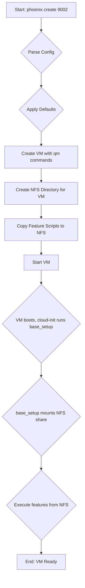

# VM Creation Design for phoenix CLI

## 1. Overview

This document outlines the design for enhancing the `phoenix` CLI to support the creation and management of virtual machines (VMs). This design is tailored for general-purpose server VMs, such as a web server, based on user feedback.

## 2. `phoenix` CLI Enhancements

### 2.1. New Commands

The CLI will be updated to accept the following commands:

-   `phoenix create <ID>`: Creates a new VM based on a definition in the configuration file.
-   `phoenix start <ID>`: Starts an existing VM.
-   `phoenix stop <ID>`: Stops an existing VM.
-   `phoenix delete <ID>`: Deletes an existing VM.

## 3. `phoenix_vm_configs.json` Modifications

A new `vms` section will be added to the `phoenix_vm_configs.json` file to define VM configurations. A `vm_defaults` section will also be added to provide default values for VM creation.

### 3.1. New `vm_defaults` Section

This section will provide default settings for VMs, which can be overridden by individual VM configurations.

```json
"vm_defaults": {
    "template": "ubuntu-24.04-standard",
    "cores": 4,
    "memory_mb": 8192,
    "disk_size_gb": 100,
    "storage_pool": "local-lvm",
    "network_bridge": "vmbr0"
}
```

### 3.2. New `vms` Section

This section will contain an array of VM objects, each defining a specific VM to be created.

```json
"vms": [
    {
        "name": "webserver-vm",
        "vmid": 9002,
        "cores": 4,
        "memory_mb": 8192,
        "disk_size_gb": 100,
        "features": [
            "base_setup",
            "install_webserver"
        ],
        "volumes": [
            {
                "type": "nfs",
                "share": "local-nfs",
                "path": "/vm-features/9002",
                "mount_point": "/mnt/nfs/features"
            }
        ]
    }
]
```

## 4. VM Creation Workflow

The `phoenix create <ID>` command will trigger the following sequence of operations, which now leverages a persistent NFS share for feature script delivery.

1.  **Parse Configuration**: Read the `phoenix_vm_configs.json` file and locate the specified VM definition.
2.  **Apply Defaults**: Merge the `vm_defaults` with the specific VM configuration.
3.  **Create VM**: Execute a series of `qm` commands to create and configure the VM.
4.  **Create NFS Directory**: Create a dedicated directory for the VM on the NFS share.
5.  **Copy Feature Scripts**: Copy the scripts for the specified features to the NFS directory.
6.  **Start VM**: Start the VM. On first boot, `cloud-init` will run the `base_setup` feature, which installs `nfs-common` and mounts the NFS share.
7.  **Execute Features**: The remaining feature scripts are executed from the mounted NFS share.

### 4.1. Mermaid Diagram of the Workflow



## 5. Schema Updates

The `phoenix_vm_configs.schema.json` file will be updated to include definitions for the new `vm_defaults` and `vms` sections to ensure proper validation.
