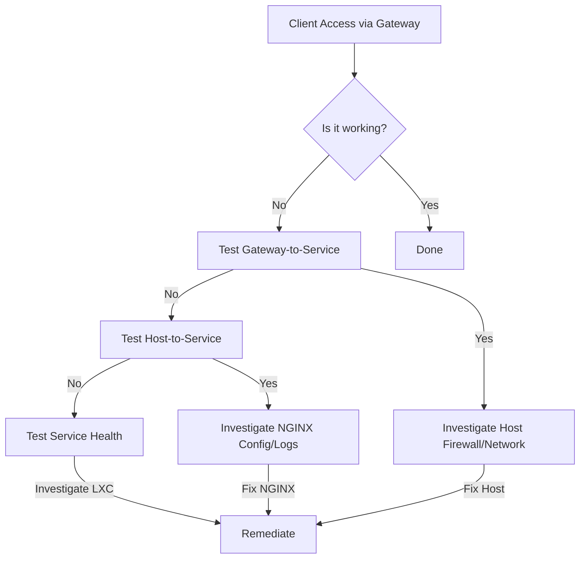

# Phoenix Hypervisor Technical Strategy

## 1. Introduction

This document outlines the technical strategy for the Phoenix Hypervisor ecosystem, covering diagnostic procedures, NGINX gateway configuration, firewall remediation, orchestration scripts, and vLLM deployment strategies.

## 2. Service Diagnostic and Remediation Plan

### 2.1. Diagnostic Principles

The core principle is to test the system from the inside out. When a service is unavailable from the client's perspective, we will follow a step-by-step process to pinpoint the exact location of the failure.



### 2.2. Diagnostic Toolkit

#### 2.2.1. Service Health Scripts (to be run inside the LXC)

A simple shell script can be created for each service to check its status.

**Example (`check_ollama.sh`):**
```bash
#!/bin/bash
# check_ollama.sh

# Check if the process is running
if ! pgrep -f ollama > /dev/null; then
    echo "Error: Ollama process is not running."
    exit 1
fi

# Check if the API is responsive
if ! curl --fail --silent http://localhost:11434/ > /dev/null; then
    echo "Error: Ollama API is not responding."
    exit 1
fi

echo "Success: Ollama is healthy."
exit 0
```

#### 2.2.2. Host-Level Checks (to be run on the Proxmox host)

*   **Ping:** `ping <lxc_ip>`
*   **Port Check:** `nc -zv <lxc_ip> <service_port>`
*   **API Check:** `curl http://<lxc_ip>:<port>/health`

#### 2.2.3. NGINX Health Checks (to be configured in NGINX)

This provides automated, proactive monitoring of backend services.

**Example NGINX Configuration:**
```nginx
upstream n8n_backend {
    server 10.0.0.154:5678;

    # Add a health check
    health_check;
}

server {
    # ...
    location / {
        proxy_pass http://n8n_backend;
        # ...
    }
}
```

### 2.3. Remediation Workflow

1.  **Client reports an issue:** User cannot access a service (e.g., n8n).
2.  **Check NGINX Health Status:** NGINX provides a status page for health checks. This is the first place to look.
3.  **If NGINX marks the service as down:**
    *   SSH into the **Proxmox Host**.
    *   Run **Host-Level Checks** against the service's LXC.
    *   **If Host-Level Checks fail:**
        *   SSH into the **LXC Container**.
        *   Run the **Service Health Script**.
        *   Investigate the service logs (`journalctl`, application logs) within the LXC.
    *   **If Host-Level Checks succeed:**
        *   The issue is likely between the NGINX container and the service container. Check firewall rules and NGINX logs.
4.  **If NGINX marks the service as up:**
    *   The issue is likely between the client and NGINX. Check client-side network configuration, DNS, and any firewalls between the client and the gateway.

## 3. NGINX Gateway Strategy

### 3.1. NGINX Gateway Analysis and Testing Plan

This section outlines the expected functionality of the services exposed through the nginx gateway at `10.0.0.153`.

#### 3.1.1. NGINX Gateway IP Address

*   **IP Address:** `10.0.0.153`

#### 3.1.2. Service Definitions

*   **qdrant:**
    *   **Local Endpoint:** `http://10.0.0.153/qdrant/`
    *   **Key Functionalities:** Vector database for AI applications.
    *   **Example `curl` command:** `curl -X GET http://10.0.0.153/qdrant/healthz`
*   **vllm chat (granite):**
    *   **Local Endpoint:** `http://10.0.0.153/v1/chat/completions`
    *   **Key Functionalities:** Generative AI tasks.
    *   **Example `curl` command:** `curl -X POST http://10.0.0.153/v1/chat/completions -H "Content-Type: application/json" -d '{"model": "granite-3.3-8b-instruct", "messages": [{"role": "user", "content": "Hello! What is your name?"}]}'`
*   **vllm embedding:**
    *   **Local Endpoint:** `http://10.0.0.153/v1/embeddings`
    *   **Key Functionalities:** Semantic search and clustering.
    *   **Example `curl` command:** `curl -X POST http://10.0.0.153/v1/embeddings -H "Content-Type: application/json" -d '{"model": "ibm-granite/granite-embedding-english-r2", "input": "Hello, world!"}'`
*   **n8n:**
    *   **Local Endpoint:** `http://10.0.0.153/n8n/`
    *   **Key Functionalities:** Workflow automation tool.
    *   **Example `curl` command:** `curl -L http://10.0.0.153/n8n/`
*   **Portainer:**
    *   **Local Endpoint:** Not accessible via the gateway IP address.
    *   **Key Functionalities:** Accessed via the hostname `portainer.phoenix.local`.

### 3.2. NGINX Gateway Enhancement Plan

This section summarizes the findings from our detailed service-by-service analysis and presents a prioritized plan for enhancing the NGINX gateway.

#### 3.2.1. Key Themes and Recommendations

*   **Security (High Priority):**
    *   Implement SSL/TLS on all HTTP endpoints.
    *   Enable upstream SSL verification.
    *   Add HSTS and other standard security headers.
*   **Reliability (Medium Priority):**
    *   Implement active health checks for all upstream services.
    *   Consider a high-availability setup for critical services.
*   **Maintainability (Medium Priority):**
    *   Refactor the monolithic `vllm_gateway` configuration into smaller, service-specific files.
    *   Consolidate the `ollama_proxy` into the main gateway.
    *   Improve documentation.
*   **Performance (Low Priority):**
    *   Implement caching for static assets.
    *   Consider adding a caching layer for idempotent API endpoints.

### 3.3. NGINX Request Capabilities

This section provides a detailed breakdown of the types of requests that the NGINX gateway is configured to handle for each backend service.

*   **n8n (`n8n_proxy`):** Standard HTTP/HTTPS and WebSocket.
*   **Portainer (`portainer_proxy`):** Standard HTTP/HTTPS and WebSocket.
*   **Ollama (`ollama_proxy` and `vllm_gateway`):** API requests.
*   **vLLM Services (`vllm_gateway`):** OpenAI-Compatible API requests with dynamic routing.
*   **Qdrant (`vllm_gateway`):** API requests.
*   **Open WebUI (`vllm_gateway`):** Standard HTTP/HTTPS and WebSocket.
*   **Llama.cpp (`vllm_gateway`):** API requests.

### 3.4. NGINX Service-by-Service Analysis

This section contains a detailed analysis of each service proxied by the NGINX gateway, including current configuration, areas for improvement, and actionable recommendations.

## 4. Firewall Remediation Plan

This section outlines the root cause of the recent firewall configuration failures and presents a robust, system-wide solution that aligns with the Phoenix Hypervisor architecture.

### 4.1. Root Cause Analysis

The previous attempts to fix the firewall script failed due to a fundamental misunderstanding of how Proxmox enables container-level firewalls. The firewall for an LXC container must be enabled on a per-network-interface basis (e.g., `net0`) using the command `pct set <vmid> --net0 firewall=1`.

### 4.2. Proposed Solution

The solution is to modify the `phoenix_hypervisor_firewall.sh` script to use the correct, idempotent Proxmox commands for enabling and disabling the firewall, while continuing to manage the specific firewall rules from the JSON configuration.

## 5. Orchestrator Script Refinement Plan

This section outlines the necessary refinements to the `phoenix_orchestrator.sh` script to resolve deployment failures related to shared volume permissions.

### 5.1. Analysis of the Root Cause

The deployment failures stem from two primary logical flaws in the script:

1.  **Incorrect Timing of `idmap` Generation:** The script attempts to read the `idmap` from a container's configuration file *before* the container has been set as unprivileged.
2.  **Over-reaching Scope in Volume Application:** The `apply_shared_volumes` function iterates through all containers associated with a shared volume, even those not part of the current orchestration run.

### 5.2. Proposed Logical Changes

To resolve these issues, the following changes will be made to the script's logic:

1.  **Introduce `ensure_container_defined` function:** A new function, `ensure_container_defined`, will be created to handle the initial creation or cloning of a container.
2.  **Refine `get_container_mapped_root_uid` function:** This function will be made more robust with explicit checks for the existence of the container's configuration file and the `idmap` line within it.
3.  **Refine `apply_shared_volumes` function:** The logic for setting `container_root` ownership will be modified to only act on the container specified in the current orchestration run (`$CTID`).

## 6. Shared Volume Permissions Strategy

This section outlines a new, system-wide strategy for managing permissions on shared volumes mounted into unprivileged LXC containers within the Phoenix Hypervisor environment.

### 6.1. New Architectural Strategy

The new strategy is to enhance the `phoenix_orchestrator.sh` script to dynamically manage shared volume permissions. This will be achieved by:

1.  **Introducing an `owner` property** to the `shared_volumes` definition in `phoenix_hypervisor_config.json`.
2.  **Modifying the `apply_shared_volumes` function** in `phoenix_orchestrator.sh` to read this new property and apply ownership accordingly.
3.  **Implementing a helper function** to determine the mapped root UID for a given container.

## 7. vLLM Orchestration and Deployment Strategy

### 7.1. vLLM Orchestration Refinement Plan

This section outlines the plan to correct a logic error in the vLLM feature installation script and to streamline the container configuration by removing redundant feature definitions.

### 7.2. vLLM Remediation and Automation Plan

This section outlines the plan to verify the exact conditions that led to the successful launch of the vLLM service in container 950 and to integrate these findings into the `phoenix_orchestrator.sh` deployment script.

### 7.3. vLLM Template-Based Deployment Strategy

This section outlines a new strategy for deploying vLLM containers. The current model, where each container builds its own environment from scratch, is slow and prone to inconsistencies. This plan details a transition to a template-based model, where a "golden" template container (CTID 920) is fully provisioned with a known-good vLLM environment, and new containers (e.g., 950, 951) are created as lightweight clones of this template.