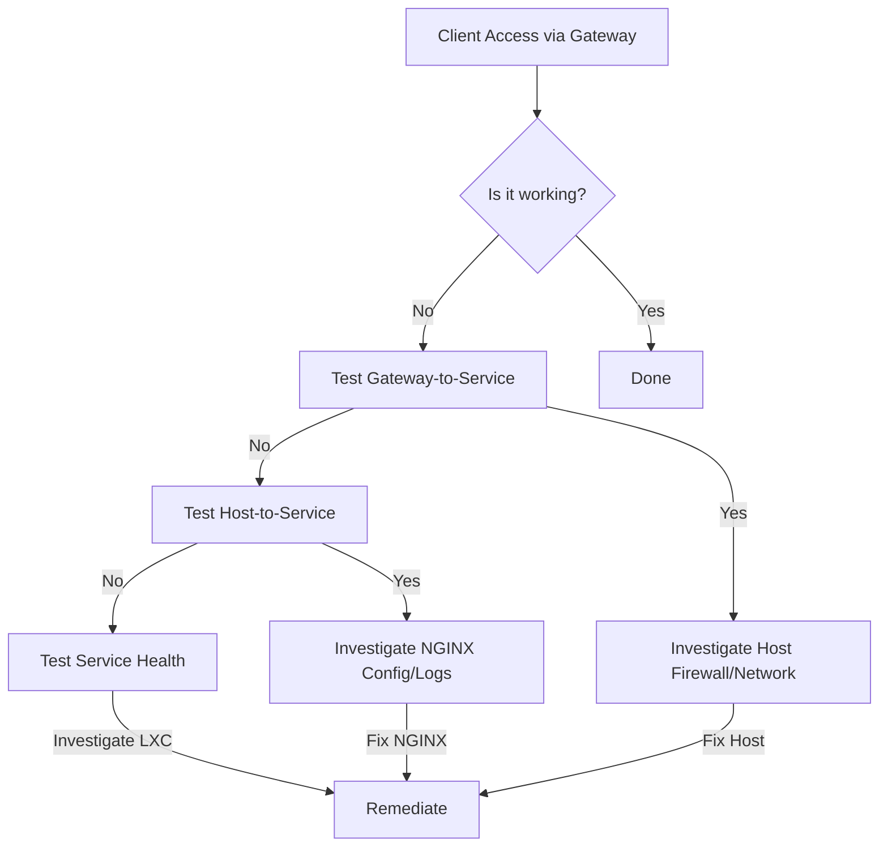

# Phoenix Hypervisor Technical Strategy

## 1. Introduction

This document outlines the technical strategy for the Phoenix Hypervisor ecosystem, covering diagnostic procedures, NGINX gateway configuration, firewall management, orchestration scripts, and vLLM deployment strategies. The strategy is grounded in the principles of declarative configuration, idempotency, and modularity, as implemented in the `phoenix` CLI and its associated configuration files.

## 2. Service Diagnostic and Remediation Plan

### 2.1. Diagnostic Principles

The core principle is to test the system from the inside out. When a service is unavailable from the client's perspective, we will follow a step-by-step process to pinpoint the exact location of the failure. This process is supported by a suite of health check scripts and the centralized logging facilitated by the CLI.



### 2.2. Diagnostic Toolkit

#### 2.2.1. Service Health Scripts (run inside the LXC)

The `health_checks` directory contains a suite of scripts for verifying the health of individual services. These scripts are executed by the `phoenix` CLI and check for running processes, API responsiveness, and other service-specific indicators.

**Example (`check_ollama.sh`):**
```bash
#!/bin/bash
# check_ollama.sh

# Check if the process is running
if ! pgrep -f ollama > /dev/null; then
    echo "Error: Ollama process is not running."
    exit 1
fi

# Check if the API is responsive
if ! curl --fail --silent http://localhost:11434/ > /dev/null; then
    echo "Error: Ollama API is not responding."
    exit 1
fi

echo "Success: Ollama is healthy."
exit 0
```

#### 2.2.2. Host-Level Checks (run on the Proxmox host)

*   **Ping:** `ping <lxc_ip>`
*   **Port Check:** `nc -zv <lxc_ip> <service_port>`
*   **API Check:** `curl http://<lxc_ip>:<port>/health`

#### 2.2.3. NGINX Health Checks (configured in NGINX)

The NGINX configuration includes active health checks for upstream services, providing proactive monitoring of backend availability.

**Example NGINX Configuration:**
```nginx
upstream n8n_backend {
    server 10.0.0.154:5678;

    # Add a health check
    health_check;
}

server {
    # ...
    location / {
        proxy_pass http://n8n_backend;
        # ...
    }
}
```

### 2.3. Remediation Workflow

1.  **Client reports an issue:** User cannot access a service (e.g., n8n).
2.  **Check NGINX Health Status:** The NGINX health status page is the first point of investigation.
3.  **If NGINX marks the service as down:**
    *   SSH into the **Proxmox Host**.
    *   Run **Host-Level Checks** against the service's LXC.
    *   **If Host-Level Checks fail:**
        *   SSH into the **LXC Container**.
        *   Run the appropriate **Service Health Script**.
        *   Investigate service logs (`journalctl`, application logs) within the LXC.
    *   **If Host-Level Checks succeed:**
        *   The issue is likely between the NGINX container and the service container. Check firewall rules and NGINX logs.
4.  **If NGINX marks the service as up:**
    *   The issue is likely between the client and NGINX. Check client-side network configuration, DNS, and any firewalls between the client and the gateway.

## 3. NGINX Gateway Strategy

### 3.1. NGINX Gateway Analysis and Testing Plan

The NGINX gateway at `10.0.0.153` serves as the central entry point for all services. The configuration is managed declaratively through the `phoenix_hypervisor_config.json` and the `sites-available` directory.

#### 3.1.1. Service Definitions

*   **qdrant:**
    *   **Local Endpoint:** `http://10.0.0.153/qdrant/`
    *   **Key Functionalities:** Vector database for AI applications.
    *   **Example `curl` command:** `curl -X GET http://10.0.0.153/qdrant/healthz`
*   **vllm chat (granite):**
    *   **Local Endpoint:** `http://10.0.0.153/v1/chat/completions`
    *   **Key Functionalities:** Generative AI tasks.
    *   **Example `curl` command:** `curl -X POST http://10.0.0.153/v1/chat/completions -H "Content-Type: application/json" -d '{"model": "granite-3.3-8b-instruct", "messages": [{"role": "user", "content": "Hello! What is your name?"}]}'`
*   **vllm embedding:**
    *   **Local Endpoint:** `http://10.0.0.153/v1/embeddings`
    *   **Key Functionalities:** Semantic search and clustering.
    *   **Example `curl` command:** `curl -X POST http://10.0.0.153/v1/embeddings -H "Content-Type: application/json" -d '{"model": "ibm-granite/granite-embedding-english-r2", "input": "Hello, world!"}'`
*   **n8n:**
    *   **Local Endpoint:** `http://10.0.0.153/n8n/`
    *   **Key Functionalities:** Workflow automation tool.
    *   **Example `curl` command:** `curl -L http://10.0.0.153/n8n/`
*   **Portainer:**
    *   **Local Endpoint:** Not accessible via the gateway IP address.
    *   **Key Functionalities:** Accessed via the hostname `portainer.phoenix.local`.

### 3.2. NGINX Gateway Enhancement Plan

*   **Security (High Priority):**
    *   Implement SSL/TLS on all HTTP endpoints.
    *   Enable upstream SSL verification.
    *   Add HSTS and other standard security headers.
*   **Reliability (Medium Priority):**
    *   Implement active health checks for all upstream services.
    *   Consider a high-availability setup for critical services.
*   **Maintainability (Medium Priority):**
    *   Refactor the monolithic `vllm_gateway` configuration into smaller, service-specific files.
    *   Consolidate the `ollama_proxy` into the main gateway.
    *   Improve documentation.
*   **Performance (Low Priority):**
    *   Implement caching for static assets.
    *   Consider adding a caching layer for idempotent API endpoints.

## 4. Firewall Management Strategy

Firewall management is handled declaratively through the `phoenix_hypervisor_config.json` and `phoenix_lxc_configs.json` files. The `phoenix` CLI applies the firewall rules during container provisioning, ensuring a consistent and reproducible security posture.

### 4.1. Declarative Firewall Configuration

The firewall for an LXC container is enabled on a per-network-interface basis (e.g., `net0`) using the command `pct set <vmid> --net0 firewall=1`. The specific firewall rules are defined in the `firewall.rules` section of the container's configuration in `phoenix_lxc_configs.json`.

## 5. Orchestration Strategy

The `phoenix` CLI is the cornerstone of the Phoenix Hypervisor's automation strategy. It implements a dispatcher-manager architecture to manage the entire lifecycle of the hypervisor, LXC containers, and VMs.

### 5.1. Dispatcher-Manager Architecture

The `phoenix` script acts as a dispatcher, parsing verb-first commands and routing them to the appropriate manager script (`hypervisor-manager.sh`, `lxc-manager.sh`, `vm-manager.sh`). Each manager implements a state machine for its domain, ensuring idempotent and robust execution.

### 5.2. Modular Feature Installation

Features such as Docker, NVIDIA drivers, and vLLM are installed through a modular system of scripts located in the `lxc_setup` and `vm_features` directories. This allows for easy extension and modification of container and VM capabilities.

## 6. Shared Volume Permissions Strategy

The `phoenix` CLI dynamically manages permissions on shared volumes mounted into unprivileged LXC containers. This is achieved through the `owner` property in the `shared_volumes` definition in `phoenix_hypervisor_config.json`, which ensures that the container's mapped root UID is correctly applied to the shared volume.

## 7. vLLM Orchestration and Deployment Strategy

The deployment of vLLM containers is managed through a template-based strategy. A "golden" template container (CTID 920) is fully provisioned with a known-good vLLM environment, and new containers are created as lightweight clones of this template. This approach ensures consistency and significantly reduces deployment time. The specific vLLM model and its configuration are defined in the `phoenix_lxc_configs.json` file for each container.