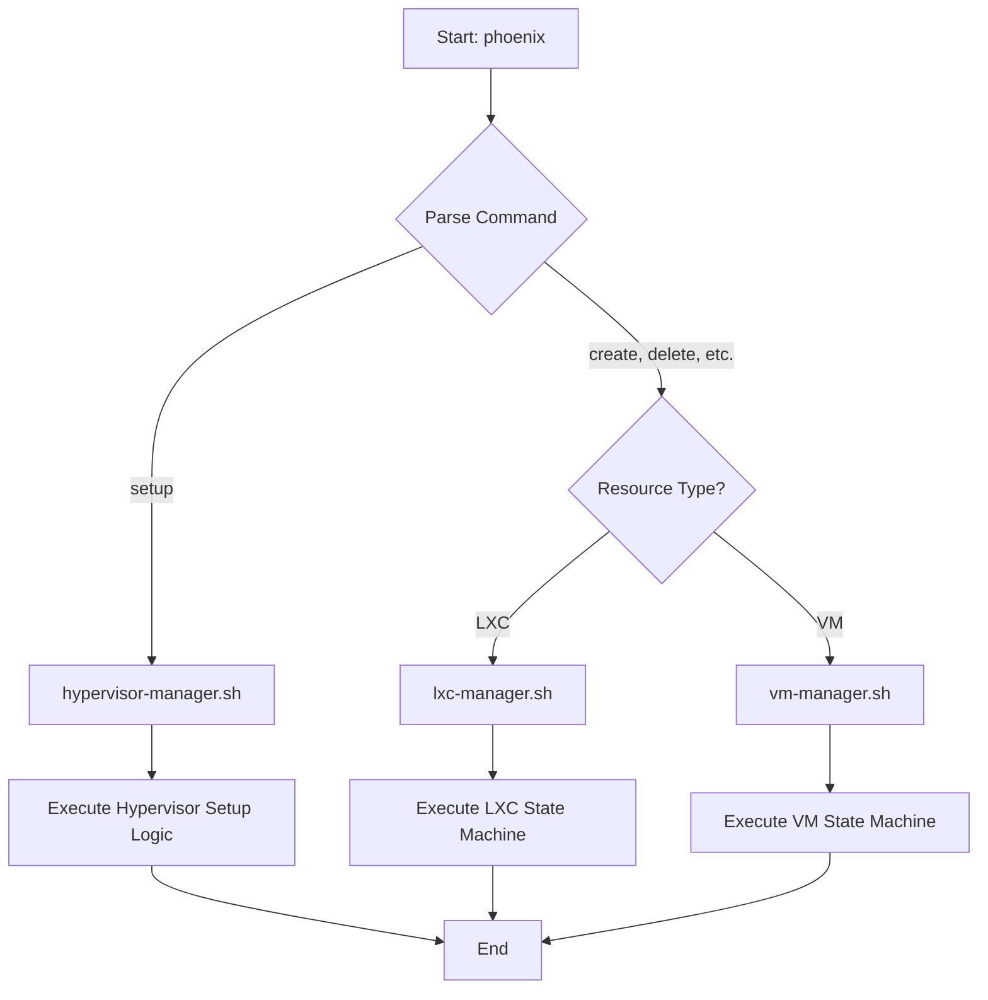

# System Diagrams

This document contains Mermaid diagrams that illustrate the high-level system architecture, the detailed workflow of the `phoenix` CLI, and the container templating strategy.

## High-Level System Architecture

This diagram provides a comprehensive overview of the Phoenix Hypervisor ecosystem, including user interaction, orchestration, configuration management, and the virtualized resources.

```mermaid
graph TD
    subgraph "User"
        A[Developer/Admin]
    end

    subgraph "Phoenix Hypervisor (Proxmox Host)"
        B[phoenix CLI]
        C[Configuration Files]
        D[LXC Containers]
        E[Virtual Machines]
        F[Storage Pools]
        G[Networking]
    end

    subgraph "Configuration Files"
        C1[/etc/phoenix_hypervisor_config.json]
        C2[/etc/phoenix_lxc_configs.json]
        C3[/etc/phoenix_vm_configs.json]
    end

    A -- Manages --> B
    B -- Reads --> C1
    B -- Reads --> C2
    B -- Reads --> C3
    B -- Provisions/Manages --> D
    B -- Provisions/Manages --> E
    B -- Manages --> F
    B -- Configures --> G
```

## Phoenix CLI Workflow

This diagram details the dispatcher-manager logic of the `phoenix` CLI, showing the distinct execution paths for hypervisor setup, LXC container orchestration, and VM provisioning.



## LXC Container Templating Strategy

This diagram illustrates the hierarchical templating and cloning strategy for LXC containers, which ensures a consistent and modular approach to building virtualized environments.

```mermaid
graph TD
    subgraph "Base Templates"
        T1[ubuntu-24.04-standard]
    end

    subgraph "Feature-Specific Templates"
        T2[900: Template-Base]
        T3[901: Template-GPU]
        T4[902: Template-Docker]
        T5[903: Template-Docker-GPU]
    end

    subgraph "Provisioned Containers"
        C1[950: vllm-qwen2.5-7b-awq]
        C2[953: Nginx-VscodeRag]
        C3[955: ollama-oWUI]
        C4[910: Portainer]
    end

    T1 -- Creates --> T2
    T2 -- Cloned to create --> T3
    T2 -- Cloned to create --> T4
    T3 -- Cloned to create --> T5

    T5 -- Cloned to create --> C1
    T2 -- Cloned to create --> C2
    T3 -- Cloned to create --> C3
    T4 -- Cloned to create --> C4