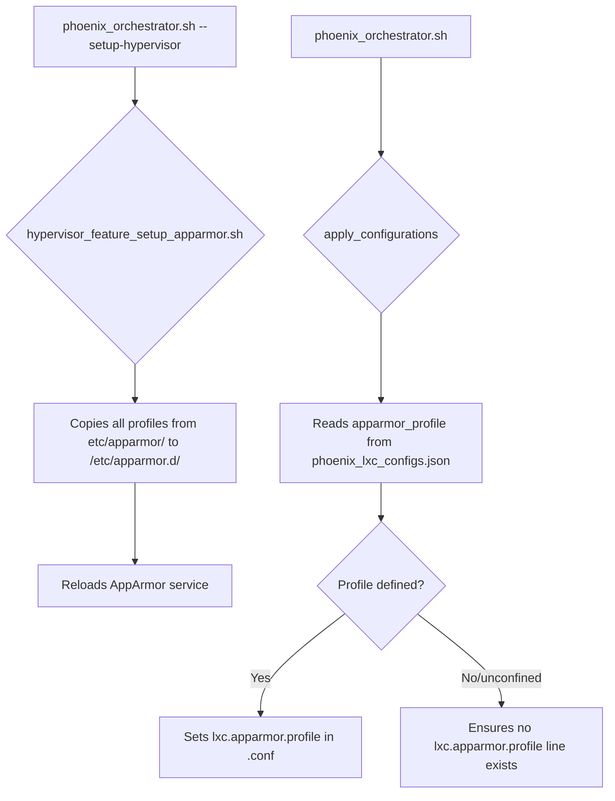

# AppArmor Remediation and Architectural Redesign

This document outlines a new, more robust, and flexible architecture for managing AppArmor profiles within the Phoenix project. This redesign addresses the limitations of the current implementation and provides a more scalable and maintainable solution for securing LXC containers with NVIDIA GPU passthrough.

## 1. Project Structure

The following changes will be made to the project structure to accommodate the new AppArmor profiles:

```
/usr/local/phoenix_hypervisor/
|-- etc/
|   |-- apparmor/
|   |   |-- lxc-nvidia-gpu-base       # New base profile
|   |   |-- lxc-nvidia-gpu-docker     # New Docker-specific profile
|   |   `-- lxc-phoenix-nvidia-gpu    # (DEPRECATED) - To be removed
|   |-- phoenix_lxc_configs.json
|   `-- phoenix_lxc_configs.schema.json
|-- bin/
|   |-- hypervisor_setup/
|   |   `-- hypervisor_feature_setup_apparmor.sh
|   `-- phoenix_orchestrator.sh
```

### Key Changes:

*   **New Profile Files:** Two new AppArmor profile files, `lxc-nvidia-gpu-base` and `lxc-nvidia-gpu-docker`, will be created in the `etc/apparmor/` directory.
*   **Deprecated Profile:** The existing `lxc-phoenix-nvidia-gpu` profile will be deprecated and eventually removed.

## 2. Configuration-Driven Profile Assignment

To enable explicit and declarative profile assignment, the `phoenix_lxc_configs.json` schema will be modified to include an `apparmor_profile` key.

### `phoenix_lxc_configs.schema.json` Changes:

A new property will be added to the container configuration schema:

```json
"apparmor_profile": {
    "type": "string",
    "description": "The AppArmor profile to apply to the container. Use 'unconfined' for no profile.",
    "default": "lxc-nvidia-gpu-base"
}
```

### `phoenix_lxc_configs.json` Example:

Each container definition will now include the `apparmor_profile` key:

```json
"950": {
    "name": "vllm-qwen2.5-7b-awq",
    "apparmor_profile": "lxc-nvidia-gpu-base",
    ...
},
"952": {
    "name": "qdrant-VSCodeRag",
    "apparmor_profile": "lxc-nvidia-gpu-docker",
    ...
},
"955": {
    "name": "ollama-oWUI",
    "apparmor_profile": "unconfined",
    ...
}
```

## 3. Enhanced Setup Script

The `hypervisor_feature_setup_apparmor.sh` script will be modified to intelligently copy all available AppArmor profiles from the project's `etc/apparmor/` directory to `/etc/apparmor.d/`.

### New Logic for `hypervisor_feature_setup_apparmor.sh`:

1.  **Iterate Through Profiles:** The script will loop through all files in the `etc/apparmor/` directory.
2.  **Idempotent Copy:** For each profile, it will check if a profile with the same name and content already exists in `/etc/apparmor.d/`. The copy operation will only be performed if the profile is new or has been updated.
3.  **Reload AppArmor:** After all profiles have been copied, the script will reload the AppArmor service to apply the changes.

### Pseudocode:

```bash
source_dir="${PHOENIX_DIR}/etc/apparmor/"
dest_dir="/etc/apparmor.d/"
profiles_changed=false

for profile in "${source_dir}"/*; do
    profile_name=$(basename "$profile")
    dest_path="${dest_dir}/${profile_name}"

    if [ ! -f "$dest_path" ] || ! diff -q "$profile" "$dest_path" >/dev/null; then
        log_info "Copying AppArmor profile ${profile_name} to ${dest_path}..."
        cp "$profile" "$dest_path"
        profiles_changed=true
    fi
done

if [ "$profiles_changed" = true ]; then
    log_info "Reloading AppArmor profiles..."
    apparmor_parser -r -W "$dest_dir"
    systemctl reload apparmor.service
    log_success "AppArmor profiles reloaded successfully."
else
    log_info "AppArmor profiles are already up-to-date. No changes needed."
fi
```

## 4. Improved Orchestration Logic

The `phoenix_orchestrator.sh` script will be redesigned to read the `apparmor_profile` from the JSON configuration and apply it to the corresponding LXC container's `.conf` file.

### New Logic for `phoenix_orchestrator.sh` (within `apply_configurations` function):

1.  **Read `apparmor_profile`:** The script will retrieve the value of the `apparmor_profile` key from the container's JSON configuration.
2.  **Handle `unconfined`:** If the profile is set to `"unconfined"`, the script will ensure that no `lxc.apparmor.profile` line is present in the container's `.conf` file.
3.  **Apply Profile:** If a specific profile is defined, the script will idempotently set the `lxc.apparmor.profile` in the container's `.conf` file to the specified value.

### Pseudocode:

```bash
apparmor_profile=$(jq_get_value "$CTID" ".apparmor_profile" || echo "lxc-nvidia-gpu-base")
conf_file="/etc/pve/lxc/${CTID}.conf"

if [ "$apparmor_profile" == "unconfined" ]; then
    log_info "Setting AppArmor profile to unconfined for container $CTID..."
    sed -i '/^lxc.apparmor.profile:/d' "$conf_file"
else
    log_info "Applying AppArmor profile '${apparmor_profile}' for container $CTID..."
    profile_line="lxc.apparmor.profile: ${apparmor_profile}"
    
    if grep -q "^lxc.apparmor.profile:" "$conf_file"; then
        sed -i "s|^lxc.apparmor.profile:.*|$profile_line|" "$conf_file"
    else
        echo "$profile_line" >> "$conf_file"
    fi
fi
```

## 5. New AppArmor Profiles

Two new AppArmor profiles will be created to provide granular control over container permissions.

### `lxc-nvidia-gpu-base`

This profile is a general-purpose profile for standard, unprivileged LXC containers requiring GPU access.

```
# Do not load this file. Rather, load /etc/apparmor.d/lxc-containers, which
# sources this file.

profile lxc-nvidia-gpu-base flags=(attach_disconnected,mediate_deleted) {
  #include <tunables/global>
  #include <abstractions/lxc/container-base>
  #include <abstractions/lxc/start-container>

  # Allow necessary mounts for the container filesystem
  mount fstype=rpc_pipefs,
  mount fstype=cgroup,
  mount fstype=cgroup2,
  mount fstype=debugfs,
  mount fstype=proc,
  mount,
  mount options=(rw,nosuid,nodev,noexec,relatime) -> /sys/kernel/debug/,
  
  # Allow NVIDIA GPU device files
  /dev/nvidia* rwm,
  /dev/nvidia-uvm rwm,
  /dev/nvidia-uvm-tools rwm,
  /dev/nvidia-caps/* rwm,

  # Deny writes to /proc/sys/fs/binfmt_misc/register
  deny mount fstype=binfmt_misc,
}
```

### `lxc-nvidia-gpu-docker`

This profile is tailored for containers running Docker, which may require additional permissions.

```
# Do not load this file. Rather, load /etc/apparmor.d/lxc-containers, which
# sources this file.

profile lxc-nvidia-gpu-docker flags=(attach_disconnected,mediate_deleted) {
  #include <tunables/global>
  #include <abstractions/lxc/container-base>
  #include <abstractions/lxc/start-container>

  # Allow necessary mounts for the container filesystem
  mount fstype=rpc_pipefs,
  mount fstype=cgroup,
  mount fstype=cgroup2,
  mount fstype=debugfs,
  mount fstype=proc,
  mount,
  mount options=(rw,nosuid,nodev,noexec,relatime) -> /sys/kernel/debug/,
  
  # Allow NVIDIA GPU device files
  /dev/nvidia* rwm,
  /dev/nvidia-uvm rwm,
  /dev/nvidia-uvm-tools rwm,
  /dev/nvidia-caps/* rwm,

  # Additional permissions for Docker
  mount fstype=overlay,
  mount fstype=aufs,
  mount fstype=tmpfs,
  mount options=(rw,nosuid,nodev,noexec,relatime) -> /var/lib/docker/,

  # Deny writes to /proc/sys/fs/binfmt_misc/register
  deny mount fstype=binfmt_misc,
}
```

## 6. Summary and Workflow

This new architecture provides a more robust, flexible, and transparent way to manage AppArmor profiles for LXC containers in the Phoenix project. By moving to a configuration-driven approach, we eliminate the ambiguity of the previous implementation and provide a clear and explicit way to define the security posture of each container.

### Workflow Diagram:


