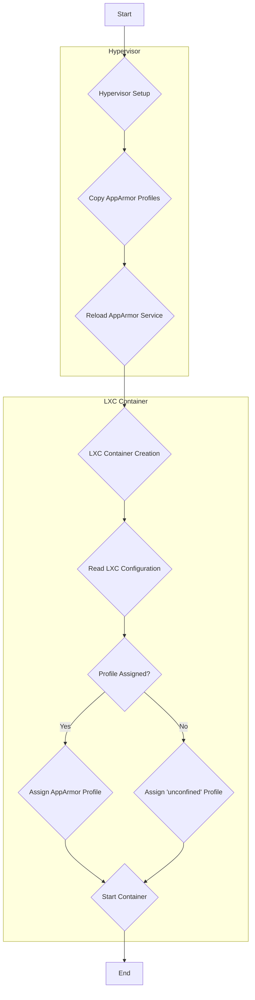

# AppArmor Workflow Analysis

## 1. Overview

This document provides a comprehensive analysis of the AppArmor workflow for the Phoenix Hypervisor, covering both hypervisor setup and LXC container creation. The workflow is designed to be idempotent and driven by a single source of truth, ensuring a consistent and secure environment. However, a recent analysis has revealed a significant discrepancy between the intended design and the current implementation, which will be detailed in this document.

## 2. Workflow Diagram

## 3. Hypervisor Setup

The hypervisor setup is handled by the `hypervisor_feature_setup_apparmor.sh` script. This script is responsible for deploying the custom AppArmor profiles to the hypervisor.

### 3.1. Idempotent Design

The script is designed to be idempotent, meaning it can be run multiple times without changing the result beyond the initial application. It achieves this by comparing the source and destination profiles and only taking action if there are differences.

### 3.2. Workflow Steps

1.  **Copy AppArmor Profiles:** The script copies all AppArmor profiles from `/usr/local/phoenix_hypervisor/etc/apparmor/` to `/etc/apparmor.d/`.
2.  **Validate Profiles:** Before loading the profiles, the script validates their syntax to prevent errors.
3.  **Reload AppArmor Service:** If any profiles have changed, the script reloads the AppArmor service to apply the changes.

## 4. LXC Container Creation

The AppArmor profiles are assigned to LXC containers during the creation process, using the `phoenix_lxc_configs.json` file as the single source of truth. The `phoenix_orchestrator.sh` script's `apply_apparmor_profile` function reads the `apparmor_profile` key from the configuration and applies it to the container.

### 4.1. Single Source of Truth

The `phoenix_lxc_configs.json` file defines the AppArmor profile for each LXC container using the `apparmor_profile` key. This centralized approach is intended to ensure that all containers are configured consistently and securely.

### 4.2. Workflow Steps

1.  **Read LXC Configuration:** During container creation, the `phoenix_orchestrator.sh` script reads the `phoenix_lxc_configs.json` file to get the container's configuration.
2.  **Assign AppArmor Profile:** The value of the `apparmor_profile` key is used to assign the appropriate AppArmor profile to the container. If the value is `unconfined`, the container will run without AppArmor restrictions.
3.  **Start Container:** The container is started with the specified AppArmor profile, enforcing the defined security policies.

## 5. Discrepancy Analysis and Recommendations

### 5.1. Analysis

A review of the current `phoenix_lxc_configs.json` file reveals that nearly all container definitions are set to `"apparmor_profile": "unconfined"`. This means that despite the presence of custom AppArmor profiles (`lxc-gpu-docker-storage`, `lxc-nesting-v1`, etc.), they are not being applied to the containers. This represents a significant deviation from the intended security posture of the Phoenix Hypervisor environment.

The root cause of this discrepancy appears to be a configuration oversight rather than a flaw in the workflow automation. The `hypervisor_feature_setup_apparmor.sh` and `phoenix_orchestrator.sh` scripts are functioning as designed, but they are being fed incorrect data from the configuration file.

### 5.2. Recommendations

To remediate this issue and align the implementation with the intended design, the following actions are recommended:

1.  **Update `phoenix_lxc_configs.json`:** The `apparmor_profile` key for each container in `phoenix_lxc_configs.json` should be updated to reference the appropriate AppArmor profile. For example, containers requiring GPU, Docker, and storage access should use the `lxc-gpu-docker-storage` profile.
2.  **Testing and Validation:** After updating the configuration, a thorough testing and validation phase should be conducted to ensure that the AppArmor profiles do not introduce any regressions or unexpected behavior. This should include testing all critical container functions, such as GPU passthrough, Docker operations, and storage access.
3.  **Documentation Update:** The `13_apparmor_workflow_analysis.md` document has been updated to reflect the current state and the recommended remediation. Once the remediation is complete, this document should be reviewed again to ensure it accurately reflects the final implementation.

## 6. AppArmor Profiles

The following AppArmor profiles are available in the Phoenix Hypervisor environment:

### 6.1. `lxc-gpu-docker-storage`

This profile is designed for containers that require access to NVIDIA GPUs, Docker, and shared storage. It includes rules to:

*   Allow access to NVIDIA GPU device files.
*   Allow access to Docker-related files and directories.
*   Allow access to shared storage mounts.
*   Deny writes to sensitive system areas.

### 6.2. `lxc-nesting-v1`

This profile is designed for containers that require nesting capabilities. It includes rules to:

*   Enable nesting-related capabilities.
*   Incorporate rules from Proxmox's default nesting profile.
*   Add custom rules for GPU, Docker, and storage access.

## 7. Conclusion

The AppArmor workflow for the Phoenix Hypervisor is a well-designed and robust system that ensures a secure and consistent environment for all LXC containers. However, the current implementation is not aligned with the intended design due to a configuration oversight. By updating the `phoenix_lxc_configs.json` file to use the correct AppArmor profiles, the security posture of the environment can be significantly improved. The use of idempotent scripts and a single source of truth for configuration will make the workflow easy to manage and maintain once the initial configuration is corrected.