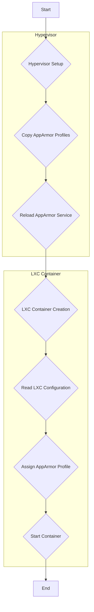

# AppArmor Workflow Analysis

## 1. Overview

This document provides a comprehensive analysis of the AppArmor workflow for the Phoenix Hypervisor, covering both hypervisor setup and LXC container creation. The workflow is designed to be idempotent and driven by a single source of truth, ensuring a consistent and secure environment.

## 2. Workflow Diagram

## 3. Hypervisor Setup

The hypervisor setup is handled by the `hypervisor_feature_setup_apparmor.sh` script. This script is responsible for deploying the custom AppArmor profiles to the hypervisor.

### 3.1. Idempotent Design

The script is designed to be idempotent, meaning it can be run multiple times without changing the result beyond the initial application. It achieves this by comparing the source and destination profiles and only taking action if there are differences.

### 3.2. Workflow Steps

1.  **Copy AppArmor Profiles:** The script copies all AppArmor profiles from `/usr/local/phoenix_hypervisor/etc/apparmor/` to `/etc/apparmor.d/`.
2.  **Validate Profiles:** Before loading the profiles, the script validates their syntax to prevent errors.
3.  **Reload AppArmor Service:** If any profiles have changed, the script reloads the AppArmor service to apply the changes.

## 4. LXC Container Creation

The AppArmor profiles are assigned to LXC containers during the creation process, using the `phoenix_lxc_configs.json` file as the single source of truth.

### 4.1. Single Source of Truth

The `phoenix_lxc_configs.json` file defines the AppArmor profile for each LXC container using the `apparmor_profile` key. This centralized approach ensures that all containers are configured consistently and securely.

### 4.2. Workflow Steps

1.  **Read LXC Configuration:** During container creation, the provisioning scripts read the `phoenix_lxc_configs.json` file to get the container's configuration.
2.  **Assign AppArmor Profile:** The value of the `apparmor_profile` key is used to assign the appropriate AppArmor profile to the container.
3.  **Start Container:** The container is started with the specified AppArmor profile, enforcing the defined security policies.

## 5. AppArmor Profiles

The following AppArmor profiles are used in the Phoenix Hypervisor environment:

### 5.1. `lxc-gpu-docker-storage`

This profile is designed for containers that require access to NVIDIA GPUs, Docker, and shared storage. It includes rules to:

*   Allow access to NVIDIA GPU device files.
*   Allow access to Docker-related files and directories.
*   Allow access to shared storage mounts.
*   Deny writes to sensitive system areas.

### 5.2. `lxc-nesting-v1`

This profile is designed for containers that require nesting capabilities. It includes rules to:

*   Enable nesting-related capabilities.
*   Incorporate rules from Proxmox's default nesting profile.
*   Add custom rules for GPU, Docker, and storage access.

## 6. Conclusion

The AppArmor workflow for the Phoenix Hypervisor is a well-designed and robust system that ensures a secure and consistent environment for all LXC containers. The use of idempotent scripts and a single source of truth for configuration makes the workflow easy to manage and maintain.