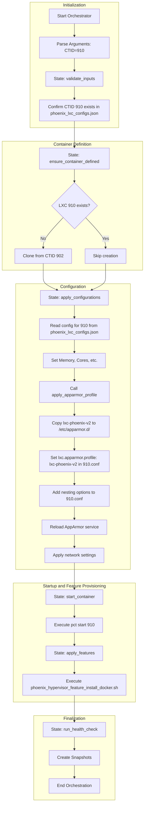
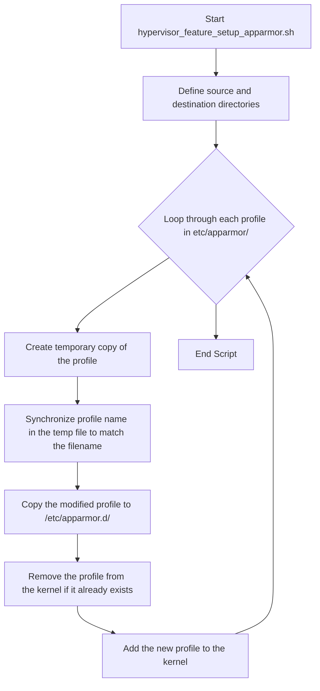

# AppArmor Deep Dive for Phoenix Hypervisor

This document provides a comprehensive overview of the AppArmor implementation within the Phoenix Hypervisor project. It is intended for an audience of technology consultants and internal architects.

## 1. High-Level Strategy & Industry Standards

Our primary goal with AppArmor is to enforce the **principle of least privilege** for our LXC containers. By default, containers run with a restrictive security profile that only allows the operations necessary for their specific function. This aligns with industry best practices for container security, which emphasize defense-in-depth and minimizing the attack surface.

**Key Strategic Principles:**

*   **Declarative Security:** AppArmor profiles are managed as code and are an integral part of the container's definition in `phoenix_lxc_configs.json`. This ensures that security policies are version-controlled and consistently applied.
*   **Centralized Management:** The `phoenix_orchestrator.sh` script is the single point of entry for applying AppArmor profiles, ensuring that all containers are configured according to our defined policies.
*   **Profile Granularity:** We create custom profiles for specific use cases (e.g., Docker with nesting) rather than relying on a one-size-fits-all approach. This allows us to tailor permissions to the needs of each container.

## 2. Architectural Integration

AppArmor is integrated into our orchestration process at two key stages: initial hypervisor setup and individual container configuration.

```mermaid
graph TD
    subgraph Hypervisor Setup
        A[Run orchestrator --setup-hypervisor] --> B[Execute hypervisor_feature_setup_apparmor.sh];
        B --> C[Copy all custom profiles to /etc/apparmor.d/];
        C --> D[Reload all AppArmor profiles];
    end

    subgraph Container Orchestration
        E[Run orchestrator <CTID>] --> F[State: apply_configurations];
        F --> G[Call apply_apparmor_profile function];
        G --> H[Read apparmor_profile from phoenix_lxc_configs.json];
        H --> I[Copy custom profile to /etc/apparmor.d/];
        I --> J[Set lxc.apparmor.profile in container's .conf file];
        J --> K[Reload AppArmor service];
        K --> L[State: start_container];
    end
```

This architecture ensures that the hypervisor is always aware of our custom profiles, and that each container is configured with the correct profile during its creation and configuration lifecycle.

## 3. Profile Analysis: `lxc-phoenix-v2`

The `lxc-phoenix-v2` profile is a prime example of our approach to custom, granular security. It is designed specifically for containers that require Docker and nesting capabilities.

**Key Features:**

*   **Includes:** It builds upon the standard LXC abstractions (`container-base`, `start-container`) to provide a solid foundation.
*   **Capabilities:** It grants a specific set of capabilities required for container management, such as `sys_admin`, `sys_chroot`, and `net_admin`.
*   **Mounts:** It explicitly allows the necessary `mount` operations for Docker's storage drivers and for nesting, including `proc`, `sysfs`, and `cgroup`.
*   **Docker-Specific Permissions:** It grants read/write access to the Docker socket (`/var/run/docker.sock`) and the Docker library directory (`/var/lib/docker/**`).

This targeted approach ensures that the container has all the permissions it needs to function correctly, without granting unnecessary access to the host system.

## 4. Detailed Workflow Explanation

The end-to-end workflow for applying an AppArmor profile is as follows:

1.  **Configuration:** A container's desired AppArmor profile is defined in the `phoenix_lxc_configs.json` file using the `apparmor_profile` key.
### 3.1. Capability Breakdown

The following table details the specific Linux capabilities granted in the `lxc-phoenix-v2` profile, providing a clear rationale for each permission.

| Capability           | Description                                                                                                | Justification for Docker/Nesting                                                                      |
| -------------------- | ---------------------------------------------------------------------------------------------------------- | ----------------------------------------------------------------------------------------------------- |
| `sys_admin`          | The most privileged capability. Required for a wide range of administrative tasks.                         | Essential for managing nested containers, creating namespaces, and performing advanced Docker operations. |
| `sys_chroot`         | Allows the use of the `chroot()` system call.                                                              | Used by container runtimes like Docker to change the root directory of a process.                     |
| `mknod`              | Allows the creation of special files (devices) using `mknod()`.                                            | Required by Docker to create and manage device nodes within the container's filesystem.               |
| `sys_nice`           | Allows changing the scheduling priority of processes.                                                      | Useful for performance tuning and resource management within the container.                           |
| `sys_resource`       | Allows bypassing resource limits.                                                                          | Can be necessary for Docker to manage resource allocation for its child containers effectively.       |
| `net_bind_service`   | Allows binding to privileged ports (below 1024).                                                           | Necessary for running services like web servers that need to bind to ports 80 or 443.                 |
| `net_raw`            | Allows the use of RAW and PACKET sockets.                                                                  | Required for certain networking tools and for Docker's networking drivers to function correctly.      |
| `net_admin`          | Allows performing various network-related administrative operations.                                       | Critical for Docker to create and manage its own network namespaces, bridges, and virtual interfaces. |
| `mac_admin`          | Allows overriding Mandatory Access Control (MAC).                                                          | Necessary for the container to manage its own security policies, especially in a nested environment.  |
| `net_broadcast`      | Allows sending broadcast messages.                                                                         | Used for network discovery and other network protocols that rely on broadcast packets.                |
2.  **Orchestration:** When the `phoenix_orchestrator.sh` script is run for that container, it enters the `apply_configurations` state.
3.  **Profile Application:** The `apply_apparmor_profile` function is called.
    *   It reads the `apparmor_profile` value from the configuration file.
    *   It copies the corresponding profile from our project's `/usr/local/phoenix_hypervisor/etc/apparmor/` directory to the system's `/etc/apparmor.d/` directory.
    *   It modifies the container's configuration file (`/etc/pve/lxc/<CTID>.conf`) to set the `lxc.apparmor.profile` to the specified profile.
    *   If `apparmor_manages_nesting` is true, it also adds the necessary lines to the configuration file to enable nesting.
4.  **Enforcement:** The script reloads the AppArmor service using `systemctl reload apparmor`. This makes the host's kernel aware of the new or updated profile.
5.  **Container Start:** When the container is started in a later state, LXC reads the configuration file and tells the kernel to apply the specified AppArmor profile to the container's processes.

This workflow is robust, idempotent, and ensures that our security policies are consistently enforced across all containers.
## 5. Lifecycle of a Container: The Story of LXC 910

To illustrate the entire process, let's trace the lifecycle of container 910 (Portainer) from a single command to a fully operational state.

**Command:** `usr/local/phoenix_hypervisor/bin/phoenix_orchestrator.sh 910`

**Step-by-Step Breakdown:**

1.  **Initialization:** The orchestrator starts, parses the command-line arguments, and confirms that a configuration for container 910 exists in our `phoenix_lxc_configs.json` file.
2.  **Container Definition:** The script checks if a container with CTID 910 already exists. If not, it clones it from our Docker template (CTID 902).
3.  **Configuration:** This is the most critical phase for our discussion.
    *   The script reads all the configuration details for 910 from the JSON file, including memory, cores, and network settings.
    *   The `apply_apparmor_profile` function is called. It reads that `apparmor_profile` is set to `lxc-phoenix-v2`.
    *   It copies the `lxc-phoenix-v2` file from our project's `etc/apparmor` directory to the system's `/etc/apparmor.d` directory.
    *   It then modifies the container's configuration file (`/etc/pve/lxc/910.conf`) to include the line `lxc.apparmor.profile: lxc-phoenix-v2`.
    *   Because `apparmor_manages_nesting` is true for 910, it also adds the necessary lines for nesting to `910.conf`.
    *   Finally, it reloads the AppArmor service, ensuring the host kernel is aware of our profile.
4.  **Startup and Feature Provisioning:** The container is started. Once it is running, the orchestrator applies the "docker" feature by executing the `phoenix_hypervisor_feature_install_docker.sh` script inside the container.
5.  **Finalization:** The orchestrator runs any defined health checks and creates snapshots, completing the process.

This detailed lifecycle demonstrates how our declarative configuration drives a consistent and secure provisioning process, with AppArmor being a foundational part of the container's identity from the moment of its creation.
## 6. Architectural Alignment with Proxmox Philosophy

An important consideration in our architecture is the minimalist nature of the Proxmox VE host environment. By default, Proxmox does not include the `apparmor-utils` package, which provides command-line tools for managing AppArmor profiles. This is a deliberate design choice that aligns with the philosophy of keeping the hypervisor lean, stable, and secure.

Our declarative, code-driven approach to AppArmor management aligns perfectly with this philosophy. By treating the hypervisor as a production target and managing our security profiles within our version-controlled project, we enhance the stability and reproducibility of our entire system.
## 7. The Role of Configuration Files

Our AppArmor strategy is entirely driven by our declarative configuration files. This ensures that our security policies are version-controlled, auditable, and consistently applied.

### `phoenix_lxc_configs.json`

This file is the heart of our container configuration and plays a direct role in our AppArmor implementation. For each container, we define two key properties:

*   `"apparmor_profile"`: This string specifies which AppArmor profile to apply to the container. The `phoenix_orchestrator.sh` script reads this value and uses it to select the correct profile from our custom profile directory. If the value is `"unconfined"`, no profile is applied.
*   `"apparmor_manages_nesting"`: This boolean flag tells the orchestrator whether the selected AppArmor profile includes the necessary permissions for nesting. If `true`, the orchestrator will add the `lxc.apparmor.allow_nesting=1` line to the container's configuration, enabling nested virtualization.

This declarative approach allows us to see the security posture of our entire container fleet at a glance, simply by reading this file.

### `phoenix_hypervisor_config.json`

While this file does not directly reference AppArmor profiles, it plays a crucial supporting role. It defines the overall structure of the hypervisor, including storage locations and network configurations. A stable and well-defined hypervisor environment is a prerequisite for a successful AppArmor implementation, as it ensures that the paths and resources that our profiles are protecting are consistent and predictable.
## 8. Deep Dive: Hypervisor Setup (`--setup-hypervisor`)

The initial setup of the hypervisor is a critical process that lays the foundation for our entire security architecture. The `hypervisor_feature_setup_apparmor.sh` script, called during the `--setup-hypervisor` run, is responsible for ensuring that our custom AppArmor profiles are correctly deployed and loaded on the Proxmox host.

### Workflow

### Step-by-Step Breakdown

1.  **Initialization:** The script defines the source directory for our custom profiles (`/usr/local/phoenix_hypervisor/etc/apparmor/`) and the system's destination directory (`/etc/apparmor.d/`).
2.  **Profile Iteration:** It loops through every file in our source directory.
3.  **Profile Synchronization:** For each profile, it performs a critical step: it dynamically updates the `profile` name *inside* the file to match the filename. The script also sanitizes the profile name by replacing hyphens with underscores to ensure it is a valid AppArmor profile name. This prevents the "label not found" errors we encountered during our debugging session and ensures that our profiles are always correctly identified by the AppArmor service.
4.  **Deployment:** The synchronized profile is then copied to the system's `/etc/apparmor.d/` directory, making it available to the AppArmor service.
5.  **Idempotent Reload:** The script ensures that the process is idempotent by first attempting to remove the profile from the kernel (in case it was already loaded) and then adding the new version. This guarantees that we are always running the latest version of our profiles.

This robust process, executed as one of the final steps in the hypervisor setup, ensures that our declarative security policies are not just defined in our project, but are actively enforced by the kernel before any containers are ever started.