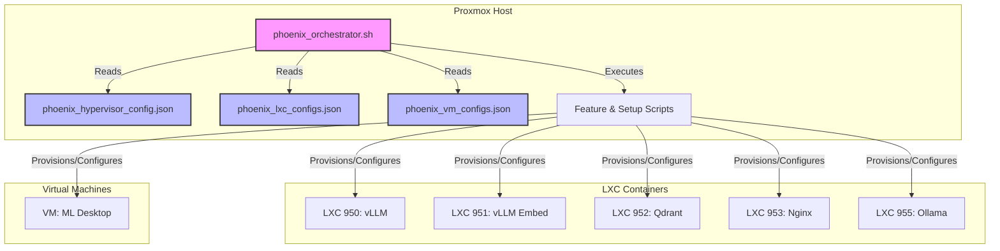

# Phoenix Hypervisor: Current State Architecture

## 1. Overview

The Phoenix Hypervisor ecosystem is a powerful, single-node virtualization platform built on Proxmox. Its orchestration is managed by a central, idempotent shell script, `phoenix_orchestrator.sh`, which operates on a declarative configuration model using a set of JSON files. This design provides a strong foundation for managing complex AI/ML workloads.

The current architecture can be summarized as follows:

*   **Configuration-Driven:** The entire system's desired state is defined in `phoenix_hypervisor_config.json`, `phoenix_lxc_configs.json`, and `phoenix_vm_configs.json`.
*   **Centralized Orchestration:** The `phoenix_orchestrator.sh` script acts as the single point of entry for all provisioning, configuration, and management tasks.
*   **Template-Based Provisioning:** A multi-layered templating strategy is used to create specialized LXC containers for different workloads (e.g., base, GPU, Docker).
*   **Monolithic Orchestrator:** The `phoenix_orchestrator.sh` script contains the logic for all orchestration tasks, including hypervisor setup, LXC and VM lifecycle management, feature installation, and testing.

## 2. Current Architecture Diagram

The following Mermaid diagram illustrates the current architecture of the Phoenix Hypervisor ecosystem, highlighting the central role of the `phoenix_orchestrator.sh` script and its interaction with the various configuration files and system components.

## 3. Initial Analysis & Areas for Improvement

While the current architecture is robust and functional, several areas can be refined to improve maintainability, scalability, and security:

*   **Configuration Management:** The JSON configuration files, while effective, are becoming large and complex. There is an opportunity to introduce more modularity and validation to prevent errors and simplify management.
*   **Orchestration Logic:** The `phoenix_orchestrator.sh` script is a monolithic bash script that handles all aspects of orchestration. As the system grows, this script will become increasingly difficult to maintain and extend.
*   **Secret Management:** The discovery of a hardcoded password in the Samba setup script highlights the need for a centralized and secure method of managing secrets.
*   **Testing and Validation:** While a testing framework exists, it could be expanded to provide more comprehensive coverage and be more tightly integrated into the orchestration workflow.
*   **Observability:** The current monitoring stack is a good start, but there is an opportunity to enhance logging, metrics, and tracing to provide a more holistic view of the system's health and performance.

These areas will be the focus of my subsequent proposals for refinement and polish.