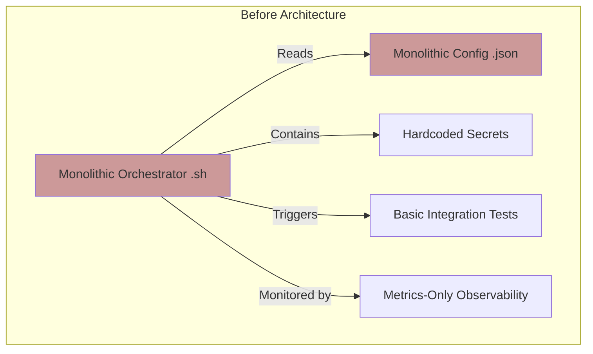
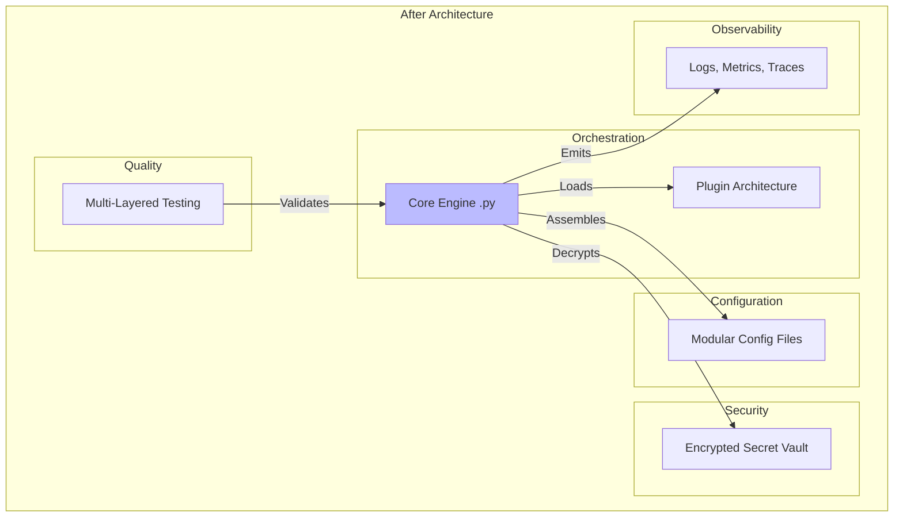

# Phoenix Hypervisor Evolution: A Strategic Plan for Refinement

## 1. Introduction

The Phoenix Hypervisor has a strong architectural foundation. It is declarative, idempotent, and successfully automates a complex AI/ML environment. The next stage in its lifecycle is to evolve this foundation, addressing key areas of technical debt and implementing best practices that will ensure its long-term scalability, security, and maintainability.

This document consolidates a series of proposals into a single, cohesive strategic plan. It presents a vision for the "after" state of the Phoenix Hypervisor—a system that is more modular, robust, and observable.

## 2. The "Before" State: A Monolithic Core

Our current architecture is characterized by a monolithic core:

*   **Monolithic Configuration:** A single `phoenix_lxc_configs.json` file defines all containers.
*   **Monolithic Orchestrator:** A single `phoenix_orchestrator.sh` script contains all business logic.
*   **In-Situ Security:** Secrets are managed on an ad-hoc basis, with some hardcoded.
*   **Basic Testing:** Validation is primarily post-deployment.
*   **Metrics-Focused Observability:** Monitoring is centered around Prometheus metrics.

## 3. The "After" State: A Modular, Secure, and Observable Ecosystem

Our proposed evolution will transform this monolithic core into a modern, plugin-based, and highly observable ecosystem.

### 3.1. The Five Pillars of Evolution

1.  **Modular Configuration:** Decompose the monolithic JSON files into a hierarchical, directory-based structure with base files, reusable profiles, and service-specific overrides.
2.  **Plugin-Based Orchestrator:** Refactor the monolithic bash script into a lightweight Python core engine with a plugin architecture for handling different domains (LXC, VM, ZFS, etc.).
3.  **Centralized Secret Management:** Introduce a GPG-encrypted vault to securely store and manage all secrets, eliminating hardcoded credentials.
4.  **Multi-Layered Testing:** Implement the testing pyramid with fast unit tests for plugins, robust integration tests for services, and comprehensive E2E tests for user workflows.
5.  **Holistic Observability:** Augment our existing metrics with structured logging and distributed tracing to provide a complete, three-pillar view of the system.

### 3.2. The "After" Architecture Diagram

This diagram illustrates the proposed future state of the Phoenix Hypervisor.

## 4. Summary of Gains

This strategic evolution will yield significant gains across the board:

*   **Maintainability:** The system will be easier to understand, modify, and extend.
*   **Scalability:** The modular architecture will scale gracefully as we add more services and complexity.
*   **Security:** Centralized secret management will drastically reduce our security risks.
*   **Reliability:** A comprehensive testing strategy will lead to a more robust and predictable system.
*   **Operability:** Enhanced observability will reduce our Mean Time to Resolution (MTTR) and make the system easier to manage.

## 5. Next Steps

This document provides the high-level strategic vision. The detailed implementation plans for each of these pillars have been created in their respective proposal documents. The next step is to review and approve this overall strategy, after which we can begin the phased implementation of these enhancements.