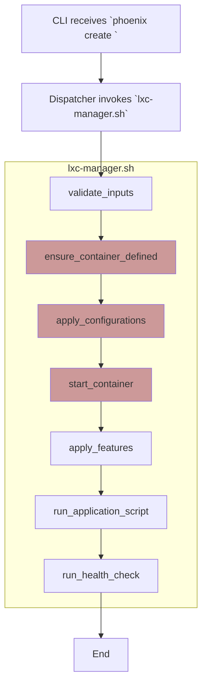
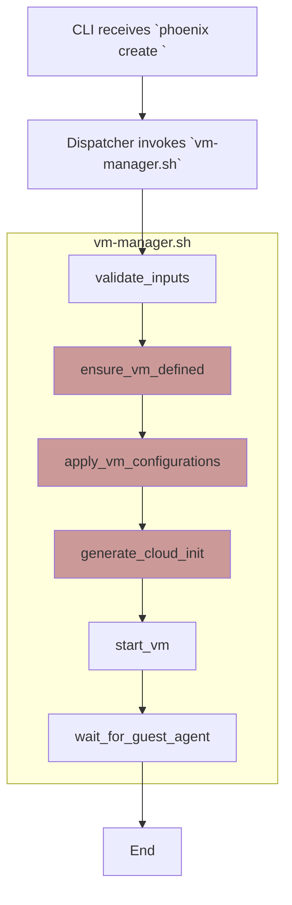

# Deep Dive: The Phoenix CLI Workflows

## 1. Introduction

This document provides a focused analysis of the three primary workflows managed by the `phoenix` CLI: Hypervisor Setup, LXC Container Construction, and VM Construction. For each workflow, we will examine the implementation of the dispatcher-manager architecture.

## 2. Workflow 1: Hypervisor Setup

This workflow is triggered by the `phoenix setup` command and is responsible for preparing the Proxmox host from a base state.

### 2.1. Implemented State

The `phoenix` dispatcher routes the `setup` command to the `hypervisor-manager.sh` script.

*   **Logic:** The `hypervisor-manager.sh` script contains a series of well-defined, testable functions (`setup_zfs`, `install_nvidia`, `configure_network`, etc.) that are called in a specific order.
*   **Configuration:** The manager script is responsible for parsing the `phoenix_hypervisor_config.json` file.
*   **State Management:** Each step is wrapped in error handling, and the script is designed to be idempotent.

**Implemented Workflow Diagram:**
```mermaid
graph TD
    A[CLI receives `phoenix setup`] --> B[Dispatcher invokes `hypervisor-manager.sh`];
    subgraph "hypervisor-manager.sh"
        direction TB
        C1[setup_zfs()]
        C2[configure_network()]
        C3[install_drivers()]
        C4[setup_firewall()]
    end
    B --> C1 --> C2 --> C3 --> C4;
    C4 --> D[Return Success/Failure];
    D --> E[End];

    style B fill:#bbf
```

## 3. Workflow 2: LXC Container Construction

This is the core workflow for provisioning and managing LXC containers, triggered by commands like `phoenix create <ID>`.

### 3.1. Implemented State

The `phoenix` dispatcher routes all LXC-related commands to the `lxc-manager.sh` script.

*   **Logic:** The `lxc-manager.sh` script implements a state machine for LXC containers. A series of functions (`ensure_container_defined`, `apply_configurations`, `start_container`, `apply_features`, etc.) are called in a fixed sequence for a given CTID. The logic is intertwined with `pct` command execution and parsing.
*   **Configuration:** The script uses `jq` extensively to query the `phoenix_lxc_configs.json` file at multiple points.
*   **State Management:** State is checked by repeatedly querying the system (`pct status`, `pct config`).

**Implemented Workflow Diagram:**


## 4. Workflow 3: VM Construction

This workflow is similar to LXC construction but involves `qm` and Cloud-Init. It is triggered by commands like `phoenix create <ID>`.

### 4.1. Implemented State

The `phoenix` dispatcher routes all VM-related commands to the `vm-manager.sh` script.

*   **Logic:** The `vm-manager.sh` script follows a similar state machine to the LXC workflow but uses `qm` commands. A significant piece of logic is the dynamic generation of Cloud-Init files from templates and JSON values.
*   **Configuration:** It reads from `phoenix_vm_configs.json` using `jq`.
*   **State Management:** Relies on `qm status` and waits for the guest agent.

**Implemented Workflow Diagram:**


By breaking down the monolithic orchestrator into these specialized, domain-focused manager scripts, we have created a system that is significantly more maintainable, testable, and extensible.