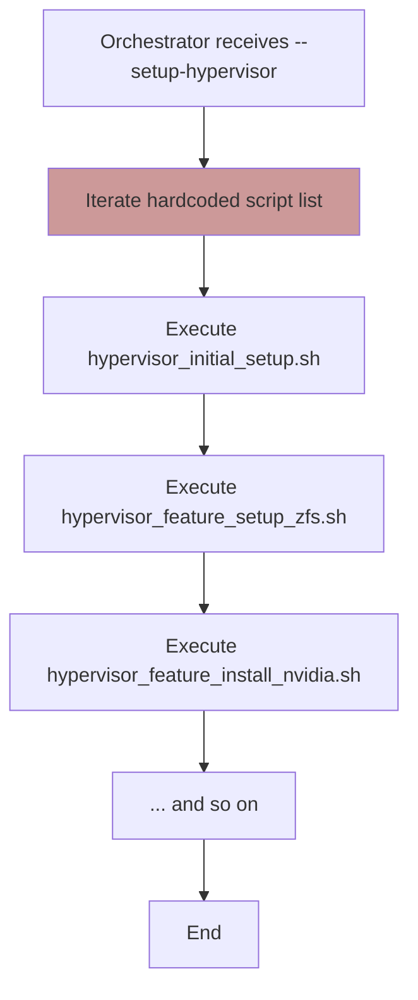
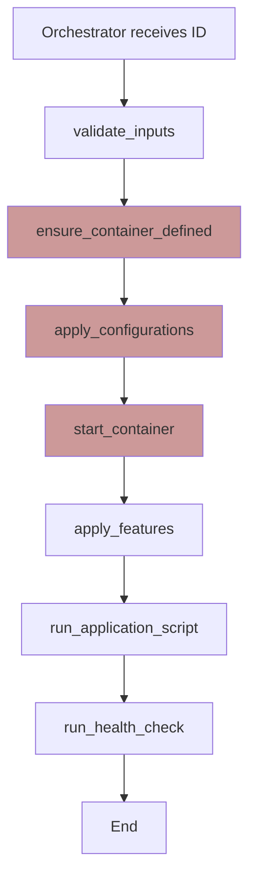

# Deep Dive: Evolving the Phoenix Orchestrator Workflows

## 1. Introduction

This document provides a focused analysis of the three primary workflows managed by the `phoenix_orchestrator.sh` script: Hypervisor Setup, LXC Container Construction, and VM Construction. For each workflow, we will examine the current implementation, define an ideal future state based on the proposed Python-based plugin architecture, and outline a clear migration path.

## 2. Workflow 1: Hypervisor Setup

This workflow is triggered by the `--setup-hypervisor` flag and is responsible for preparing the Proxmox host from a base state.

### 2.1. Current State

The current implementation is a procedural sequence of shell scripts called from the main orchestrator.

*   **Logic:** A hardcoded list of script names is iterated through, and each script is executed in order.
*   **Configuration:** Each script is responsible for parsing the `phoenix_hypervisor_config.json` file itself.
*   **State Management:** State is managed implicitly through the success or failure of each script. There is no transactional capability; a failure midway requires manual intervention.

**Current Workflow Diagram:**


### 2.2. Ideal State

In the ideal state, this workflow is managed by a dedicated `Hypervisor` plugin within the Python-based orchestration engine.

*   **Logic:** The core engine invokes a `setup()` method on the `Hypervisor` plugin. This method calls a series of well-defined, testable internal methods (`_setup_zfs`, `_install_nvidia`, `_configure_network`, etc.).
*   **Configuration:** The core engine loads the configuration once and passes the relevant sections to the plugin, decoupling the plugin from the file structure.
*   **State Management:** Each step can be wrapped in error handling. The object-oriented nature allows for better state tracking and the potential for more intelligent recovery or rollback on failure.

**Ideal Workflow Diagram:**
```mermaid
graph TD
    A[Core Engine receives --setup-hypervisor] --> B[Instantiate Hypervisor Plugin];
    B --> C[Call hypervisor.setup()];
    subgraph "hypervisor.setup()"
        direction TB
        C1[_setup_zfs()]
        C2[_configure_network()]
        C3[_install_drivers()]
        C4[_setup_firewall()]
    end
    C --> C1 --> C2 --> C3 --> C4;
    C4 --> D[Return Success/Failure];
    D --> E[End];

    style B fill:#bbf
```

### 2.3. Path to Ideal

1.  **Create `hypervisor.py` Plugin:** Develop the basic plugin structure with placeholder methods for each setup step.
2.  **Migrate ZFS Logic:** Port the logic from `hypervisor_feature_setup_zfs.sh` into the `_setup_zfs` method. This is a good first candidate due to its complexity. Write unit tests for this method.
3.  **Incremental Migration:** One by one, migrate the logic from the remaining setup scripts into their corresponding methods in the plugin, adding unit tests for each.
4.  **Deprecate Old Scripts:** Once all logic is migrated, the old bash scripts can be removed.

## 3. Workflow 2: LXC Container Construction

This is the core workflow for provisioning and managing LXC containers.

### 3.1. Current State

The current implementation is a large, procedural state machine within the main `phoenix_orchestrator.sh` script.

*   **Logic:** A series of functions (`ensure_container_defined`, `apply_configurations`, `start_container`, `apply_features`, etc.) are called in a fixed sequence for a given CTID. The logic is intertwined with `pct` command execution and parsing.
*   **Configuration:** The script uses `jq` extensively to query the monolithic `phoenix_lxc_configs.json` file at multiple points.
*   **State Management:** State is checked by repeatedly querying the system (`pct status`, `pct config`).

**Current Workflow Diagram:**


### 3.2. Ideal State

The ideal state uses a dedicated `LXC` plugin and an object-oriented model.

*   **Logic:** The core engine's lifecycle executor calls standardized methods on an `LXC` plugin (e.g., `lxc.define()`, `lxc.configure()`, `lxc.start()`). The plugin encapsulates an `LXCContainer` object that holds the container's state and configuration. All `pct` command logic is isolated within this plugin.
*   **Configuration:** The core engine uses the proposed modular config loader to build the final configuration object for the container and passes it to the `LXCContainer` object upon instantiation.
*   **State Management:** The `LXCContainer` object tracks its own state (e.g., `defined`, `running`, `configured`), which is synchronized with the system at the beginning of each lifecycle step.

**Ideal Workflow Diagram:**
```mermaid
graph TD
    A[Core Engine receives ID] --> B[Load Merged Config for ID];
    B --> C[Instantiate lxc_plugin.LXCContainer(config)];
    C --> D[Lifecycle Executor];
    subgraph "Lifecycle Steps"
        D1[Call container.define()]
        D2[Call container.configure()]
        D3[Call container.start()]
        D4[Call container.validate()]
    end
    D --> D1 --> D2 --> D3 --> D4;
    D4 --> E[End];

    style C fill:#bbf
```

### 3.3. Path to Ideal

1.  **Develop `LXC` Plugin:** Create the `lxc.py` plugin and the `LXCContainer` class structure.
2.  **Implement `define()`:** Port the logic from `ensure_container_defined` (both `create_container_from_template` and `clone_container`) into the `define()` method. Write unit tests that verify the correct `pct` commands are generated.
3.  **Implement `configure()`:** Migrate the logic from `apply_configurations`, `apply_zfs_volumes`, etc., into the `configure()` method.
4.  **Continue Migration:** Incrementally migrate the remaining functions (`start`, `apply_features`, etc.) into corresponding methods on the `LXCContainer` object.
5.  **Integrate with Core Engine:** Wire the new plugin into the core lifecycle executor.

## 4. Workflow 3: VM Construction

This workflow is similar to LXC construction but involves `qm` and Cloud-Init.

### 4.1. Current State

The logic for VM management is also contained within the monolithic `phoenix_orchestrator.sh`, in functions like `orchestrate_vm`, `ensure_vm_defined`, and `apply_vm_configurations`.

*   **Logic:** It follows a similar state machine to the LXC workflow but uses `qm` commands. A significant piece of logic is the dynamic generation of Cloud-Init files from templates and JSON values.
*   **Configuration:** It reads from `phoenix_vm_configs.json` using `jq`.
*   **State Management:** Relies on `qm status` and waits for the guest agent.

### 4.2. Ideal State

This workflow is managed by a dedicated `VM` plugin, mirroring the structure of the `LXC` plugin.

*   **Logic:** A `vm.py` plugin provides a `VirtualMachine` class. The core engine's lifecycle executor calls methods like `vm.define()` and `vm.configure()`. The complex Cloud-Init generation is isolated in a dedicated, testable method, `vm._generate_cloud_init()`.
*   **Configuration:** The core engine loads the VM's configuration and passes it to the `VirtualMachine` object.
*   **State Management:** The `VirtualMachine` object tracks its state, providing a clean abstraction over the Proxmox API.

### 4.3. Path to Ideal

1.  **Develop `VM` Plugin:** Create the `vm.py` plugin and `VirtualMachine` class.
2.  **Isolate Cloud-Init:** Port the Cloud-Init generation logic into a `_generate_cloud_init()` method. Use a templating engine like Jinja2 for more robust and readable template processing. Write unit tests for this method.
3.  **Migrate Lifecycle Methods:** Port the `qm` command logic from the bash script into the `define()`, `configure()`, and `start()` methods of the `VirtualMachine` class.
4.  **Integrate with Core Engine:** Connect the `VM` plugin to the core lifecycle executor.

By breaking down the monolithic orchestrator into these specialized, domain-focused plugins, we will create a system that is significantly more maintainable, testable, and extensible.