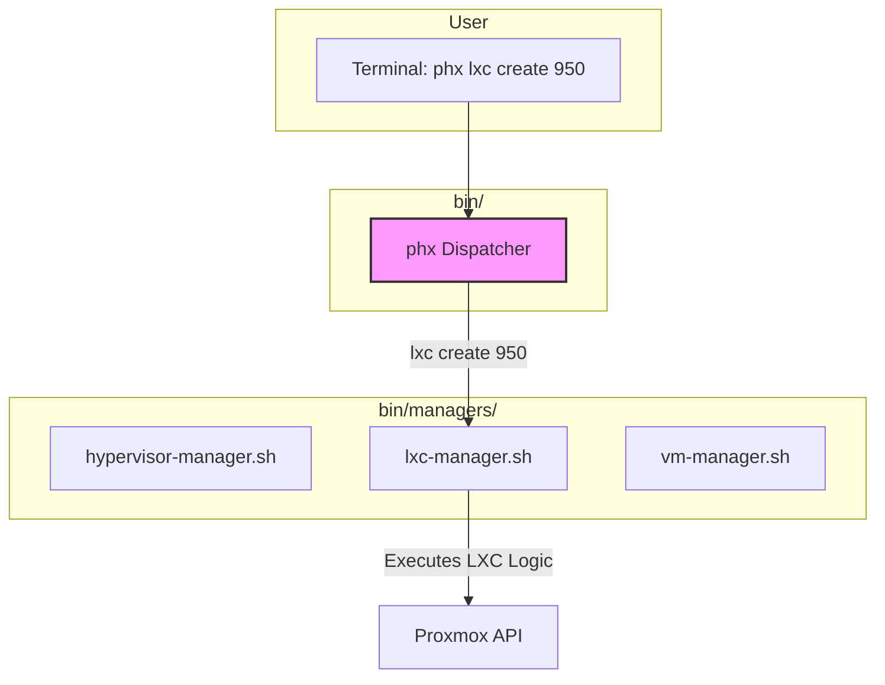

# Proposal: A Refined Shell-Based Orchestration Workflow

## 1. Introduction

Based on feedback, this proposal reframes the orchestrator evolution to stay within our existing shell-scripting paradigm. The goal is to address the current complexity by introducing a clear separation of concerns directly into our command-line interface and script architecture, rather than by changing the underlying technology.

The core problem is that `phoenix_orchestrator.sh` has become a single, overloaded entry point for three distinct jobs: managing the hypervisor, managing LXC containers, and managing VMs. This proposal refactors that entry point into a clear, intuitive, and function-oriented command structure.

## 2. Current State CLI Analysis

Currently, the CLI is a mix of flags and arguments that don't clearly distinguish between the different operational contexts.

**Current Commands:**
*   `./phoenix_orchestrator.sh --setup-hypervisor` (Manages the hypervisor)
*   `./phoenix_orchestrator.sh <ID>` (Manages an LXC or VM)
*   `./phoenix_orchestrator.sh --delete <ID>` (Manages an LXC or VM)
*   `./phoenix_orchestrator.sh --test <SUITE>` (Manages testing)
*   `./phoenix_orchestrator.sh --reconfigure` (Modifies a guest)

This structure is confusing. Does `<ID>` refer to an LXC or a VM? How do you test the hypervisor vs. a container? The ambiguity is a direct symptom of the script's monolithic design.

## 3. Proposed Ideal State: A Function-Oriented CLI

I propose a new command-line interface that is structured like modern CLI tools (e.g., `git`, `docker`, `kubectl`), using a `[noun] [verb]` syntax. This makes the user's intent explicit.

Our three core functions become the primary nouns: `hypervisor`, `lxc`, and `vm`.

### 3.1. The New Command Structure

**`phx` - The New Entry Point**

The `phoenix_orchestrator.sh` script will be renamed to `phx` (or a symlink created) to provide a clean, top-level command. This script will act as a **dispatcher**.

**Proposed Commands:**

| Command | Description |
| :--- | :--- |
| `phx hypervisor setup` | Initializes or configures the Proxmox host. |
| `phx hypervisor test [--suite <name>]` | Runs tests against the hypervisor itself. |
| `phx lxc create <ID...>` | Creates one or more LXC containers. |
| `phx lxc delete <ID...>` | Deletes one or more LXC containers. |
| `phx lxc start \| stop \| restart <ID...>` | Manages the state of LXC containers. |
| `phx lxc reconfigure <ID...>` | Forces a reconfiguration of running containers. |
| `phx lxc test <ID> [--suite <name>]` | Runs a test suite against a specific container. |
| `phx vm create <ID...>` | Creates one or more VMs. |
| `phx vm delete <ID...>` | Deletes one or more VMs. |
| `phx vm start \| stop \| restart <ID...>` | Manages the state of VMs. |

This structure is clear, self-documenting, and infinitely extensible.

### 3.2. "After" Architecture: Dispatcher and Managers

The implementation will be refactored into a dispatcher-manager model.

*   **`bin/phx` (The Dispatcher):** This will be the new, lean entry point. Its only job is to parse the first one or two arguments (`hypervisor setup`, `lxc create`) and delegate to the appropriate manager script. It will handle `--help` and basic command validation.

*   **`bin/managers/` (The Managers):** A new directory will contain the specialized logic.
    *   `hypervisor-manager.sh`: Contains all the logic from the old `--setup-hypervisor` workflow.
    *   `lxc-manager.sh`: Contains all the logic for the LXC state machine (create, delete, start, etc.).
    *   `vm-manager.sh`: Contains all the logic for the VM state machine.

**"After" Workflow Diagram:**

## 4. Goals and Gains

### Goals

*   **Clarify Intent:** Make the command-line interface intuitive and unambiguous.
*   **Separate Concerns:** Isolate the logic for each core function into its own script.
*   **Improve Maintainability:** Make it easier to find, fix, and enhance the logic for a specific domain (e.g., LXC management) without touching unrelated code.
*   **Stay within Shell:** Achieve these goals without requiring a new language or technology stack.

### Gains

*   **Improved User Experience:** The new CLI is easier to learn, use, and script against.
*   **Reduced Complexity:** The dispatcher is simple, and each manager script is smaller and more focused than the original monolithic orchestrator.
*   **Safer Changes:** Modifications to the VM workflow are now isolated in `vm-manager.sh` and have a much lower risk of impacting the LXC workflow.
*   **Foundation for Growth:** This modular structure makes it easy to add new commands (e.g., `phx lxc snapshot <ID>`) or even new managers (e.g., `phx storage manage`) in the future.

## 5. Next Steps

If this proposal is approved, we can begin a phased refactoring:

1.  **Create the Dispatcher:** Create the new `phx` script and the `bin/managers/` directory.
2.  **Move Hypervisor Logic:** Move the hypervisor setup logic from `phoenix_orchestrator.sh` into `hypervisor-manager.sh` and wire it into the dispatcher.
3.  **Move LXC Logic:** Move the LXC-related functions into `lxc-manager.sh`.
4.  **Move VM Logic:** Move the VM-related functions into `vm-manager.sh`.
5.  **Refine and Retire:** Clean up the now-empty `phoenix_orchestrator.sh` and replace it with the new `phx` dispatcher.