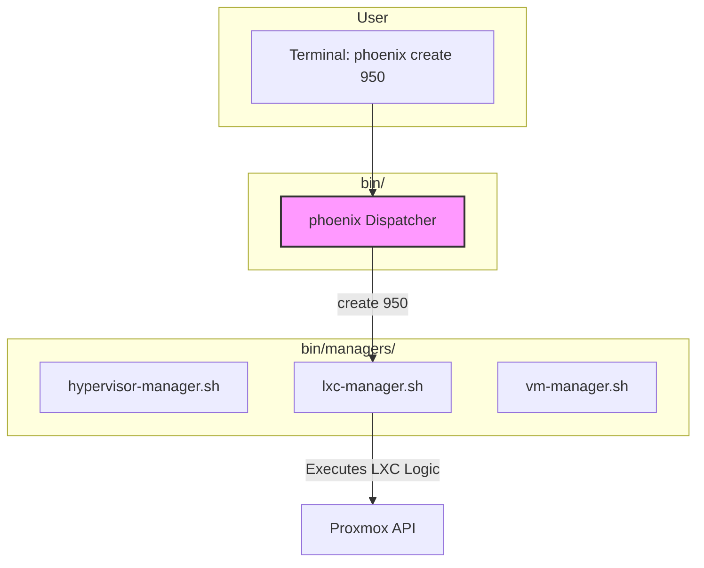

# Proposal: A Refined Shell-Based Orchestration Workflow

## 1. Introduction

Based on feedback, this proposal reframed the orchestrator evolution to stay within our existing shell-scripting paradigm. The goal was to address the complexity of the `phoenix_orchestrator.sh` script by introducing a clear separation of concerns directly into our command-line interface and script architecture.

The core problem was that `phoenix_orchestrator.sh` had become a single, overloaded entry point for three distinct jobs: managing the hypervisor, managing LXC containers, and managing VMs. This proposal refactored that entry point into a clear, intuitive, and function-oriented command structure.

## 2. Previous State CLI Analysis

Previously, the CLI was a mix of flags and arguments that didn't clearly distinguish between the different operational contexts.

**Old Commands:**
*   `./phoenix_orchestrator.sh --setup-hypervisor`
*   `./phoenix_orchestrator.sh <ID>`
*   `./phoenix_orchestrator.sh --delete <ID>`
*   `./phoenix_orchestrator.sh --test <SUITE>`
*   `./phoenix_orchestrator.sh --reconfigure`

This structure was confusing and a direct symptom of the script's monolithic design.

## 3. Implemented State: A Function-Oriented CLI

A new command-line interface was implemented, structured like modern CLI tools (e.g., `git`, `docker`, `kubectl`), using a `<verb> <target>` syntax.

### 3.1. The New Command Structure

**`phoenix` - The New Entry Point**

The `phoenix_orchestrator.sh` script was replaced by the `phoenix` script, which acts as a **dispatcher**.

**Implemented Commands:**

| Command | Description |
| :--- | :--- |
| `phoenix setup` | Initializes or configures the Proxmox host. |
| `phoenix create <ID>` | Creates an LXC container or VM. |
| `phoenix delete <ID>` | Deletes an LXC container or VM. |
| `phoenix start \| stop \| restart <ID>` | Manages the state of an LXC container or VM. |
| `phoenix reconfigure <ID>` | Forces a reconfiguration of a running container or VM. |
| `phoenix test <SUITE>` | Runs a test suite against the hypervisor or a specific guest. |
| `phoenix LetsGo` | Brings up the entire environment. |

This structure is clear, self-documenting, and extensible.

### 3.2. "After" Architecture: Dispatcher and Managers

The implementation was refactored into a dispatcher-manager model.

*   **`bin/phoenix` (The Dispatcher):** The new, lean entry point. Its only job is to parse the command and delegate to the appropriate manager script.

*   **`bin/managers/` (The Managers):** A new directory containing the specialized logic.
    *   `hypervisor-manager.sh`: Contains all the logic for the `setup` command.
    *   `lxc-manager.sh`: Contains all the logic for the LXC state machine.
    *   `vm-manager.sh`: Contains all the logic for the VM state machine.

**"After" Workflow Diagram:**

## 4. Goals and Gains

### Goals

*   **Clarify Intent:** Make the command-line interface intuitive and unambiguous.
*   **Separate Concerns:** Isolate the logic for each core function into its own script.
*   **Improve Maintainability:** Make it easier to find, fix, and enhance the logic for a specific domain.
*   **Stay within Shell:** Achieve these goals without requiring a new language or technology stack.

### Gains

*   **Improved User Experience:** The new CLI is easier to learn, use, and script against.
*   **Reduced Complexity:** The dispatcher is simple, and each manager script is smaller and more focused.
*   **Safer Changes:** Modifications to the VM workflow are now isolated in `vm-manager.sh`.
*   **Foundation for Growth:** This modular structure makes it easy to add new commands or managers.

## 5. Next Steps

This refactoring has been completed. The `phoenix` CLI is now the standard for all orchestration tasks.