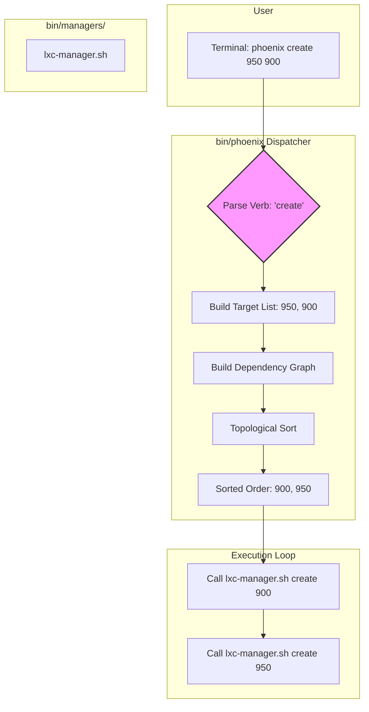

# Proposal: A Unified, Verb-First Orchestrator CLI

## 1. Introduction

This proposal revises the previous plan based on the feedback that a `[noun] [verb]` command structure may be unnecessarily complex. The new goal is to provide the simplest possible user experience by creating a unified, verb-first CLI, while still achieving the benefits of a modular, shell-based backend.

The guiding principle is: **The user states their intent (the verb), and the orchestrator figures out the context and the correct order of operations.**

## 2. The Proposed Unified CLI

We will refactor the entry point to be a single `phoenix` command that accepts a verb as its first argument. The dispatcher will intelligently route the command based on its target.

### 2.1. The New Command Structure

| Command | Description | How it Works |
| :--- | :--- | :--- |
| `phoenix LetsGo` | **Master Command:** Creates and starts all defined guests. | The dispatcher gathers all IDs from all config files and performs a full `create` and `start` operation, respecting all dependencies and boot orders. |
| `phoenix create <ID...>` | Creates one or more guests, automatically resolving dependencies. | The dispatcher builds a dependency graph of the requested IDs and creates them in the correct order. |
| `phoenix delete <ID...>` | Deletes the specified guest(s). | The dispatcher resolves the type of each ID and calls the correct manager. |
| `phoenix start <ID...>` | Starts the specified guest(s), respecting boot order. | The dispatcher sorts the guests by their configured boot order and starts them sequentially. |
| `phoenix stop <ID...>` | Stops the specified guest(s). | The dispatcher resolves the type of each ID and calls the correct manager. |
| `phoenix test <ID> [--suite <name>]` | Runs a test suite against a specific guest. | The dispatcher resolves the type of the ID and calls the correct manager. |
| `phoenix setup` | **Special Case:** Initializes or configures the hypervisor. | The dispatcher recognizes this as a hypervisor-specific command and calls the hypervisor manager directly. |

This model is simple, intuitive, and covers the vast majority of use cases with a clean `phoenix [verb] [target]` syntax.

## 3. "After" Architecture: The Smart Dispatcher

The backend architecture of manager scripts remains, but the dispatcher becomes more intelligent, handling not just target resolution but also execution order.

*   **`bin/phoenix` (The Smart Dispatcher):**
    1.  Parses the verb (`create`, `start`, `setup`, etc.).
    2.  If the verb is a special case like `setup`, it calls `hypervisor-manager.sh` directly.
    3.  For verbs like `create` or `start`, it first builds a list of all target objects (LXC and VM) from the provided IDs.
    4.  **Dependency Resolution:** It constructs a dependency graph based on the `clone_from_ctid` and `dependencies` properties in the configuration.
    5.  **Execution Ordering:** It performs a topological sort on the graph to determine the correct order of operations. For `start`, it sorts by the `boot_order` property.
    6.  It iterates through the **sorted** list of targets.
    7.  For each target, it calls the appropriate manager script with the verb and ID (e.g., `lxc-manager.sh create 900`, then `lxc-manager.sh create 901`).

*   **`bin/managers/` (The Managers):**
    *   `hypervisor-manager.sh`, `lxc-manager.sh`, `vm-manager.sh`.
    *   These scripts are unchanged from the previous proposal. They contain the focused logic for their respective domains.

### 3.1. "After" Workflow Diagram

This diagram illustrates the logic of the new "Smart Dispatcher".

## 4. Goals and Gains

This revised approach provides a superior user experience while retaining all the architectural benefits of the previous plan.

### Goals

*   **Maximize User Convenience:** Create the most intuitive and simple CLI possible.
*   **Automate Context Discovery:** Shift the burden of determining context from the user to the script.
*   **Maintain Backend Modularity:** Keep the separation of concerns in the manager scripts.

### Gains

*   **Simplicity:** The user only needs to remember a handful of verbs.
*   **Flexibility:** The user can operate on a mixed list of LXCs and VMs in a single command (e.g., `phoenix stop 950 1000`).
*   **Robustness:** The dispatcher enforces correctness by respecting dependencies, preventing race conditions and failed deployments.
*   **Maintainability:** All the benefits of the manager-based script architecture are retained.

## 5. Next Steps

This revised plan is a refinement of the previous one. The implementation steps are largely the same, but the logic within the `phoenix` dispatcher script will be expanded to include dependency resolution and execution ordering. If this revised direction is approved, we can proceed with the refactoring effort.