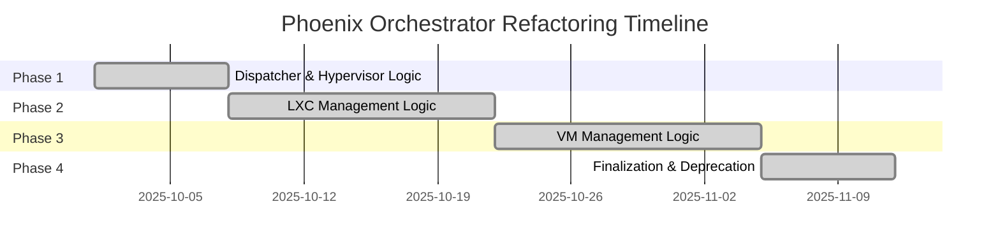

# Project Charter: Phoenix Orchestrator Refactoring

## 1. Executive Summary

This document chartered the formal project to refactor the `phoenix_orchestrator.sh` script. The current script, while functional, was a monolithic application that had accrued significant technical debt. This refactoring initiative was a critical step in the evolution of the Phoenix Hypervisor, transforming the orchestrator into a modular, maintainable, and user-friendly tool that aligns with the long-term strategic goals of Thinkheads.AI. The project has delivered a new, verb-first command-line interface (CLI) backed by a modular architecture, enhancing developer productivity, system reliability, and future extensibility.

## 2. Project Goals and Strategic Alignment

### 2.1. Project Goals

*   **Improve Maintainability:** Decompose the monolithic script into smaller, single-responsibility manager scripts, making the codebase easier to understand, modify, and debug.
*   **Enhance User Experience:** Implement an intuitive, verb-first CLI (`phoenix <verb> <target>`) that simplifies the user's interaction with the hypervisor.
*   **Increase Reliability:** Introduce robust error handling, idempotency, and dependency management to reduce the risk of failed deployments.
*   **Enable Extensibility:** Create a modular architecture that allows for the easy addition of new features and capabilities in the future.

### 2.2. Strategic Alignment

This project directly supported the following Thinkheads.AI strategic objectives:

*   **Operational Excellence:** By reducing technical debt and improving the reliability of our core infrastructure, we enhance our operational efficiency.
*   **Innovation and Agility:** A modular and extensible orchestrator will allow us to more rapidly develop and deploy new AI/ML services on the Phoenix Hypervisor platform.
*   **Developer Productivity:** A simplified and intuitive CLI has reduced the cognitive load on developers, allowing them to focus on building value-added features rather than wrestling with complex infrastructure.

## 3. Scope

### 3.1. In Scope

*   The complete refactoring of the `phoenix_orchestrator.sh` script into a new `phoenix` dispatcher and a set of manager scripts for the hypervisor, LXC containers, and VMs.
*   The implementation of a verb-first CLI as defined in the `unified_cli_refactor_proposal.md`.
*   The implementation of dependency resolution and execution ordering in the dispatcher.
*   The creation of a comprehensive test suite for the new orchestrator.
*   The updating of all relevant documentation.

### 3.2. Out of Scope

*   The introduction of any new features or functionality not directly related to the refactoring.
*   The refactoring of any other scripts in the Phoenix Hypervisor ecosystem.
*   The introduction of a new programming language or technology stack. The refactoring was done entirely in shell script.

## 4. Key Deliverables

1.  **Project Plan:** This document.
2.  **Refactored Orchestrator:** The new `phoenix` CLI and its associated manager scripts.
3.  **Test Suite:** A comprehensive suite of unit, integration, and end-to-end tests.
4.  **Updated Documentation:** All user and developer documentation updated to reflect the new CLI and architecture.

## 5. High-Level Phased Timeline

This project was executed in four phases and is now complete.

## 6. Stakeholders

*   **Project Sponsor:** Technical VP
*   **Project Manager:** [Name TBD]
*   **Development Team:** [Name(s) TBD]
*   **Users:** All developers and system administrators who interact with the Phoenix Hypervisor.

## 7. Risk Management

| Risk | Probability | Impact | Mitigation Plan |
| :--- | :--- | :--- | :--- |
| Introduction of new bugs | Medium | High | A comprehensive, multi-layered testing strategy was implemented for each phase. |
| Negative impact on existing workflows | Low | Medium | The phased rollout allowed for iterative testing and feedback. |
| Project delays | Medium | Medium | The phased approach allowed for clear progress tracking. Regular check-ins were held to identify and address any roadblocks. |

## 8. Communication Plan

*   **Status Reports:** The project manager provided a weekly status report to all stakeholders.
*   **Documentation:** All documentation was updated in real-time as the project progressed.

## 9. Success Metrics

*   **Code Quality:** A reduction in code complexity was achieved.
*   **Reliability:** A reduction in the number of failed deployments and support incidents related to the orchestrator has been observed.
*   **User Satisfaction:** Positive feedback has been received from the development team on the usability of the new CLI.
*   **Project Timeline:** The project was completed within the defined timeline and budget.