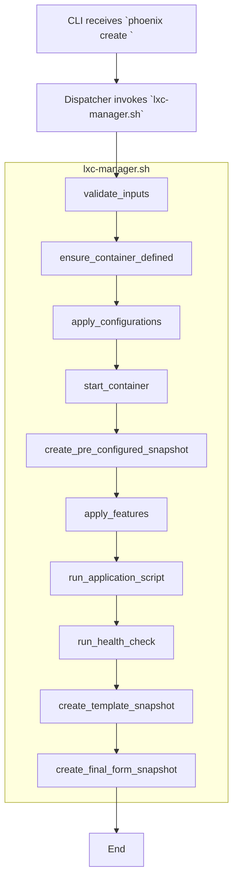
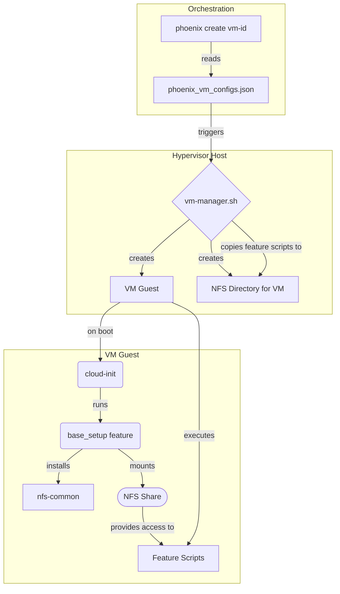
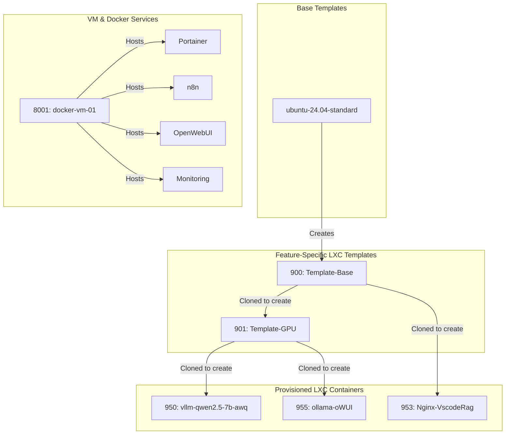
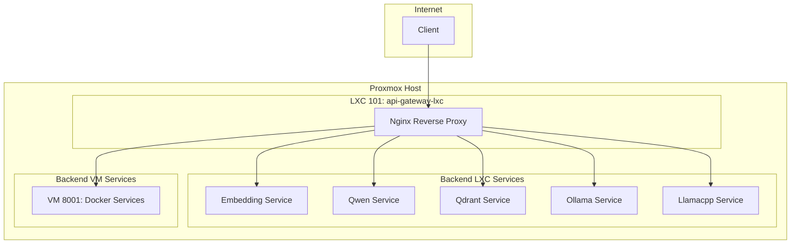

# The Phoenix Hypervisor: A Comprehensive Architectural Guide

## 1. Core Architecture & Principles

### 1.1. Introduction & Technical Vision

The technical vision for Thinkheads.AI is to achieve excellence through a declarative, idempotent, and automated infrastructure that enables the rapid and repeatable deployment of complex AI/ML/DL environments. This vision is embodied by the **Phoenix Hypervisor** project, a sophisticated Infrastructure-as-Code (IaC) solution that orchestrates both LXC containers and QEMU VMs on a local Proxmox server.

The Phoenix Hypervisor ecosystem is a powerful, single-node virtualization platform built on Proxmox. Its orchestration is managed by a central, idempotent `phoenix` CLI, which operates on a declarative configuration model using a set of JSON files. This design provides a strong foundation for managing complex AI/ML workloads.

### 1.2. Architectural Principles

The architecture is guided by a set of core principles that ensure a robust, efficient, and maintainable platform.

*   **Declarative Configuration**: The desired state of the entire system is defined in declarative JSON files. The orchestrator's job is to make the live system match this declaration, not to define the steps to get there. This simplifies management and reduces the risk of human error.
*   **Idempotency**: Operations are designed to produce the same result regardless of how many times they are executed. The `phoenix` CLI can be run safely at any time, and it will only make changes if there is a difference between the desired state and the current state.
*   **Modularity and Reusability**: Components are designed as independent, interchangeable modules. This is achieved through a sophisticated templating system for LXC containers and VMs, and a modular system of feature scripts.
*   **Configuration as Code**: Infrastructure and application configurations are managed as version-controlled code, enabling automated provisioning, consistent environments, and clear audit trails.
*   **Security by Design**: Security is integrated into the architecture from the ground up, including the use of AppArmor profiles, unprivileged containers, and declarative firewall rules.
*   **Open-Source First**: The project prioritizes the adoption and integration of free and open-source software solutions to minimize costs and leverage a vast ecosystem of tools.

### 1.3. High-Level System Architecture

The following diagram provides a comprehensive overview of the Phoenix Hypervisor ecosystem, including user interaction, orchestration, configuration management, and the virtualized resources.

```mermaid
graph TD
    subgraph "User"
        A[Developer/Admin]
    end

    subgraph "Phoenix Hypervisor (Proxmox Host)"
        B[phoenix CLI]
        C[Configuration Files]
        D[LXC Containers]
        E[Virtual Machines]
        F[Storage Pools]
        G[Networking]
    end

    subgraph "Configuration Files"
        C1[/etc/phoenix_hypervisor_config.json]
        C2[/etc/phoenix_lxc_configs.json]
        C3[/etc/phoenix_vm_configs.json]
    end

    A -- Manages --> B
    B -- Reads --> C1
    B -- Reads --> C2
    B -- Reads --> C3
    B -- Provisions/Manages --> D
    B -- Provisions/Manages --> E
    B -- Manages --> F
    B -- Configures --> G

## 2. Configuration Management

### 2.1. The Role of Declarative Configuration

The most significant architectural pillar of the Phoenix Hypervisor is its shift from imperative scripting to a centralized, schema-driven JSON configuration. This decouples the **"what"** (the desired state defined in JSON) from the **"how"** (the execution logic in the shell scripts).

This declarative approach ensures that our infrastructure is reproducible, version-controlled, and can be easily modified and extended.

### 2.2. Configuration File Overview

The entire system's state is defined across three core JSON files:

*   **`phoenix_hypervisor_config.json`**: Defines global settings for the Proxmox environment, including networking, storage (ZFS), users, shared volumes, and hypervisor-level features.
*   **`phoenix_lxc_configs.json`**: Provides detailed configurations for each LXC container, specifying resources, features (e.g., Docker, NVIDIA, vLLM, Ollama), application-specific scripts, and security policies.
*   **`phoenix_vm_configs.json`**: Defines the configurations for virtual machines, including their source templates, resources, and features.

### 2.3. Configuration Data Dictionary

A comprehensive data dictionary for all keys and values within these JSON files is maintained to ensure clarity and consistency. It provides detailed explanations for each configuration option, making the system easier to understand, operate, and extend.

### 2.4. Schema and Validation

Each configuration file is validated against a corresponding JSON schema (`*.schema.json`). This ensures data integrity, prevents common configuration errors, and enforces a consistent structure across the environment.

## 3. Orchestration

The orchestration in `phoenix_hypervisor` is handled by an intelligent entry point that manages the entire lifecycle of the system in a predictable, repeatable manner.

### 3.1. The `phoenix` CLI

The `phoenix` CLI is the cornerstone of the Phoenix Hypervisor's automation strategy. It serves as the single point of entry for all provisioning, management, and testing tasks, ensuring a consistent, repeatable, and idempotent process. The CLI uses an intuitive, verb-first command structure (e.g., `phoenix setup`, `phoenix create <ID>`).

### 3.2. Dispatcher-Manager Architecture

The `phoenix` script acts as a **dispatcher**, parsing verb-first commands and routing them to the appropriate **manager** script (`hypervisor-manager.sh`, `lxc-manager.sh`, `vm-manager.sh`). Each manager implements a state machine for its domain, ensuring idempotent and robust execution. This separation of concerns makes the system easy to extend and maintain.

### 3.3. Orchestration Workflows

The orchestration is divided into three primary workflows, each managed by its specialized script.

#### 3.3.1. Hypervisor Setup

Triggered by `phoenix setup`, this workflow prepares the Proxmox host. The `hypervisor-manager.sh` executes a series of setup functions in a specific order, including ZFS configuration, network setup, driver installation, and firewall configuration.

```mermaid
graph TD
    A[CLI receives `phoenix setup`] --> B[Dispatcher invokes `hypervisor-manager.sh`];
    subgraph "hypervisor-manager.sh"
        direction TB
        C1[setup_zfs()]
        C2[configure_network()]
        C3[install_drivers()]
        C4[setup_firewall()]
    end
    B --> C1 --> C2 --> C3 --> C4;
    C4 --> D[Return Success/Failure];
    D --> E[End];
```

#### 3.3.2. LXC Container Construction

Triggered by commands like `phoenix create <ID>`, this workflow is managed by `lxc-manager.sh`, which implements a state machine for the container lifecycle.



#### 3.3.3. VM Construction

Triggered by `phoenix create <ID>`, this workflow is managed by `vm-manager.sh`. The process has been re-architected to use a persistent NFS share for feature script delivery, replacing the previous ISO-based method.



### 3.4. Inter-Script Communication

Communication between the `phoenix` dispatcher and the manager scripts is handled exclusively through command-line arguments. This ensures optimal decoupling, as the manager scripts are self-contained and can be tested in isolation.

## 4. Virtualization

The Phoenix Hypervisor orchestrates both LXC containers and QEMU/KVM Virtual Machines, leveraging a sophisticated, multi-layered templating strategy to ensure consistency and rapid provisioning.

### 4.1. LXC Container Management

LXC containers are the primary virtualization technology used for hosting AI/ML workloads and services. The `lxc-manager.sh` script manages their entire lifecycle, from creation and configuration to startup and feature application, all driven by the declarative definitions in `phoenix_lxc_configs.json`.

### 4.2. VM Management

Virtual Machines are used for development environments that require a full OS. The `vm-manager.sh` script manages their lifecycle, driven by `phoenix_vm_configs.json`.

The feature installation process now leverages a persistent NFS share for each VM. This provides a stable and reliable channel for script delivery and data persistence. The `phoenix_vm_configs.json` schema has been extended to support a `volumes` array, allowing for the declarative mounting of storage, including the dedicated NFS share for feature scripts.

A new `base_setup` feature has been introduced to handle prerequisite installations (like `nfs-common`) and the mounting of this persistent storage inside the guest. This new architecture simplifies the `vm-manager.sh` script by removing all ISO creation and management logic.

### 4.3. Templating Strategy

The system uses a hierarchical, snapshot-based template structure to optimize the creation of both VMs and LXCs. This allows for the creation of "golden" templates with common features (e.g., base setup, NVIDIA drivers, Docker), which can then be cloned to create more specialized containers and VMs.

#### 4.3.1. Lifecycle Snapshots

To enhance idempotency and provide well-defined restore points, the orchestration engine creates two standardized snapshots during the `create` workflow for containers with `enable_lifecycle_snapshots` set to `true`:

*   **`final-form`**: This snapshot is taken after all provisioning steps are complete, including feature installation, application scripts, and health checks. It represents the fully provisioned and validated state of the container.

The `template_snapshot_name` property is used to create a persistent, named snapshot for containers that are intended to be used as cloneable templates. By convention, this is set to `final-form` to ensure that cloned containers inherit a fully provisioned state.



## 5. Networking

A shared network facilitates internal communication between all virtualized resources, while a dedicated API gateway provides a secure and managed entry point for all services.

### 5.1. Network Topology

The network is configured with a single bridge (`vmbr0`) that provides connectivity for all LXC containers and VMs. IP addresses, gateways, and DNS settings are all managed declaratively through the `phoenix_hypervisor_config.json` and `phoenix_lxc_configs.json` files.

### 5.2. API Gateway (NGINX)

LXC container `101` functions as a multi-service Nginx reverse proxy and API gateway. This container serves as a secure and efficient entry point for a variety of backend services, aligning with modern microservice architecture principles. The configuration is managed declaratively, with site configurations stored in the project repository and mounted into the container.



### 5.3. Firewall Management

Firewall management is handled declaratively through the `phoenix_hypervisor_config.json` and `phoenix_lxc_configs.json` files. The `phoenix` CLI applies the firewall rules during container provisioning, ensuring a consistent and reproducible security posture.

## 6. Storage

The Phoenix Hypervisor's storage architecture is built on a declarative model, with ZFS as its foundation. The desired state of all storage resources is defined in `phoenix_hypervisor_config.json`, and a series of idempotent scripts are responsible for implementing this state.

The system utilizes ZFS for its robust and high-performance pools and datasets. These are then exposed to the Proxmox environment and guest machines through direct integration, NFS shares, and Samba (SMB/CIFS) shares, providing a flexible and powerful storage solution.

For a comprehensive deep dive into the storage architecture, including ZFS, NFS, and Samba configuration, implementation details, and architectural diagrams, please refer to the **[Phoenix Hypervisor Storage Architecture Guide](../03_phoenix_hypervisor_implementation/00_guides/14_storage_architecture_guide.md)**.

## 7. Security

Security is a foundational principle of the Phoenix Hypervisor, with a multi-layered approach that includes mandatory access control, container isolation, and declarative security policies.

### 7.1. AppArmor Deep Dive

The primary goal with AppArmor is to enforce the **principle of least privilege** for all LXC containers. By default, containers run with a restrictive security profile that only allows the operations necessary for their specific function.

*   **Declarative Security:** AppArmor profiles are managed as code and are an integral part of the container's definition in `phoenix_lxc_configs.json`.
*   **Centralized Management:** The `phoenix` CLI is the single point of entry for applying AppArmor profiles, ensuring that all containers are configured according to defined policies.
*   **Profile Granularity:** A suite of custom profiles has been developed for specific use cases (e.g., `lxc-docker-nested`, `lxc-gpu-docker-storage`, `lxc-phoenix-v2`), allowing for tailored permissions.

The `hypervisor_feature_setup_apparmor.sh` script is the single source of truth for deploying and reloading AppArmor profiles, while `lxc-manager.sh` is responsible for applying the profiles to the containers based on the `apparmor_profile` key in the configuration.

### 7.2. Docker Security

The recommended approach for running Docker workloads is within a dedicated Virtual Machine (e.g., `docker-vm-01`). This provides a higher level of isolation and security compared to running Docker within an LXC container. While Docker-in-LXC is still possible, it should be reserved for specific use cases where the overhead of a full VM is not justified.

### 7.3. User and Secret Management

Administrative users are defined declaratively in `phoenix_hypervisor_config.json`. Future evolution of the platform will include the introduction of a centralized and secure method for managing secrets, such as a GPG-encrypted vault, to eliminate hardcoded credentials.

## 8. Workloads & Features

The Phoenix Hypervisor is designed to host and manage demanding AI tasks, including LLM inference, image processing, and isolated development environments. This is achieved through a modular system of "features" that can be applied to both LXC containers and VMs.

### 8.1. Modular Feature Installation

Features such as Docker, NVIDIA drivers, and vLLM are installed through a modular system of scripts located in the `lxc_setup` and `vm_features` directories. The `features` array in the `phoenix_lxc_configs.json` and `phoenix_vm_configs.json` files allows for the declarative application of these features to any container or VM.

### 8.2. GPU Passthrough (NVIDIA)

The hypervisor is configured to support NVIDIA GPU passthrough to both LXC containers and VMs. The `gpu_assignment` key in `phoenix_lxc_configs.json` allows for the declarative assignment of specific GPUs to containers. Careful scheduling and dynamic release mechanisms are implemented to manage the dual RTX 5060 Ti GPUs, preventing clashes between concurrent workloads.

### 8.3. vLLM Deployment

The deployment of vLLM containers has been refactored to a declarative, two-script model that enhances modularity and aligns with our core architectural principles.

*   **Declarative Configuration**: The entire vLLM service is now defined by a structured `vllm_engine_config` object within `phoenix_lxc_configs.json`. This object mirrors the official vLLM Engine Arguments, providing a clear and robust method for configuring the model, cache, parallelism, and server settings.

*   **Separation of Concerns**:
    *   The feature script, `phoenix_hypervisor_feature_install_vllm.sh`, is solely responsible for installing the required software dependencies (vLLM, PyTorch, FlashInfer) at specific versions.
    *   A dedicated application script, `phoenix_hypervisor_lxc_vllm.sh`, is responsible for dynamically generating the `vllm_model_server.service` file based on the `vllm_engine_config` and deploying it.

*   **New FP8 Template**: A new template, `Template-VLLM-FP8` (CTID 921), has been introduced for FP8 quantization. It is cloned from the base GPU template (901) to ensure a clean environment, free from legacy configurations. This new, streamlined process serves as the blueprint for all future vLLM deployments.

### 8.4. Docker Integration

Docker is now primarily integrated through a dedicated VM (`docker-vm-01`), which hosts all Docker-based services. This approach centralizes Docker management and improves security and isolation. The `docker` feature can still be applied to LXC containers, but the VM-based approach is the recommended standard.

## 9. Testing & QA

The `phoenix test` command allows for post-deployment validation of containers and the hypervisor itself, executing test suites defined in the configuration files.

### 9.1. Testing Strategy

The quality assurance strategy is built upon the same core principles that guide the architecture of the Phoenix Hypervisor itself: declarative, idempotent, and modular. The `tests` key in the `phoenix_hypervisor_config.json` and `phoenix_lxc_configs.json` files allows for the declarative definition of test suites.

### 9.2. Health Checks

The `health_checks` directory contains a suite of scripts for verifying the health of individual services. These scripts are executed by the `phoenix` CLI and check for running processes, API responsiveness, and other service-specific indicators.

### 9.3. Integration Tests

Integration tests are defined for various components to ensure they function correctly within the broader ecosystem. For example, the vLLM containers have integration tests to verify context window and responsiveness, while Docker containers have tests to validate the storage driver and AppArmor confinement.

## 10. Operations & Troubleshooting

This section provides solutions to common issues that may arise when working with the Phoenix Hypervisor.

### 10.1. General Troubleshooting Steps

1.  **Check CLI and Manager Logs:** The `phoenix` CLI and its associated manager scripts are the primary entry points for all operations. Their logs are the first place to look for errors.
2.  **Validate Configuration:** Ensure that your JSON configuration files are valid and match their respective schemas.
3.  **Check Service Status:** If a service inside a container or VM is not working, check its status using `systemctl status <service>` or `journalctl -u <service>`.

### 10.2. Common Issues and Resolutions

*   **LXC Container Fails to Start:** Check the container's configuration, system logs for AppArmor denials, and try starting the container in debug mode.
*   **Docker Issues:** With the migration to a dedicated VM, Docker-related issues are now isolated to that environment. Check the Docker daemon logs within the VM (`journalctl -u docker`) and the container logs (`docker logs <container_name>`).
*   **Network Issues:** Verify the container's IP address, gateway, and bridge configuration. Check the host's firewall rules and use `ping` and `traceroute` to diagnose connectivity.
*   **VM Fails to Start:** Check the VM's configuration, review the Proxmox task logs, and access the VM's console to check for boot errors.
*   **Cloud-Init Issues:** Check the generated Cloud-Init files and review the Cloud-Init logs inside the VM at `/var/log/cloud-init.log`.