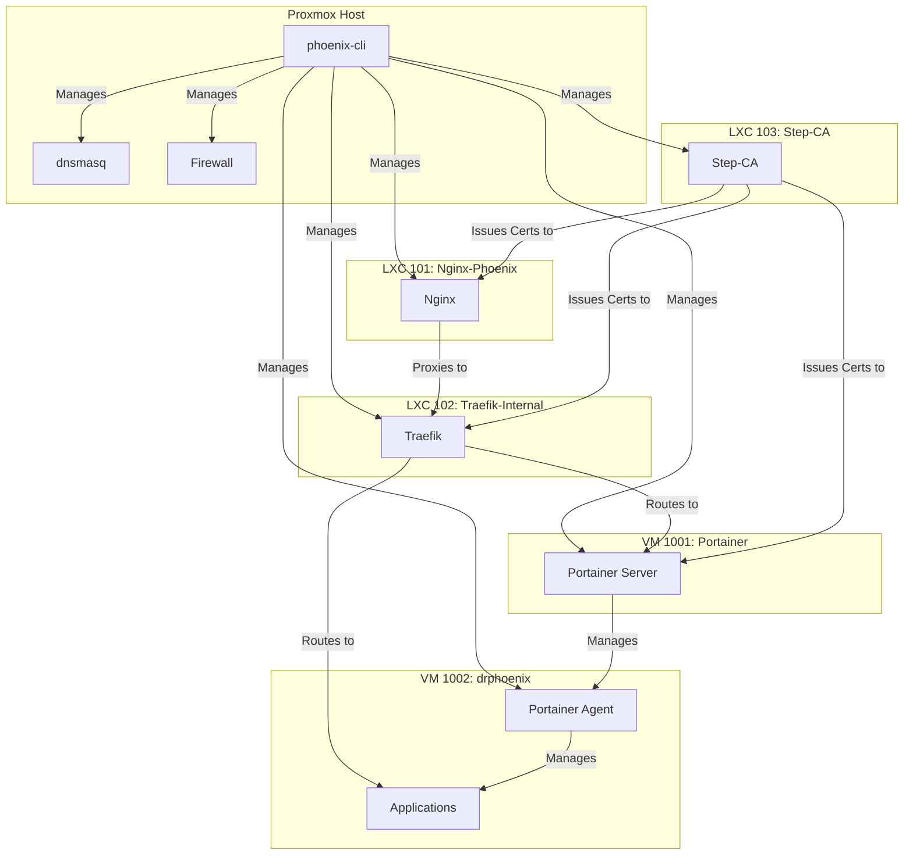

# Phoenix Hypervisor Architecture Overview

This document provides a high-level overview of the core components of the Phoenix Hypervisor system, outlining their purpose and how they integrate to form a cohesive and automated infrastructure.

## Core Components

### LXC 103: Step-CA
*   **Purpose**: The trusted certificate authority for the entire internal network. It is responsible for issuing and renewing all TLS certificates for the internal services.
*   **Integration**: It is the first component to be brought online, as all other secure services depend on it for their certificates.

### LXC 101: Nginx-Phoenix
*   **Purpose**: The primary entry point for all external traffic. It acts as the sole TLS termination point for the entire internal network and proxies all traffic to the internal Traefik service mesh.
*   **Integration**: It depends on Step-CA (103) for its TLS certificate and is the gateway for all other services.

### LXC 102: Traefik-Internal
*   **Purpose**: The internal service mesh and reverse proxy. It is responsible for routing traffic to the appropriate backend service based on the hostname.
*   **Integration**: It receives all its traffic from the Nginx gateway (101) and is responsible for routing it to the appropriate LXC or VM.

### VM 1001: Portainer
*   **Purpose**: The centralized management UI for the Docker environments. It is responsible for deploying and managing all the Docker stacks.
*   **Integration**: It is the primary control plane for all the application-level services and is managed by the `portainer-manager.sh` script.

### VM 1002: drphoenix
*   **Purpose**: The primary application host. It runs the Portainer agent and is the target for all the application-level Docker stacks.
*   **Integration**: It is managed by the Portainer server (1001) and is the host for all the core applications.

## Architecture & Workflow Diagram

