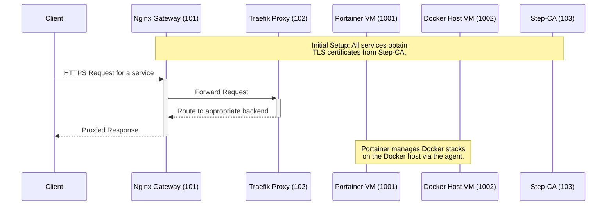

# Phoenix Component Interaction Overview

This document details the interactions between the core components of the Phoenix Hypervisor environment, focusing on the infrastructure LXCs and the primary VMs.

## Purpose and Integration of Key Components

### LXC 103: Step-CA (The Root of Trust)

*   **Purpose:** To provide a centralized Certificate Authority for the entire internal network. This ensures that all communication between services is encrypted and authenticated.
*   **Integration:**
    *   Issues a root CA certificate that must be trusted by all other VMs and LXCs.
    *   Provides an ACME interface for automated certificate issuance and renewal.
    *   Is the first component to be set up in the infrastructure chain, as all other services depend on it for their TLS certificates.

### LXC 102: Traefik-Internal (The Service Mesh)

*   **Purpose:** To act as a reverse proxy that routes traffic to the appropriate backend services. It simplifies service discovery and provides a unified entry point for all internal applications.
*   **Integration:**
    *   Depends on LXC 103 to obtain its own TLS certificate for its dashboard and for terminating TLS from the Nginx gateway.
    *   Dynamically discovers and routes to services defined in the `phoenix_lxc_configs.json` and `phoenix_vm_configs.json` files.
    *   Receives traffic from the Nginx gateway (LXC 101).

### LXC 101: Nginx-Phoenix (The Front Door)

*   **Purpose:** To serve as the primary ingress point for all traffic into the hypervisor environment. It provides a secure and stable entry point that separates the internal service mesh from the external network.
*   **Integration:**
    *   Depends on LXC 103 for its TLS certificates.
    *   Forwards all valid traffic to the Traefik proxy in LXC 102.
    *   Handles the initial TLS termination, which can offload processing from the internal services.

### VM 1001: Portainer (The Control Plane)

*   **Purpose:** To provide a centralized management interface for all Docker containers running on the Docker hosts.
*   **Integration:**
    *   Depends on the full infrastructure stack (103, 102, 101) to be accessible via its FQDN (`portainer.internal.thinkheads.ai`).
    *   Communicates with the Portainer agent on VM 1002 to manage its Docker environment.
    *   The `phoenix sync all` command interacts heavily with its API to deploy and manage Docker stacks.

### VM 1002: drphoenix (The Workhorse)

*   **Purpose:** To serve as the primary Docker host for running application workloads.
*   **Integration:**
    *   Runs the Portainer agent, which allows it to be managed by the Portainer server in VM 1001.
    *   Hosts the application stacks, such as `qdrant_service` and `thinkheads_ai_app`.
    *   Depends on the infrastructure stack for DNS resolution and secure communication.

## Interaction Diagram

The following diagram illustrates the flow of a typical request from an external client to a service running in a Docker container on VM 1002:

This detailed component breakdown completes the foundational analysis. The next phase will focus on the `phoenix sync all` workflow to identify specific areas of potential failure.