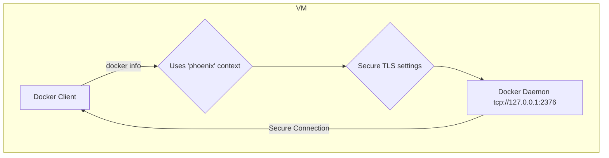

# Docker Installation and Swarm Workflow Analysis (Revised)

This document outlines the process of Docker installation, configuration, and Swarm initialization within the Phoenix Hypervisor environment. It analyzes the root cause of the Docker communication errors and presents a definitive solution.

## I. Docker Installation and mTLS Configuration (`feature_install_docker.sh`)

The process begins when a new VM is provisioned. The `feature_install_docker.sh` script is responsible for setting up a secure Docker environment.

1.  **Install Docker Engine**: Standard installation of `docker-ce`.
2.  **Generate and Place Certificates**: The hypervisor generates TLS certificates for the Docker daemon and places them in `/etc/docker/tls/` inside the VM.
3.  **Configure Docker Daemon (`/etc/docker/daemon.json`)**: The script creates a `daemon.json` file that instructs the Docker daemon to:
    *   Enable TLS (`"tls": true`).
    *   Use the provided certificates (`tlscert`, `tlskey`, `tlscacert`).
    *   Listen for connections on a secure TCP socket (`tcp://0.0.0.0:2376`).

## II. Docker Client Context Configuration (`feature_install_docker_proxy.sh`)

This is the intended method for secure client communication.

1.  **Create Docker Context**: The script creates a Docker client context named `phoenix`.
2.  **Context Details**: This context bundles all the necessary connection information:
    *   The daemon's secure address (`host=tcp://127.0.0.1:2376`).
    *   The paths to the required TLS certificates (`ca`, `cert`, `key`).
3.  **Set Default Context**: The script sets `phoenix` as the default context. This means any subsequent `docker` command run by that user will automatically use these secure settings without needing extra flags or environment variables.

### Mermaid Diagram: The Intended Workflow

## III. The Breakdown in Orchestration (`portainer-manager.sh`)

The `portainer-manager.sh` script, running on the hypervisor, bypasses the secure context that was so carefully set up.

1.  **`run_docker_command_in_vm` function**: This is the source of the problem.
2.  **`export DOCKER_HOST=tcp://10.0.0.111:2376`**: This line overrides the default `phoenix` context and forces the Docker client to make an **insecure HTTP** request to the daemon.
3.  **The Conflict**: The client sends an `http://` request, but the daemon is only listening for `https://`. This causes the `Client sent an HTTP request to an HTTPS server` error.

## IV. The Definitive Solution

The fix is to align the management script with the secure architecture we've designed. We must modify `portainer-manager.sh` to respect the Docker context.

1.  **Remove `DOCKER_HOST`**: The `export DOCKER_HOST=...` line must be completely removed from the `run_docker_command_in_vm` function.
2.  **Rely on the Default Context**: With `DOCKER_HOST` gone, the Docker client will automatically fall back to using the default `phoenix` context, which is configured for secure communication.
3.  **Run the Proxy Script**: We must ensure that the `feature_install_docker_proxy.sh` script is run *after* the certificates are renewed and placed, so the context is always up-to-date.

## V. New Plan

1.  **Update `portainer-manager.sh`**: Modify the `run_docker_command_in_vm` function to remove the `DOCKER_HOST` export.
2.  **Ensure Context Script Runs**: Add a step in `portainer-manager.sh` to explicitly run the `feature_install_docker_proxy.sh` script inside the VM after certificate renewal.
3.  **Verify**: Re-run the `sync all` command to confirm that all Docker commands now succeed.
