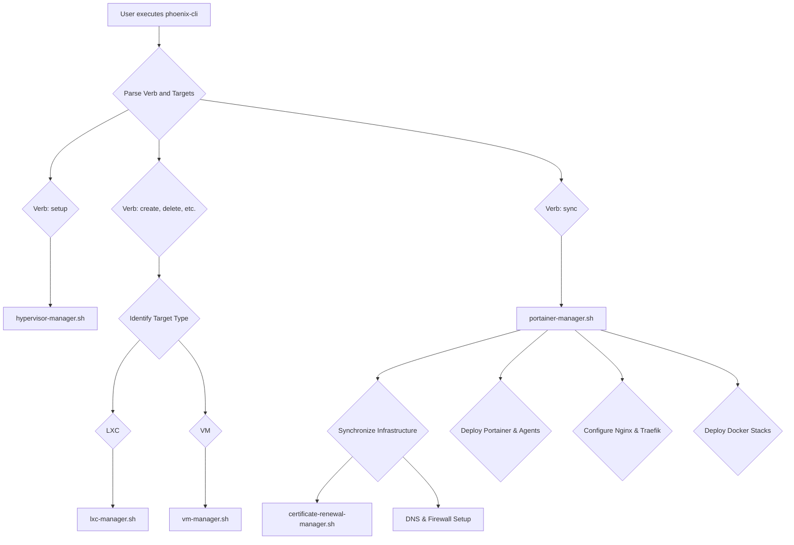

# Phoenix CLI Architecture Analysis

This document provides a comprehensive analysis of the `phoenix-cli` tool, its architecture, and the interplay between its various components.

## Core Philosophy

The `phoenix-cli` is designed as a centralized dispatcher that provides a unified interface for managing a complex Proxmox-based hypervisor environment. It follows a declarative model, where the desired state of the system is defined in a series of JSON configuration files. The CLI's primary responsibility is to interpret user commands and orchestrate the execution of specialized manager scripts to bring the system to its desired state.

## Key Components

The system is comprised of several key components:

*   **`phoenix-cli`:** The main entry point for all operations. It parses verbs (e.g., `create`, `sync`) and targets (e.g., `101`, `1001`) and dispatches them to the appropriate manager.
*   **Configuration Files (`/usr/local/phoenix_hypervisor/etc/`):**
    *   `phoenix_hypervisor_config.json`: Defines global settings for the hypervisor, including networking, storage, and firewall policies.
    *   `phoenix_lxc_configs.json`: Contains detailed configurations for each LXC container.
    *   `phoenix_vm_configs.json`: Contains detailed configurations for each Virtual Machine.
    *   `certificate-manifest.json`: A declarative manifest of all TLS certificates required by the system.
*   **Manager Scripts (`/usr/local/phoenix_hypervisor/bin/managers/`):**
    *   `hypervisor-manager.sh`: Manages the initial setup and configuration of the Proxmox host itself.
    *   `lxc-manager.sh`: Handles the lifecycle of LXC containers (create, delete, start, stop).
    *   `vm-manager.sh`: Manages the lifecycle of VMs.
    *   `portainer-manager.sh`: Orchestrates the deployment of Portainer and the synchronization of Docker stacks.
    *   `certificate-renewal-manager.sh`: Manages the renewal of TLS certificates based on the manifest.

## Workflow Visualization

The following diagram illustrates the high-level workflow of the `phoenix-cli`:

## Analysis of Key LXCs and VMs

### Infrastructure LXCs

*   **LXC 103 (Step-CA):** This is the root of trust for the entire internal network. It runs the Smallstep CA, which is responsible for issuing TLS certificates to all internal services. Its proper functioning is critical for secure communication between all components.
*   **LXC 102 (Traefik-Internal):** This container runs the Traefik reverse proxy, which is responsible for routing traffic to the various backend services (e.g., Portainer, vLLM models). It obtains its TLS certificates from LXC 103 via the ACME protocol.
*   **LXC 101 (Nginx-Phoenix):** This container serves as the primary gateway for all external traffic. It terminates TLS connections using certificates from Step-CA and then forwards traffic to the Traefik proxy in LXC 102. This two-tiered proxy architecture provides a layer of security and flexibility.

### Core VMs

*   **VM 1001 (Portainer):** This VM runs the primary Portainer server instance. It is the central management point for all Docker containers running in the environment. The `phoenix sync all` command heavily interacts with this VM to deploy and manage Docker stacks.
*   **VM 1002 (drphoenix):** This VM runs the Portainer agent and serves as the primary Docker host for application workloads, such as the `qdrant_service` and `thinkheads_ai_app`. It is registered as an environment within the Portainer server in VM 1001.

This foundational analysis clarifies the roles and interactions of the core components. The next phase will delve deeper into the specific workflows to identify potential failure points.