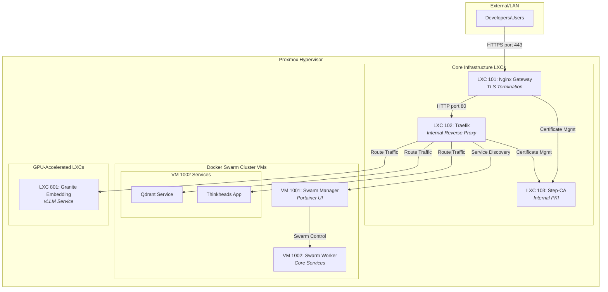

# Best Practices Guide: The Phoenix Server Architecture
**Version 1.0** | **November 16, 2025**
**Target Audience:** Development & Platform Engineering Teams
**Author:** Roo – Compiled for Internal Use

---

## 1. Executive Summary

This document provides a comprehensive guide to developing and deploying services on the Phoenix Server. It contrasts our automated, declarative architecture with general industry best practices, highlighting the specific workflows required for our platform. The core principle of the Phoenix Server is **Infrastructure as Code (IaC)**: all components, from firewall rules to service deployments, are defined in configuration files and orchestrated by the `phoenix-cli`. This approach ensures consistency, security, and rapid, repeatable deployments.

This guide will serve as the single source of truth for your development team when deploying and managing services.

---

## 2. Architecture Deep Dive: Phoenix Server vs. General Best Practices

The Phoenix Server implements a sophisticated, multi-layered architecture that aligns with modern best practices while providing a higher degree of automation and security than typical manual setups.

### 2.1 Phoenix Server Architecture Diagram



### 2.2 Comparison with General Best Practices

| Feature | General Guide's Approach | Phoenix Server's Implementation | **Phoenix Advantage & Analysis** |
| :--- | :--- | :--- | :--- |
| **Service Discovery** | Manual DNS entries `*.local`, Traefik file provider for static routes, and Docker provider for Swarm. | **Automated Hybrid Model:** DNS is automatically configured by `phoenix-cli`. Traefik's file provider is dynamically generated for LXC services, while it uses the native Docker provider for Swarm services. | **Superior Automation:** The Phoenix Server eliminates manual DNS and Traefik configuration, reducing the risk of human error. It correctly uses the best discovery method for each service type static for LXCs, dynamic for Swarm. |
| **TLS/SSL Security** | A single wildcard certificate is terminated at the edge Nginx. Internal traffic is unencrypted HTTP. | **Multi-Layered Zero-Trust:** Nginx terminates external TLS. However, Traefik, Portainer, vLLM, and other internal services obtain their own certificates from Step-CA, ensuring all internal traffic is also encrypted. | **Enhanced Security:** Our zero-trust model is an industry best practice. While more complex, it prevents lateral movement and eavesdropping within the cluster, a significant improvement over the guide's simpler model. |
| **Configuration & Deployment** | Manual creation of config files `traefik.yml`, `nginx.conf` and manual execution of `docker service create` commands. | **Fully Declarative & Automated:** All system aspects are defined in central JSON files. The `phoenix-cli` acts as an orchestration engine, reading these files to generate configurations, provision infrastructure, and deploy services. | **True Infrastructure as Code IaC:** This is the cornerstone of the Phoenix Server. It makes the entire platform reproducible, version-controllable, and auditable. The manual approach is brittle and not scalable. |
| **Network Architecture** | Recommends a single `attachable` overlay network for Traefik and Swarm services. | **Automated Swarm Networking:** The `swarm-manager.sh` and `portainer-manager.sh` scripts handle all Docker Swarm networking automatically during the `phoenix create` and `phoenix sync all` commands. | **Alignment & Automation:** Both architectures correctly identify the need for a shared overlay network. The Phoenix Server automates its creation and management, simplifying the developer experience. |
| **Firewall Management** | Suggests a high-level table of static firewall rules to be created manually in Proxmox. | **Granular & Automated Firewall:** Firewall rules are defined on a per-guest basis directly within `phoenix_lxc_configs.json` and `phoenix_vm_configs.json`. These rules are applied automatically during provisioning. | **Superior Security & Maintainability:** Our declarative, per-guest firewall rules are far more secure and easier to manage than a set of global, manually applied rules. |

---

## 3. Developer Workflow & Best Practices

Adherence to the following workflows is mandatory to ensure the stability and security of the platform. **Manual changes are not permitted and will be overwritten by the automation.**

### 3.1 Deploying a New Docker Swarm Service

This is the standard workflow for deploying stateless or stateful applications like web apps, databases, and other core services.

1.  **Create Stack Directory:** In the `/usr/local/phoenix_hypervisor/stacks/` directory, create a new folder for your service e.g., `my_new_app/`.
2.  **Add `docker-compose.yml`:** Create a standard `docker-compose.yml` file inside the new directory. **Do not use the `ports` or `expose` keywords.**
3.  **Create `phoenix.json` Manifest:** In the same directory, create a `phoenix.json` manifest. This file tells Traefik how to route traffic to your service.
    ```json
    {
      "environments": {
        "production": {
          "services": {
            "my_app_service_name": { 
              "traefik_labels": [
                "traefik.enable=true",
                "traefik.http.routers.my-app.rule=Host(`my-app.internal.thinkheads.ai`)",
                "traefik.http.routers.my-app.entrypoints=websecure",
                "traefik.http.services.my-app.loadbalancer.server.port=8080" 
              ]
            }
          }
        }
      }
    }
    ```
4.  **Assign Stack to VM:** Open [`phoenix_vm_configs.json`](usr/local/phoenix_hypervisor/etc/phoenix_vm_configs.json:1) and add the name of your stack directory to the `docker_stacks` array for the desired worker VM e.g., VM 1002.
5.  **Deploy:** Run the command `phoenix sync all`. This will synchronize the stack files, instruct Portainer to deploy the service, and configure Traefik for service discovery.

### 3.2 Deploying a New LXC Service e.g., GPU Worker

This workflow is reserved for specialized services that require direct hardware access, such as GPU-accelerated machine learning models.

1.  **Define LXC:** Open [`phoenix_lxc_configs.json`](usr/local/phoenix_hypervisor/etc/phoenix_lxc_configs.json:1) and create a new entry for your LXC. Specify its resources memory, cores, network configuration, GPU assignment, and any dependencies.
2.  **Configure vLLM if applicable:** For vLLM services, add the `vllm_engine_config` object to define the model, quantization, and server settings.
3.  **Define Routing:** Add a `traefik_service` object so the system knows how to route traffic to it.
4.  **Provision the LXC:** Run `phoenix create <new_lxc_id>`. This will build, configure, and start the container.
5.  **Update Network Routing:** Run `phoenix sync all`. This will update the central DNS server and Traefik's file-based configuration to include the new LXC service.

---

## 4. Immediate Goal: Deploying Qdrant and Granite Embedding

To achieve the immediate goal of getting Qdrant and the Granite Embedding model online, follow these steps in order:

1.  **Provision the Swarm Cluster:** This brings up the manager and worker nodes.
    ```bash
    phoenix create 1001 1002
    ```
2.  **Deploy Core Services including Qdrant:** The `sync all` command reads the `docker_stacks` configuration for VM 1002 and deploys Qdrant.
    ```bash
    phoenix sync all
    ```
3.  **Provision the Granite Embedding LXC:** This builds the dedicated GPU-accelerated container.
    ```bash
    phoenix create 801
    ```
4.  **Update Routing for Granite:** Run `sync all` again to make the rest of the network aware of the new LXC service.
    ```bash
    phoenix sync all
    ```

After these steps, `qdrant.internal.thinkheads.ai` and `granite-embedding.internal.thinkheads.ai` will be online and accessible within the internal network.
