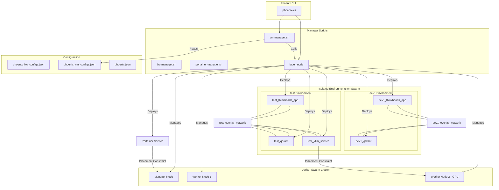

# Phoenix CLI: Docker Swarm Integration Enhancement Proposal

This document outlines a detailed plan to integrate Docker Swarm into the `phoenix-cli`, transitioning from a collection of standalone Docker hosts to a robust, multi-node orchestration cluster. This enhancement will enable the rapid deployment and management of isolated, multi-tenant application environments (e.g., `dev1`, `test`, `prod-copy`).

## 1. Core Objectives

*   **Environment Isolation:** Provide strong network and configuration isolation for different application environments.
*   **CLI-Driven Workflow:** Automate the entire lifecycle of these environments through `phoenix-cli` commands, minimizing manual UI interaction.
*   **Resource-Aware Scheduling:** Ensure services can be scheduled on specific nodes based on hardware requirements (e.g., GPUs).
*   **Simplified Management:** Present the entire cluster as a single entity to Portainer, which will act as a visual dashboard rather than a deployment tool.

## 2. Proposed Architecture Changes

The core of this proposal is to introduce a new `swarm-manager.sh` and extend the existing configuration and CLI to support Swarm-native concepts.

### 2.1. Configuration Schema Updates

To support the new Swarm architecture, we will extend the existing configuration files to include Swarm-specific attributes.

*   **`phoenix_vm_configs.json`:**
    *   Add a `swarm_role` attribute to each VM definition (`manager` or `worker`).
    *   Add a `node_labels` array to each VM definition for service placement constraints (e.g., `["gpu=true"]`).
*   **`phoenix.json` (for each stack):**
    *   Add a `placement_constraints` array to the service definition to control where services are deployed (e.g., `["node.labels.gpu == true"]`).

### 2.2. New `swarm-manager.sh` Script

A new manager script will be created to encapsulate all Swarm-related logic.

*   **Location:** `usr/local/phoenix_hypervisor/bin/managers/swarm-manager.sh`
*   **Responsibilities:**
    *   **`init_swarm`:** Initializes a new Swarm on the designated manager node.
    *   **`generate_join_tokens`:** Retrieves the join tokens for both managers and workers.
    *   **`join_swarm`:** Joins a worker node to the Swarm.
    *   **`label_node`:** Applies labels from `phoenix_vm_configs.json` to the corresponding Swarm node.
    *   **`deploy_stack`:** Deploys a Docker stack to the Swarm, creating environment-specific networks and naming conventions.
    *   **`remove_stack`:** Removes an environment-specific stack from the Swarm.
    *   **`get_swarm_status`:** Provides a summary of the Swarm's health.

### 2.3. `phoenix-cli` Enhancements

The main `phoenix-cli` script will be updated to include a new `swarm` verb.

*   **New Verb:** `swarm`
*   **Sub-commands:**
    *   **`phoenix swarm init`:** Initializes the Swarm cluster.
    *   **`phoenix swarm join <vmid>`:** Joins the specified VM to the Swarm.
    *   **`phoenix swarm deploy <stack_name> --env <environment_name>`:** Deploys the specified stack as a new, isolated environment.
    *   **`phoenix swarm rm <stack_name> --env <environment_name>`:** Removes the specified environment.
    *   **`phoenix swarm status`:** Displays the status of the Swarm.

### 2.4. Portainer as a Swarm Service

The existing Portainer deployment will be migrated to run as a Swarm service.

*   **`portainer_service/docker-compose.yml`:** The Compose file will be updated with a `deploy` key to specify that it should run as a replicated service on the manager node(s).
*   **`portainer-manager.sh`:** The `deploy_portainer_instances` function will be modified to use the new `swarm-manager.sh` to deploy Portainer as a service.

## 3. New Architecture Diagram

The following diagram illustrates the new, Swarm-based architecture:

## 4. Workflow Impact

The user workflow will be significantly streamlined:

1.  **One-Time Setup:** The user runs `phoenix sync all`. This command builds the VMs, initializes the Swarm, and deploys the Portainer dashboard service.
2.  **Environment Management:** The user can now create, update, and destroy isolated application environments using single `phoenix swarm` commands, without ever needing to log into the Portainer UI for deployment.
3.  **Monitoring:** The Portainer UI serves as a "pane of glass" for observing the state of the cluster and the various deployed environments.

This enhancement represents a significant step forward in the maturity of the `phoenix-cli`, enabling powerful, automated, and isolated environment management.