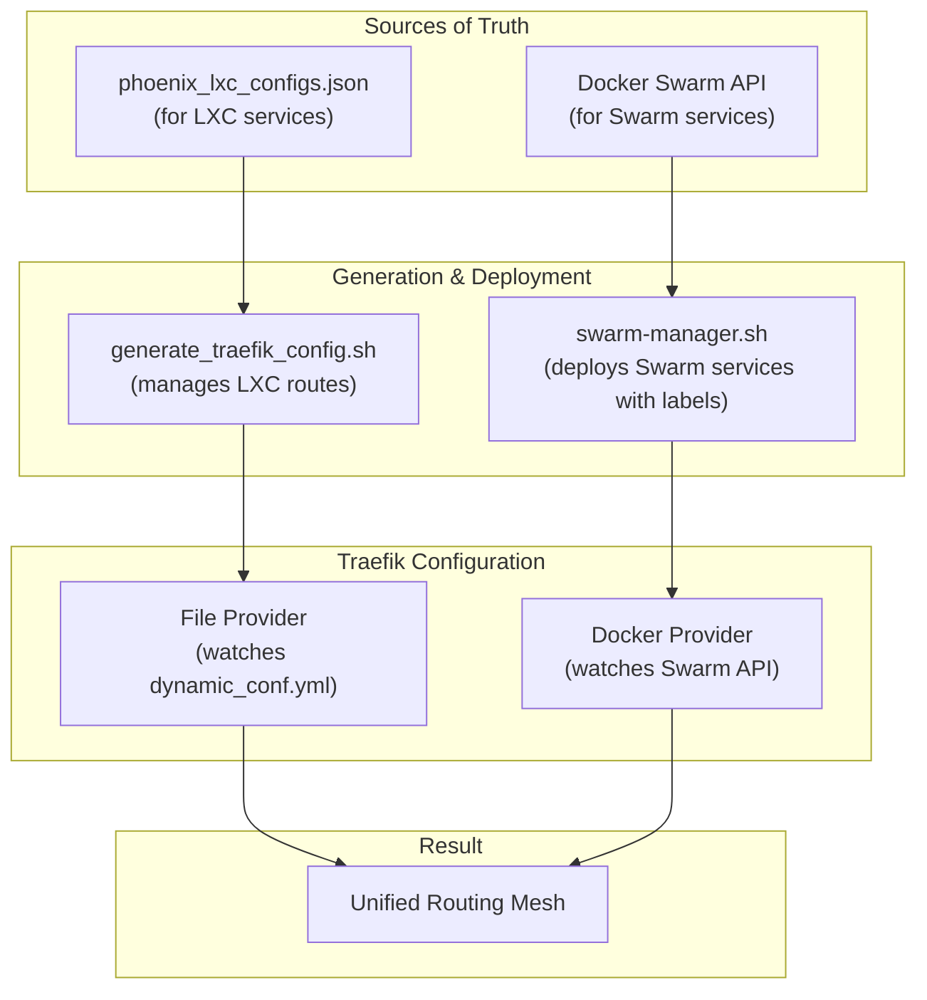

# Phoenix Hypervisor: Docker Swarm and Service Discovery Guide

This document provides a comprehensive overview of the Docker Swarm-centric workflow within the Phoenix Hypervisor ecosystem. It details the hybrid service discovery model, the end-to-end deployment automation provided by the `phoenix sync all` command, and a practical guide for deploying new services.

## 1. The Hybrid Service Discovery Model

The Phoenix Hypervisor employs a powerful hybrid service discovery model, leveraging two of Traefik's core providers in parallel to create a single, unified routing mesh.



### 1.1. File Provider (for Core Infrastructure)

-   **Purpose:** Provides stable, declarative routing for foundational LXC and VM-based services (e.g., Step-CA, NGINX, GPU workers).
-   **Mechanism:** The `generate_traefik_config.sh` script reads the `phoenix_lxc_configs.json` and `phoenix_vm_configs.json` files and generates a `dynamic_conf.yml` file. Traefik's `file` provider watches this file for changes.
-   **Workflow:** This configuration is updated whenever `phoenix sync all` is run.

### 1.2. Docker Provider (for Application Services)

-   **Purpose:** Provides dynamic, real-time service discovery for all containerized applications running on the Docker Swarm.
-   **Mechanism:** Traefik is configured to connect directly to the Docker Swarm manager's API. It automatically detects any running services, reads the `deploy.labels` attached to them, and creates the appropriate routing rules in memory.
-   **Workflow:** This configuration is updated in real-time, without any manual intervention, whenever a Docker stack is deployed, updated, or removed.

## 2. The `phoenix sync all` Workflow

The `phoenix sync all` command is the master "converge" operation for the entire application and infrastructure landscape. It is a single, idempotent command that brings the system into its desired state as defined by the configuration files.

The workflow proceeds in the following stages:

1.  **Infrastructure Convergence:** Synchronizes foundational services, including DNS, firewall rules, and TLS certificates.
2.  **Swarm Verification & Healing:** Ensures the Docker Swarm cluster is active, the manager is leading, and all worker nodes are correctly joined.
3.  **Core Service Deployment:** Deploys the Portainer service as a Docker Stack, which is essential for cluster management and observability.
4.  **Gateway & Proxy Configuration:** Configures the Traefik and NGINX gateways.
5.  **Application Stack Deployment (NEW):** Automatically discovers and deploys all application stacks (e.g., `qdrant_service`, `thinkheads_ai_app`) that are defined in the `docker_stacks` array of the `phoenix_vm_configs.json`.

## 3. Developer Guide: Deploying a New Service

Deploying a new containerized service is a fully declarative process.

### Step 1: Create the Stack Definition

Create a new directory for your service in the `stacks/` directory (e.g., `stacks/my_new_service/`). This directory must contain two files:

-   **`docker-compose.yml`:** A standard Docker Compose file defining your service, networks, and volumes.
-   **`phoenix.json`:** A manifest file that defines the environment-specific configurations for your service.

**Example: `stacks/my_new_service/phoenix.json`**

```json
{
    "description": "My new awesome service.",
    "environments": {
        "production": {
            "services": {
                "my_service": {
                    "traefik_labels": [
                        "traefik.enable=true",
                        "traefik.http.routers.my-service.rule=Host(`my-service.internal.thinkheads.ai`)",
                        "traefik.http.routers.my-service.entrypoints=web",
                        "traefik.http.services.my-service.loadbalancer.server.port=8080"
                    ]
                }
            }
        }
    }
}
```

### Step 2: Assign the Stack to a VM

In the `usr/local/phoenix_hypervisor/etc/phoenix_vm_configs.json` file, find the VM where you want to run your service (typically a Swarm worker) and add your new stack to the `docker_stacks` array.

**Example: `phoenix_vm_configs.json`**

```json
{
    "vmid": 1002,
    "name": "drphoenix",
    // ... other configurations ...
    "docker_stacks": [
        "qdrant_service",
        "thinkheads_ai_app",
        "my_new_service" // Add your new service here
    ]
}
```

### Step 3: Run the Sync Command

From the `usr/local/phoenix_hypervisor/bin` directory, run the master sync command:

```bash
./phoenix sync all
```

That's it. The `phoenix-cli` will automatically deploy your new stack to the Swarm, and Traefik will automatically discover the `traefik_labels` and make your service available at `http://my-service.internal.thinkheads.ai`.