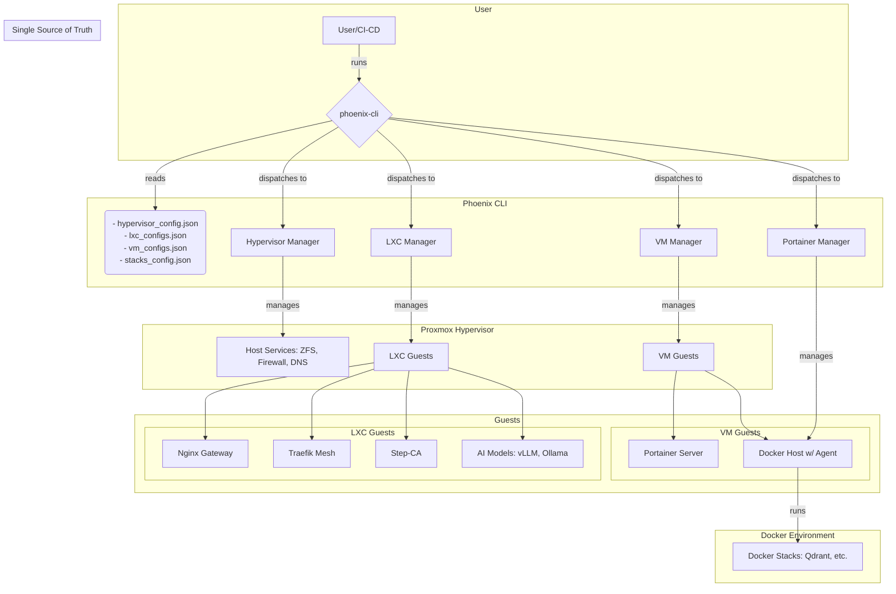
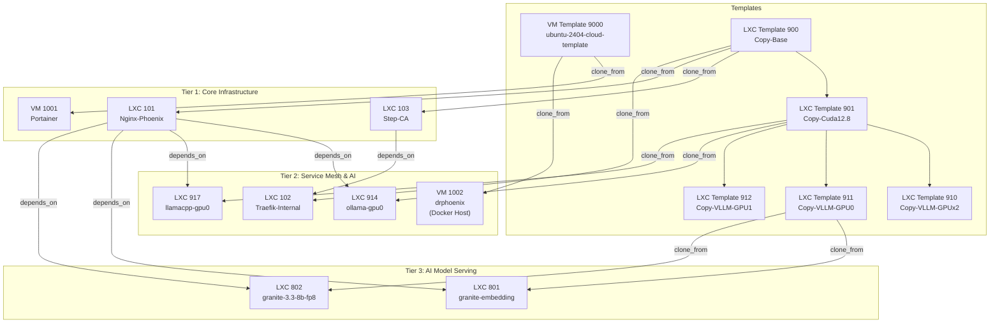

# Phoenix Hypervisor System Architecture Guide

## 1. Overview

The Phoenix Hypervisor project is a robust, declarative, and feature-based system for orchestrating the creation and configuration of LXC containers and Virtual Machines (VMs) on Proxmox. It is specifically tailored for AI and machine learning workloads.

The core of the project is the `phoenix-cli`, an idempotent orchestrator that manages the entire lifecycle of a virtualized resource based on a set of central JSON configuration files that act as a single source of truth.

### 1.1. Key Architectural Concepts

-   **Unified Orchestration**: The `phoenix-cli` provides a single point of entry for managing the hypervisor, LXC containers, and QEMU/KVM VMs.
-   **Declarative Configuration**: All hypervisor, VM, and container specifications are defined in `phoenix_hypervisor_config.json`, `phoenix_vm_configs.json`, `phoenix_lxc_configs.json`, and `phoenix_stacks_config.json`. This provides a clear, version-controllable definition of the desired system state.
-   **Idempotent Orchestration**: The CLI is designed to be stateless and idempotent. Running a command multiple times produces the same result, making deployments resilient and repeatable.
-   **Automated Dependency Resolution**: The CLI automatically builds a dependency graph for all guests and templates, ensuring that resources are created and started in the correct topological order.
-   **Hierarchical Templating**: The system uses a hierarchical, snapshot-based template structure to optimize the creation of both VMs and LXCs, allowing for layered feature inheritance.
-   **Modular Feature Installation**: Guest customization is handled through a series of modular, reusable "feature" scripts (e.g., for installing NVIDIA drivers, Docker, or vLLM).

## 2. System Architecture Diagram

This diagram provides a high-level overview of the entire system, from the CLI to the individual services running within the guests.



## 3. Guest Dependency and Template Architecture

The following diagram illustrates the build-time and run-time dependencies between all guest templates and active instances.



## 4. Orchestration Workflow

The `phoenix-cli` is the single entry point for all provisioning tasks. It acts as a dispatcher, parsing the user's command, resolving dependencies, and routing tasks to the appropriate manager script (`hypervisor-manager.sh`, `lxc-manager.sh`, `vm-manager.sh`, or `portainer-manager.sh`).

For a detailed breakdown of all available commands, see the **[Phoenix Hypervisor CLI Usage Guide](cli_usage_guide.md)**.

### 4.1. Data Access and Querying

To ensure robust and consistent access to configuration data, all scripts should use the centralized data access functions provided in `phoenix_hypervisor_common_utils.sh`. These functions provide a layer of validation and error handling that prevents silent failures when a configuration value is missing or null.

-   `get_global_config_value <jq_query>`: Retrieves a single value from the main `phoenix_hypervisor_config.json` file.
-   `jq_get_value <ctid> <jq_query>`: Retrieves a single value for a specific LXC container from the `phoenix_lxc_configs.json` file.
-   `jq_get_vm_value <vmid> <jq_query>`: Retrieves a single value for a specific VM from the `phoenix_vm_configs.json` file.
-   `jq_get_array <ctid> <jq_query>`: Retrieves an array of values for a specific LXC container.

**Example Usage:**

```bash
# Get the domain name from the global config
DOMAIN=$(get_global_config_value '.domain_name')

# Get the memory allocation for LXC container 101
MEMORY=$(jq_get_value "101" ".memory_mb")

# Get the list of features for VM 1001
FEATURES=$(jq_get_vm_value "1001" ".features[]")
```