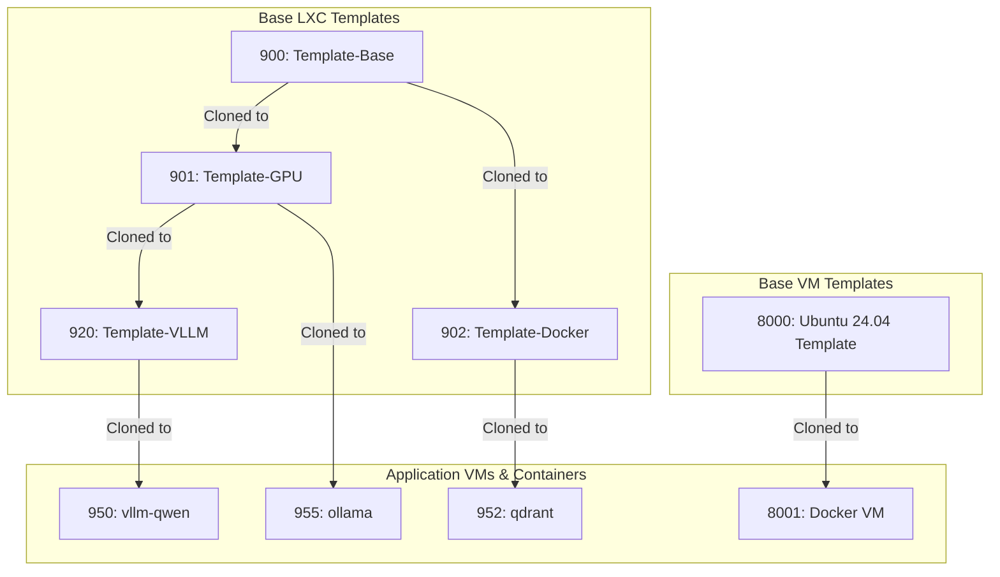
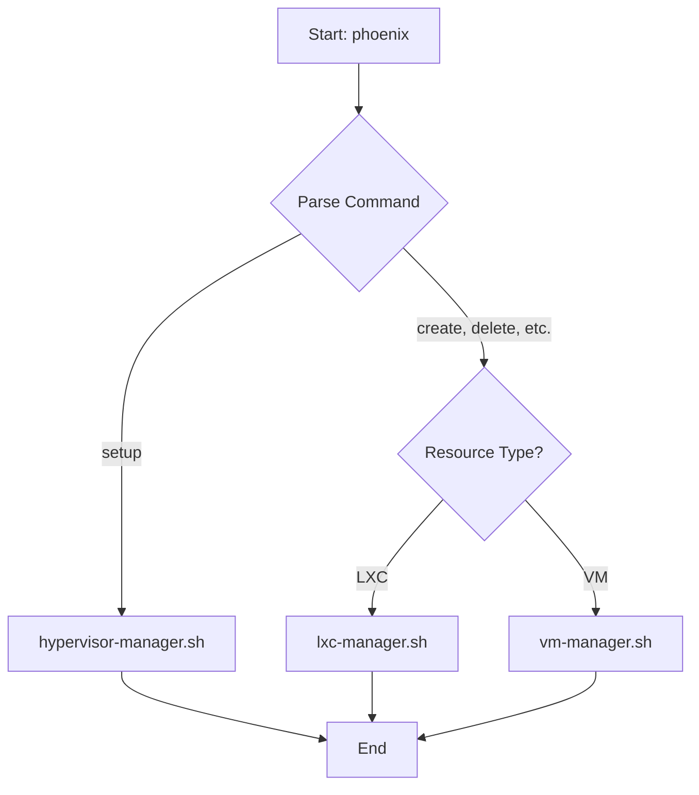

# Phoenix Hypervisor System Architecture Guide

## 1. Overview

The Phoenix Hypervisor project is a robust, declarative, and feature-based system for orchestrating the creation and configuration of LXC containers and Virtual Machines (VMs) on Proxmox. It is specifically tailored for AI and machine learning workloads.

The core of the project is the `phoenix` CLI, an idempotent orchestrator that manages the entire lifecycle of a virtualized resource based on central JSON configuration files.

### 1.1. Key Architectural Concepts

-   **Unified Orchestration**: The `phoenix` CLI provides a single point of entry for managing the hypervisor, LXC containers, and QEMU/KVM VMs.
-   **Declarative Configuration:** All hypervisor, VM, and container specifications are defined in `phoenix_hypervisor_config.json`, `phoenix_vm_configs.json`, and `phoenix_lxc_configs.json`. This provides a clear, version-controllable definition of the desired system state.
-   **Idempotent Orchestration:** The CLI is designed to be stateless and idempotent, ensuring that running it multiple times produces the same result, making deployments resilient and repeatable.
-   **Hierarchical Templating:** The system uses a hierarchical, snapshot-based template structure to optimize the creation of both VMs and LXCs.
-   **Modular Feature Installation:** Customization is handled through a series of modular, reusable "feature" scripts (e.g., for installing NVIDIA drivers, Docker, or vLLM).

### 1.2. Hierarchical Templating Diagram

## 2. Orchestration Workflow

The `phoenix` CLI is the single entry point for all provisioning tasks. It acts as a dispatcher, parsing the user's command and routing it to the appropriate manager script (`hypervisor-manager.sh`, `lxc-manager.sh`, or `vm-manager.sh`).

### 2.1. Main Orchestration Flow

### 2.2. Key LXC Orchestration Steps (lxc-manager.sh)

1.  **`ensure_container_defined`**: Checks if the container exists. If not, it creates it from a base template or clones it from a parent template's snapshot.
2.  **`apply_configurations`**: Sets the container's core resources (CPU, memory), network settings, AppArmor profile, and other pct/lxc options.
3.  **`apply_zfs_volumes` / `apply_dedicated_volumes`**: Creates and attaches dedicated storage volumes.
4.  **`ensure_container_disk_size`**: Resizes the container's root disk to the specified size.
5.  **`start_container`**: Starts the container, with retry logic.
6.  **`apply_features`**: Executes modular feature scripts inside the container (e.g., for Docker, NVIDIA).
7.  **`run_application_script`**: Copies and executes a final, application-specific script inside the container.
8.  **`run_health_check`**: Performs health checks to verify services are running correctly.
9.  **`create_template_snapshot`**: If the container is a template, it creates a ZFS snapshot.

### 2.3. Key VM Orchestration Steps (vm-manager.sh)

1.  **`ensure_vm_defined`**: Checks if the VM exists. If not, it clones it from a master template or creates it from a cloud image.
2.  **`apply_vm_configurations`**: Sets the VM's core resources and generates dynamic Cloud-Init configurations for networking and user setup.
3.  **`start_vm`**: Starts the VM.
4.  **`wait_for_guest_agent`**: Waits for the QEMU Guest Agent to become responsive.
5.  **`apply_vm_features`**: Applies features via Cloud-Init on the first boot.
6.  **`create_vm_snapshot`**: If the VM is a template, it creates a snapshot.
7.  **Template Finalization**: If the VM is a template, it is cleaned, finalized, and converted to a Proxmox template.

## 3. Configuration Reference

The entire system is driven by three central JSON configuration files.

### 3.1. `phoenix_hypervisor_config.json`

This file contains global settings for the hypervisor environment, including storage, networking, users, and shared resources.

### 3.2. `phoenix_vm_configs.json`

This file contains the specific definitions for each QEMU/KVM Virtual Machine, keyed by its `vmid`.

| Key | Type | Description |
| --- | --- | --- |
| `vmid` | Number | The unique ID of the VM. |
| `name` | String | The hostname of the VM. |
| `clone_from_vmid` | Number | The VMID of the master template to clone from. |
| `template_image` | String | The cloud image to use for creating a new template. |
| `cores` / `memory_mb` | Number | CPU and RAM allocation. |
| `network_config` | Object | Defines the VM's network interface, including IP address and gateway. |
| `user_config` | Object | Defines the default user, password hash, and SSH key. |
| `features` | Array | A list of feature scripts to be embedded in the Cloud-Init configuration. |

### 3.3. `phoenix_lxc_configs.json`

This file contains the specific definitions for each LXC container, keyed by its Container ID (CTID).

| Key | Type | Description |
| --- | --- | --- |
| `name` | String | The hostname of the container. |
| `clone_from_ctid` | String | The CTID of the parent template to clone from. |
| `template_snapshot_name`| String | If this container is a template, this defines the snapshot name. |
| `features` | Array | A list of modular features to install (e.g., "base_setup", "nvidia", "docker"). |
| `application_script` | String | The final script to run to start the container's primary application. |
| `dependencies` | Array | A list of other container IDs that must be created before this one. |
| `gpu_assignment` | String | The GPU(s) to assign to the container. |
| `volumes` / `zfs_volumes` | Array | A list of dedicated storage volumes to attach to the container. |
| `vllm_*` | String/Number | Parameters for configuring vLLM, such as the model, quantization, and port. |
| `apparmor_profile` | String | The AppArmor profile to apply to the container. |
| `pct_options` / `lxc_options` | Array | A list of Proxmox-specific or low-level LXC options to apply. |