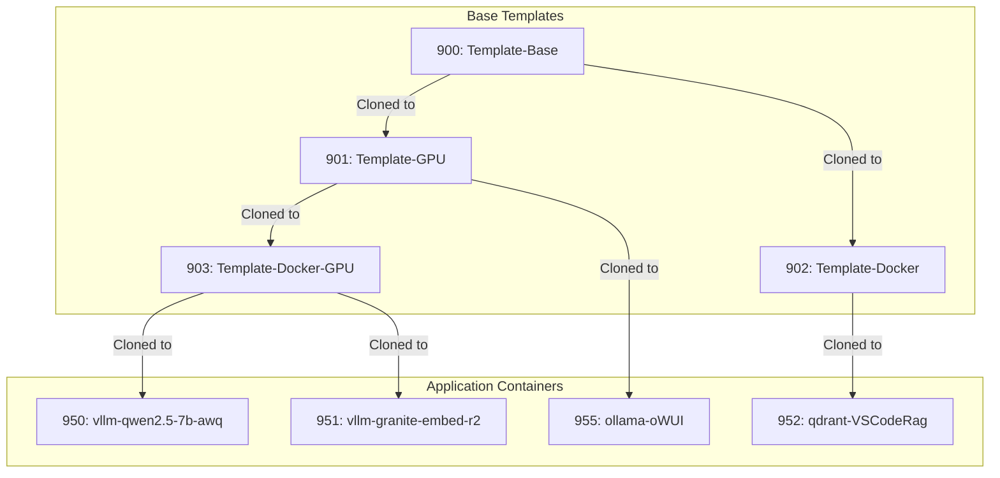
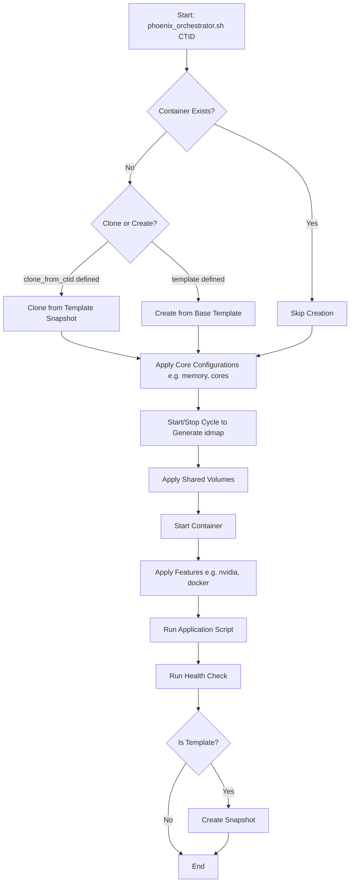

# Phoenix Hypervisor System Architecture Guide

## 1. Overview

The Phoenix Hypervisor project is a robust, declarative, and feature-based system for orchestrating the creation and configuration of LXC containers and Virtual Machines (VMs) on Proxmox. It is specifically tailored for AI and machine learning workloads.

The core of the project is the `phoenix_orchestrator.sh` script, a single, idempotent orchestrator that manages the entire lifecycle of a container based on central JSON configuration files.

### 1.1. Key Architectural Concepts

-   **Declarative Configuration:** All hypervisor and container specifications are defined in `phoenix_hypervisor_config.json` and `phoenix_lxc_configs.json`. This provides a clear, version-controllable definition of the desired system state.
-   **Idempotent Orchestration:** The orchestrator is designed to be stateless and idempotent, ensuring that running it multiple times produces the same result, making deployments resilient and repeatable.
-   **Hierarchical Templating:** The system uses a hierarchical, snapshot-based template structure to optimize container creation. Base templates are built and snapshotted, and subsequent containers are cloned from these snapshots, ensuring consistency and speed.
-   **Modular Feature Installation:** Container customization is handled through a series of modular, reusable "feature" scripts (e.g., for installing NVIDIA drivers, Docker, or vLLM). These are applied based on a `features` array in the container's configuration.

### 1.2. Hierarchical Templating Diagram

## 2. Orchestration Workflow

The `phoenix_orchestrator.sh` script is the single entry point for all provisioning tasks. It operates as a state machine to guide containers through a series of states, ensuring a predictable and resumable workflow.

### 2.1. Main Orchestration Flow

The following diagram illustrates the sequence of operations for provisioning and configuring a single LXC container.

### 2.2. Key Orchestration Steps

1.  **`ensure_container_defined`**: Checks if the container exists. If not, it either creates it from a base template or clones it from a parent template's snapshot, as defined in the configuration.
2.  **`apply_configurations`**: Sets the container's core resources, such as CPU cores, memory, and network settings.
3.  **`generate_idmap_cycle`**: For unprivileged containers, it starts and immediately stops the container. This critical step forces Proxmox to generate the necessary `idmap` file, which is required for correct permission mapping on shared volumes.
4.  **`apply_shared_volumes`**: Mounts shared storage volumes (defined in `phoenix_hypervisor_config.json`) into the container. This step relies on the `idmap` generated in the previous step.
5.  **`start_container`**: Starts the container for regular operation.
6.  **`apply_features`**: Executes the modular feature scripts (e.g., `phoenix_hypervisor_feature_install_nvidia.sh`) inside the container to install and configure software.
7.  **`run_application_script`**: Executes a final, application-specific script (e.g., `phoenix_hypervisor_lxc_vllm.sh`) to launch the primary service.
8.  **`run_health_check`**: Performs a health check to verify the service is running correctly.
9.  **`create_template_snapshot`**: If the container is defined as a template (`template_snapshot_name` is set), it creates a ZFS snapshot. This snapshot can then be used as a clone source for other containers.

## 3. Configuration Reference

The entire system is driven by two central JSON configuration files.

### 3.1. `phoenix_hypervisor_config.json`

This file contains global settings for the hypervisor environment, including storage, networking, users, and shared resources.

| Key | Type | Description |
| --- | --- | --- |
| `version` | String | The version of the configuration file format. |
| `author` | String | The author(s) of the configuration file. |
| `users` | Object | Defines the primary administrative user for the hypervisor. |
| `core_paths` | Object | Defines critical file paths used by the system, such as the path to the LXC config file. |
| `timezone` | String | The timezone for the hypervisor. |
| `network` | Object | Global network configuration, including interface details and default subnet. |
| `docker` | Object | Specifies default Docker images (e.g., for Portainer). |
| `nfs` / `samba` | Object | Configuration for NFS and Samba shares. |
| `zfs` | Object | Defines ZFS storage pools and datasets, including RAID levels and disks. |
| `proxmox_storage_ids` | Object | Maps friendly names to Proxmox storage identifiers. |
| `proxmox_defaults` | Object | Default settings for new Proxmox LXC containers (cores, memory, etc.). |
| `vm_defaults` / `vms` | Object / Array | Default settings and specific definitions for QEMU/KVM Virtual Machines. |
| `nvidia_driver` | Object | NVIDIA driver installation settings for the hypervisor. |
| `behavior` | Object | Defines system behavior, such as `debug_mode`. |
| `shared_volumes` | Object | **Crucial Section:** Defines shared storage volumes, their host paths, and how they are mounted into specific containers. |

### 3.2. `phoenix_lxc_configs.json`

This file contains the specific definitions for each LXC container, keyed by its Container ID (CTID).

| Key | Type | Description |
| --- | --- | --- |
| `name` | String | The hostname of the container. |
| `start_at_boot` | Boolean | Whether the container should start when the hypervisor boots. |
| `boot_order` | Number | The boot priority of the container. |
| `memory_mb` / `cores` | Number | RAM and CPU core allocation. |
| `template` | String | The base template file to use for creation (only for base templates). |
| `clone_from_ctid` | String | The CTID of the parent template to clone from. |
| `template_snapshot_name` | String | If this container is a template, this defines the name of the snapshot to create. |
| `storage_pool` / `storage_size_gb` | String / Number | The storage location and size for the container's root disk. |
| `network_config` | Object | Defines the container's network interface, including IP address, gateway, and bridge. |
| `unprivileged` | Boolean | If `true`, the container runs in unprivileged mode, requiring an `idmap`. |
| `features` | Array of Strings | A list of modular features to install (e.g., "base_setup", "nvidia", "docker"). |
| `application_script` | String | The final script to run to start the container's primary application. |
| `dependencies` | Array of Strings | A list of CTIDs that must be running before this container starts. |
| `health_check` | Object | Defines a command to run to verify the container's service is healthy. |
| `vllm_*` | Various | Specific parameters for configuring vLLM, such as model name, quantization, and port. |