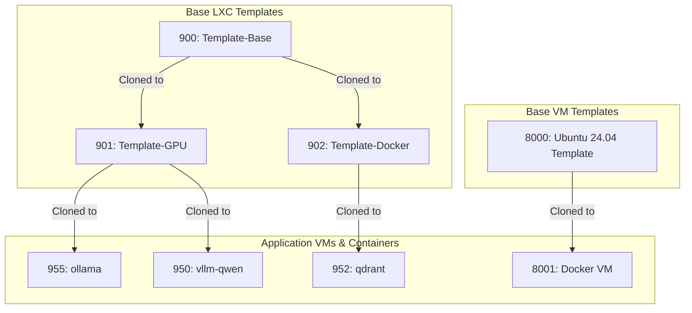
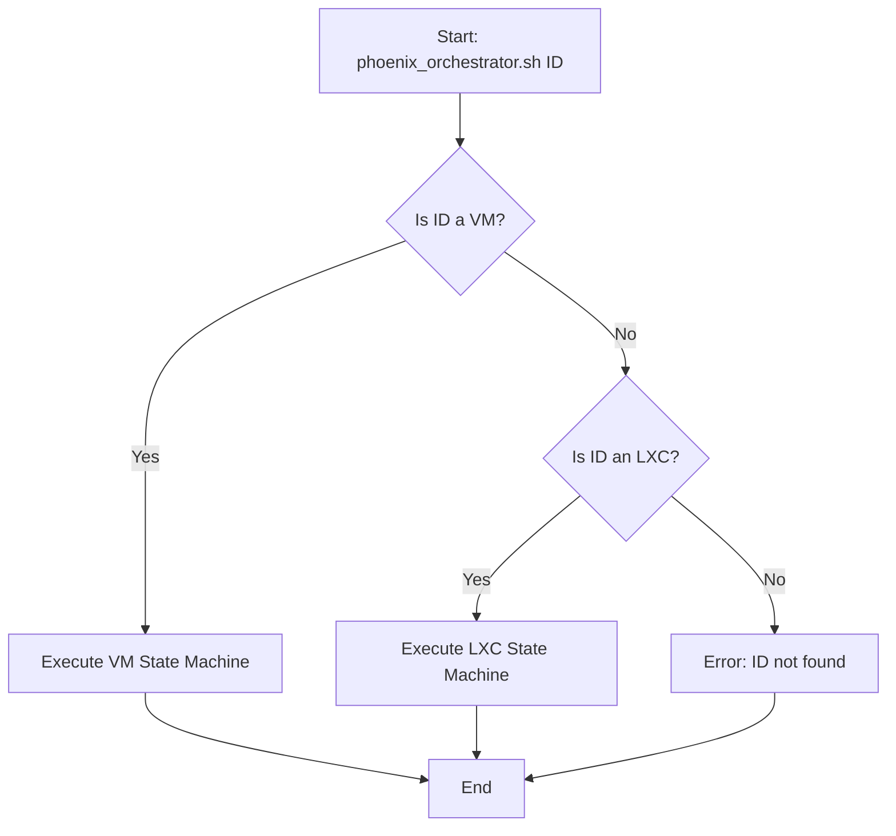

# Phoenix Hypervisor System Architecture Guide

## 1. Overview

The Phoenix Hypervisor project is a robust, declarative, and feature-based system for orchestrating the creation and configuration of LXC containers and Virtual Machines (VMs) on Proxmox. It is specifically tailored for AI and machine learning workloads.

The core of the project is the `phoenix_orchestrator.sh` script, a single, idempotent orchestrator that manages the entire lifecycle of a virtualized resource based on central JSON configuration files.

### 1.1. Key Architectural Concepts

-   **Unified Orchestration**: The `phoenix_orchestrator.sh` script provides a single point of entry for managing both LXC containers and QEMU/KVM VMs.
-   **Declarative Configuration:** All hypervisor, VM, and container specifications are defined in `phoenix_hypervisor_config.json`, `phoenix_vm_configs.json`, and `phoenix_lxc_configs.json`. This provides a clear, version-controllable definition of the desired system state.
-   **Idempotent Orchestration:** The orchestrator is designed to be stateless and idempotent, ensuring that running it multiple times produces the same result, making deployments resilient and repeatable.
-   **Hierarchical Templating:** The system uses a hierarchical, snapshot-based template structure to optimize the creation of both VMs and LXCs.
-   **Modular Feature Installation:** Customization is handled through a series of modular, reusable "feature" scripts (e.g., for installing NVIDIA drivers, Docker, or vLLM).

### 1.2. Hierarchical Templating Diagram

## 2. Orchestration Workflow

The `phoenix_orchestrator.sh` script is the single entry point for all provisioning tasks. It first determines if the target ID is a VM or an LXC container and then executes the appropriate state machine.

### 2.1. Main Orchestration Flow

### 2.2. Key LXC Orchestration Steps

1.  **`ensure_container_defined`**: Checks if the container exists. If not, it either creates it from a base template or clones it from a parent template's snapshot.
2.  **`apply_configurations`**: Sets the container's core resources, such as CPU cores, memory, and network settings.
3.  **`apply_shared_volumes`**: Mounts shared storage volumes into the container.
4.  **`start_container`**: Starts the container.
5.  **`apply_features`**: Executes modular feature scripts inside the container.
6.  **`run_application_script`**: Executes a final, application-specific script.
7.  **`run_health_check`**: Performs a health check to verify the service is running correctly.
8.  **`create_template_snapshot`**: If the container is a template, it creates a ZFS snapshot.

### 2.3. Key VM Orchestration Steps

1.  **`ensure_vm_defined`**: Checks if the VM exists. If not, it clones it from a master template.
2.  **`apply_vm_configurations`**: Sets the VM's core resources and generates dynamic Cloud-Init configurations for networking and user setup.
3.  **`start_vm`**: Starts the VM.
4.  **`wait_for_guest_agent`**: Waits for the QEMU Guest Agent to become responsive.
5.  **Feature Application**: Features are applied via Cloud-Init on the first boot.
6.  **`create_vm_snapshot`**: If the VM is a template, it creates a snapshot.

## 3. Configuration Reference

The entire system is driven by three central JSON configuration files.

### 3.1. `phoenix_hypervisor_config.json`

This file contains global settings for the hypervisor environment, including storage, networking, users, and shared resources.

### 3.2. `phoenix_vm_configs.json`

This file contains the specific definitions for each QEMU/KVM Virtual Machine, keyed by its `vmid`.

| Key | Type | Description |
| --- | --- | --- |
| `vmid` | Number | The unique ID of the VM. |
| `name` | String | The hostname of the VM. |
| `clone_from_vmid` | Number | The VMID of the master template to clone from. |
| `cores` / `memory_mb` | Number | CPU and RAM allocation. |
| `network_config` | Object | Defines the VM's network interface, including IP address and gateway. |
| `user_config` | Object | Defines the default user, password hash, and SSH key. |
| `features` | Array | A list of feature scripts to be embedded in the Cloud-Init configuration. |

### 3.3. `phoenix_lxc_configs.json`

This file contains the specific definitions for each LXC container, keyed by its Container ID (CTID).

| Key | Type | Description |
| --- | --- | --- |
| `name` | String | The hostname of the container. |
| `clone_from_ctid` | String | The CTID of the parent template to clone from. |
| `template_snapshot_name`| String | If this container is a template, this defines the snapshot name. |
| `features` | Array | A list of modular features to install (e.g., "base_setup", "nvidia", "docker"). |
| `application_script` | String | The final script to run to start the container's primary application. |