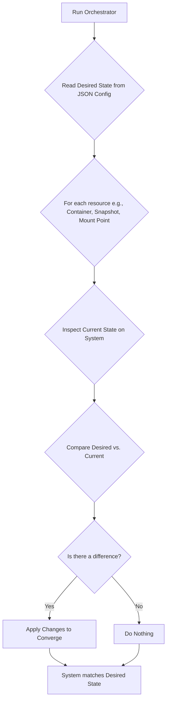

# Phoenix Hypervisor: Declarative Architecture Guide

## 1. Overview

This document serves as the single, authoritative source of truth for the core architectural principles of the Phoenix Hypervisor orchestration engine. It consolidates and supersedes previous documentation on this topic, establishing a clear and unified understanding of how the system is designed to be declarative, idempotent, and convergent.

The orchestrator's primary function is to transform the desired state, defined in JSON configuration files, into a live, running system. This guide explains the principles and mechanisms that make this process reliable, predictable, and maintainable.

## 2. Core Principles Defined

In the context of the Phoenix Hypervisor, our architectural principles are defined as follows:

*   **Declarative State**: We define *what* the system should look like, not *how* to get it there. The JSON configuration files (`phoenix_hypervisor_config.json` and `phoenix_lxc_configs.json`) are the single source of truth for the entire system's desired state. The orchestrator's job is to make the live system match this declaration.
*   **Idempotency**: Actions can be repeated multiple times with the same outcome. The orchestrator can be run safely at any time, and it will only make changes if there is a difference between the desired state and the current state. This is crucial for automation and recovery. If a container already exists, the orchestrator will not try to create it again.
*   **Convergent Design**: The system is designed to be self-healing. The orchestrator actively works to converge the *current state* of the system with the *desired state* defined in the configuration. If configuration drift occurs, the next run of the orchestrator will detect and correct it.

## 3. The Orchestration Workflow: A Convergent Loop

The orchestrator follows a model that can be conceptualized as an "Inspect, Compare, Converge" loop. While not implemented as a single, monolithic engine, this principle is applied at various stages of the orchestration process.



### 3.1. Reading the Desired State

The foundation of the declarative model is the `jq_get_value` function in [`usr/local/phoenix_hypervisor/bin/phoenix_hypervisor_common_utils.sh`](usr/local/phoenix_hypervisor/bin/phoenix_hypervisor_common_utils.sh:235). This function is used throughout the orchestration scripts to read the desired configuration for a given resource from the JSON files.

### 3.2. Inspecting and Converging: Practical Examples

The principles of idempotency and convergence are demonstrated in the codebase through various checks and actions.

#### Example 1: Idempotent Container Creation

The `ensure_container_defined` function in [`usr/local/phoenix_hypervisor/bin/phoenix_orchestrator.sh`](usr/local/phoenix_hypervisor/bin/phoenix_orchestrator.sh:560) is a prime example of an idempotent operation.

*   **Inspect**: It first checks if the container already exists using `pct status "$CTID"`.
*   **Compare**: It compares the existence of the container with the desired state (the fact that the script was called for this CTID).
*   **Converge**: If the container does not exist, it proceeds with creation by calling `clone_container` or `create_container_from_template`. If it does exist, it does nothing.

```bash
# From usr/local/phoenix_hypervisor/bin/phoenix_orchestrator.sh
ensure_container_defined() {
    local CTID="$1"
    log_info "Ensuring container $CTID is defined..."
    if pct status "$CTID" > /dev/null 2>&1; then
        log_info "Container $CTID already exists. Skipping creation."
        return 0
    fi
    # ... proceeds with creation ...
}
```

#### Example 2: Idempotent Snapshot Creation

Similarly, the `create_template_snapshot` function ensures that a snapshot is only created if it doesn't already exist.

*   **Inspect**: It lists existing snapshots with `pct listsnapshot "$CTID"`.
*   **Compare**: It checks if the desired snapshot name is in the list.
*   **Converge**: If the snapshot is not found, it creates it using `pct snapshot`.

```bash
# From usr/local/phoenix_hypervisor/bin/phoenix_orchestrator.sh
create_template_snapshot() {
    # ...
    # Check if the snapshot already exists
    if pct listsnapshot "$CTID" | grep -q "$snapshot_name"; then
        log_info "Snapshot '$snapshot_name' already exists for CTID $CTID. Skipping."
        return 0
    fi
    # ... proceeds with snapshot creation ...
}
```

#### Example 3: Converging Shared Volumes

The `apply_shared_volumes` function demonstrates a convergent approach to managing mount points.

*   **Inspect**: It checks the container's configuration for existing mount points with `pct config "$CTID"`.
*   **Compare**: It compares the existing mount points against the desired mount points from the JSON configuration.
*   **Converge**: If a desired mount point is missing, it adds it using `pct set`.

```bash
# From usr/local/phoenix_hypervisor/bin/phoenix_orchestrator.sh
apply_shared_volumes() {
    # ...
    if ! pct config "$CTID" | grep -q "mp[0-9]*:.*,mp=${mount_point}"; then
        log_info "Creating mount point for CTID $CTID: $host_path -> $mount_point"
        # ... finds the next available mp number and sets it ...
        run_pct_command set "$CTID" --mp${mp_num} "${host_path},mp=${mount_point}"
    else
        log_info "Mount point already exists for CTID $CTID: $mount_point"
    fi
    # ...
}
```

## 4. The Main Orchestration Flow

The entire process is orchestrated by the `main_state_machine` function in [`usr/local/phoenix_hypervisor/bin/phoenix_orchestrator.sh`](usr/local/phoenix_hypervisor/bin/phoenix_orchestrator.sh:1549). This function defines the sequence of operations that ensures a container is brought from a non-existent state to a fully configured and running state, respecting the principles of idempotency and convergence at each step.

The sequence of states is as follows:
1.  `validate_inputs`
2.  `ensure_container_defined`
3.  `apply_configurations`
4.  `apply_shared_volumes`
5.  `apply_dedicated_volumes`
6.  `ensure_container_disk_size`
7.  `start_container`
8.  `apply_features`
9.  `run_application_script`
10. `run_health_check`
11. `create_template_snapshot`

This structured, stateful approach ensures that the orchestration is predictable, repeatable, and resilient to failure.