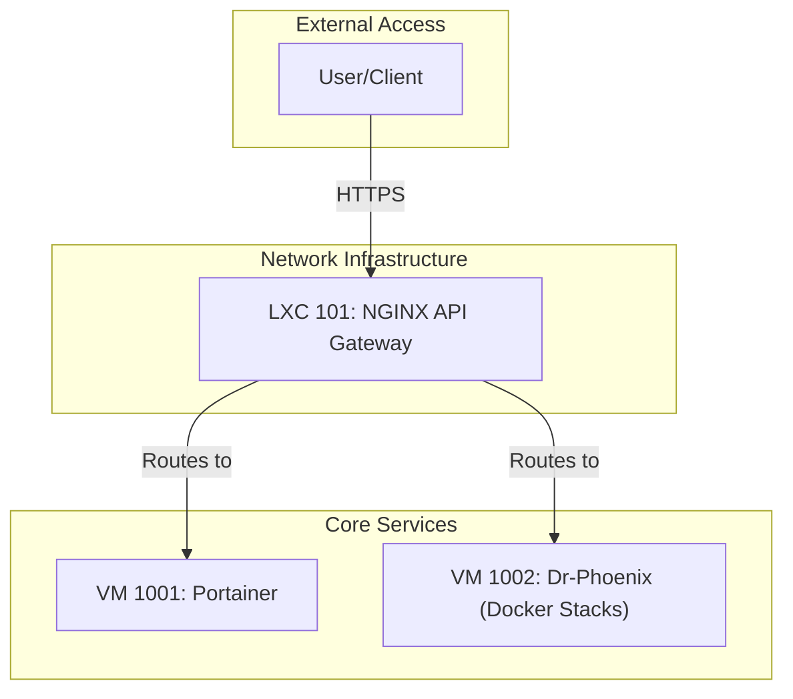

# LXC Container Implementation Guide

## 1. Overview

This document provides a single, authoritative, and RAG-optimized overview of all LXC Container Implementations within the Phoenix Hypervisor project. It synthesizes information from numerous planning and implementation documents, cross-referenced with the `phoenix_lxc_configs.json` file to establish a ground truth for each container's configuration and purpose.

## 2. System Architecture

The LXC containers operate within a unified network bridge (`vmbr0`) and are fronted by a central NGINX API Gateway (CTID 101). This architecture simplifies service discovery, centralizes access control, and provides a consistent interface for all backend services.

### High-Level Interaction Diagram

---

## 3. Container Implementations

This section provides a detailed breakdown of each container's purpose, key software, resource allocation, and configuration details, sourced directly from `phoenix_lxc_configs.json`.

### VM 1002: Dr-Phoenix

*   **Purpose**: Hosts all Dockerized services, which are now managed as declarative stacks.
*   **Key Software**: Docker
*   **Declarative Stacks**: This VM is configured to run a variety of Docker stacks, as defined in `phoenix_vm_configs.json` and `phoenix_stacks_config.json`. These stacks include services such as Qdrant, vLLM, Ollama, and n8n.
*   **Resource Allocation**:
    *   **CPU**: 4 cores
    *   **Memory**: 4096 MB
    *   **Storage**: 64 GB
*   **Configuration Details**:
    *   **IP Address**: `10.0.0.102`
    *   **Data Persistence**: Data is managed by Docker volumes within the stacks.

---

## 4. Advanced Configuration Patterns

### 4.1. The Application Script Pattern

A key architectural pattern in the Phoenix Hypervisor is the use of an `application_script` defined in `phoenix_lxc_configs.json`. This pattern separates the installation of a feature's dependencies from its runtime configuration and execution.

*   **Feature Script (`lxc_setup/`)**: Responsible for installing the necessary software and libraries (e.g., `phoenix_hypervisor_feature_install_vllm.sh` installs vLLM, PyTorch, etc.). This script prepares the container with all the required tools.
*   **Application Script (`bin/`)**: Responsible for taking the declarative configuration from `phoenix_lxc_configs.json` and dynamically generating the runtime environment. For example, `phoenix_hypervisor_lxc_vllm.sh` reads the `vllm_engine_config` object, generates a systemd service file, and starts the vLLM server.

This separation of concerns ensures that our feature scripts are modular and reusable, while the application scripts provide a powerful mechanism for declarative, runtime configuration. The recent refactoring of the vLLM deployment serves as the canonical example of this pattern.