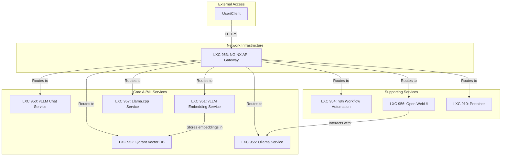

# LXC Container Implementation Guide

## 1. Overview

This document provides a single, authoritative, and RAG-optimized overview of all LXC Container Implementations within the Phoenix Hypervisor project. It synthesizes information from numerous planning and implementation documents, cross-referenced with the `phoenix_lxc_configs.json` file to establish a ground truth for each container's configuration and purpose.

## 2. System Architecture

The LXC containers operate within a unified network bridge (`vmbr0`) and are fronted by a central NGINX API Gateway. This architecture simplifies service discovery, centralizes access control, and provides a consistent interface for all backend services.

### High-Level Interaction Diagram

---

## 3. Container Implementations

This section provides a detailed breakdown of each container's purpose, key software, resource allocation, and configuration details.

### Container 950: vLLM Chat Service (`vllm-qwen2.5-7b-awq`)

*   **Purpose**: Hosts a vLLM instance serving the `Qwen/Qwen2.5-7B-Instruct-AWQ` model for high-performance chat completions.
*   **Key Software**: vLLM
*   **Resource Allocation**:
    *   **CPU**: 12 cores
    *   **Memory**: 72000 MB
    *   **Storage**: 128 GB
    *   **GPU**: Passthrough of GPU `0`
*   **Configuration Details**:
    *   **IP Address**: `10.0.0.150`
    *   **Port**: `8000`
    *   **Model**: `Qwen/Qwen2.5-7B-Instruct-AWQ`
    *   **Quantization**: `awq_marlin`
    *   **Max Model Length**: 32768
    *   **GPU Memory Utilization**: 0.85
    *   **Tensor Parallel Size**: 1

### Container 951: Embedding Service (`vllm-granite-embed-r2`)

*   **Purpose**: Hosts a vLLM instance serving the `ibm-granite/granite-embedding-english-r2` model for generating text embeddings.
*   **Key Software**: vLLM
*   **Resource Allocation**:
    *   **CPU**: 12 cores
    *   **Memory**: 72000 MB
    *   **Storage**: 128 GB
    *   **GPU**: Passthrough of GPU `0`
*   **Configuration Details**:
    *   **IP Address**: `10.0.0.151`
    *   **Port**: `8000`
    *   **Model**: `ibm-granite/granite-embedding-english-r2`
    *   **Max Model Length**: 1024
    *   **GPU Memory Utilization**: 0.10
    *   **Tensor Parallel Size**: 1

### Container 952: Vector Database (`qdrant-VSCodeRag`)

*   **Purpose**: Provides a high-performance, scalable vector database for storing and searching text embeddings.
*   **Key Software**: Qdrant (via Docker)
*   **Resource Allocation**:
    *   **CPU**: 2 cores
    *   **Memory**: 2048 MB
    *   **Storage**: 32 GB
*   **Configuration Details**:
    *   **IP Address**: `10.0.0.152`
    *   **Port**: `6333`
    *   **Data Persistence**: Data is stored in a shared volume mounted at `/qdrant/storage`.

### Container 953: API Gateway (`Nginx-VscodeRag`)

*   **Purpose**: Functions as a high-performance reverse proxy and API gateway, serving as the central, secure entry point for all backend services.
*   **Key Software**: Nginx
*   **Resource Allocation**:
    *   **CPU**: 4 cores
    *   **Memory**: 4096 MB
    *   **Storage**: 32 GB
*   **Configuration Details**:
    *   **IP Address**: `10.0.0.153`
    *   **Functionality**: Routes requests to backend services based on hostname and request path. Manages SSL termination.

### Container 954: Workflow Automation (`n8n-phoenix`)

*   **Purpose**: Hosts an n8n instance for workflow automation and service integration.
*   **Key Software**: n8n (via Docker)
*   **Resource Allocation**:
    *   **CPU**: 2 cores
    *   **Memory**: 2048 MB
    *   **Storage**: 32 GB
*   **Configuration Details**:
    *   **IP Address**: `10.0.0.154`
    *   **Port**: `5678`
    *   **Data Persistence**: Data is stored in a shared volume mounted at `/home/node/.n8n`.

### Container 955: Ollama Service (`ollama-oWUI`)

*   **Purpose**: Provides a standardized, GPU-accelerated base for running Ollama models.
*   **Key Software**: Ollama
*   **Resource Allocation**:
    *   **CPU**: 8 cores
    *   **Memory**: 32768 MB
    *   **Storage**: 128 GB
    *   **GPU**: Passthrough of GPU `0`
*   **Configuration Details**:
    *   **IP Address**: `10.0.0.155`
    *   **Port**: `11434`

### Container 956: Web Interface (`openWebUI-phoenix`)

*   **Purpose**: Provides a web-based user interface for interacting with the Ollama API.
*   **Key Software**: Open WebUI (via Docker)
*   **Resource Allocation**:
    *   **CPU**: 2 cores
    *   **Memory**: 2048 MB
    *   **Storage**: 32 GB
*   **Configuration Details**:
    *   **IP Address**: `10.0.0.156`
    *   **Port**: `8080`
    *   **Backend**: Connects to the Ollama service at `10.0.0.155:11434`.

### Container 957: Llama.cpp Service (`llamacpp`)

*   **Purpose**: Provides a GPU-accelerated environment for compiling and running models with `llama.cpp`.
*   **Key Software**: `llama.cpp`
*   **Resource Allocation**:
    *   **CPU**: 8 cores
    *   **Memory**: 32768 MB
    *   **Storage**: 128 GB
    *   **GPU**: Passthrough of GPU `1`
*   **Configuration Details**:
    *   **IP Address**: `10.0.0.157`
    *   **Port**: `8081` (if server is run)
    *   **Compilation**: Compiled with cuBLAS support for NVIDIA GPUs.