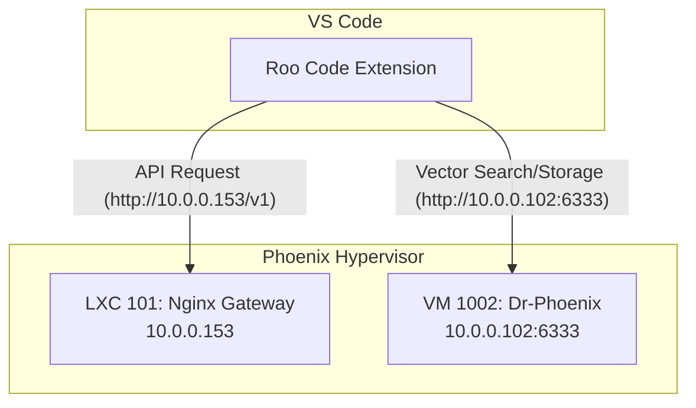

# Roo Code Integration Guide

This document provides a comprehensive guide to integrating the Roo Code extension in VS Code with the self-hosted AI services running in the Phoenix Hypervisor environment.

## 1. System Architecture Overview

The integration relies on three key LXC containers:

*   **VM 1002 (Dr-Phoenix):** Hosts the qdrant vector database and other Dockerized services.
*   **LXC 101 (Nginx API Gateway):** Acts as a reverse proxy, providing a single, stable entry point for all services.

## 2. Step-by-Step Configuration Guide

1.  **Open VSCode Settings:**
    *   On Windows/Linux, go to **File > Preferences > Settings**.
    *   On macOS, go to **Code > Settings > Settings**.
    *   Alternatively, use the shortcut `Ctrl+,` (or `Cmd+,` on macOS).

2.  **Navigate to RooCode Extension Settings:**
    *   In the Settings search bar, type `RooCode` to filter the settings.
    *   Click on **RooCode** under the **Extensions** section to view its configuration options.

3.  **Configure the Embedder Settings:**
    *   Find the **RooCode: Embedder** section.
    *   Set the **Api Base** to the Nginx Gateway URL: `http://10.0.0.153/v1`.
    *   Set the **Api Key** to `fake-key` (this is required by the extension but not validated by the server).
    *   Set the **Model Name** to `ibm-granite/granite-embedding-english-r2`.
    *   Set the **Model Dimension** to `768`.

4.  **Configure the Vector Store (Qdrant) Settings:**
    *   Find the **RooCode: Vector Store** section.
    *   Set the **Url** to your Qdrant instance URL: `http://10.0.0.102:6333`.
    *   Leave the **Api Key** field **blank**.

5.  **Save and Reload:**
    *   Your changes should save automatically.
    *   To ensure the new settings are applied, you can restart VSCode by closing and reopening it, or by running the `Developer: Reload Window` command from the Command Palette (`Ctrl+Shift+P` or `Cmd+Shift+P`).

## 3. Configuration Settings Summary

| Setting                  | Section             | Value                                           |
| :----------------------- | :------------------ | :---------------------------------------------- |
| **Api Base**             | `RooCode: Embedder` | `http://10.0.0.153/v1`                          |
| **Api Key**              | `RooCode: Embedder` | `fake-key`                                      |
| **Model Dimension**      | `RooCode: Embedder` | `768`                                           |
| **Model Name**           | `RooCode: Embedder` | `ibm-granite/granite-embedding-english-r2`      |
| **Api Key**              | `RooCode: Vector Store` | *(Leave this field blank)*                      |
| **Url**                  | `RooCode: Vector Store` | `http://10.0.0.102:6333`                        |

## 4. Advanced Configuration

Based on your initial request, here are some suggested values for the advanced configuration:

*   **Search Score Threshold:** `0.40`
*   **Maximum Search Results:** `50`

These values can be adjusted based on your specific needs and the performance of the system.