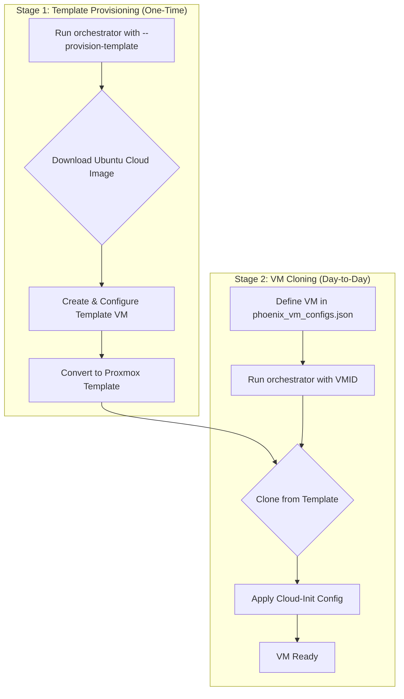

# Guide: Cloud-Image-Based VM Templating

## 1. Introduction

This guide details the strategic shift in our VM provisioning process from using standard installer ISOs to a more robust, efficient, and automated workflow based on official cloud images. This new method aligns with industry best practices for declarative infrastructure and enhances the reliability of our Phoenix Hypervisor environment.

The core of this strategy is a one-time, automated creation of a master VM template from a cloud image, which is then used to rapidly clone new VM instances.

## 2. New Workflow Overview

The new workflow is divided into two distinct stages: Template Provisioning and VM Cloning.



## 3. Architectural Improvements

Our new VM templating process incorporates several key architectural improvements to enhance reliability, efficiency, and alignment with our declarative philosophy.

### 3.1. Pre-Provisioned Master Template with `qemu-guest-agent`

The new standard procedure is to use a master VM template created from a customized cloud image. A critical enhancement is the pre-installation and enabling of the `qemu-guest-agent` directly into the master template using `virt-customize`.

*   **Benefit:** This significantly speeds up VM creation and improves reliability by ensuring the guest agent is available immediately upon boot, eliminating a common point of failure in the provisioning process.

### 3.2. Cloud-Init as the Primary IPC Mechanism

We have transitioned to using `cloud-init` as the primary mechanism for Inter-Process Communication (IPC) and configuration management.

*   **Benefit:** This replaces the old NFS-based file transfer system, which was prone to race conditions and external dependencies. `cloud-init` provides a robust, standardized way to pass configuration and scripts into the VM on first boot.

### 3.3. Declarative Feature Scripts

Feature scripts (e.g., for installing Docker) are now embedded directly into the `user-data` YAML passed to `cloud-init`.

*   **Benefit:** This aligns with the declarative philosophy of the Phoenix Hypervisor. The VM's entire configuration, including its software stack, is defined in a single, version-controllable file (`phoenix_vm_configs.json`), making the provisioning process more transparent and repeatable.

## 4. How to Provision the Master Template

The master template is the foundation for all future VM deployments. It is created from an official Ubuntu 24.04 cloud image.

**Command:**

To create or update the master template, run the following command from the `bin` directory:

```bash
./phoenix_orchestrator.sh --provision-template
```

**Process:**

1.  **Idempotency:** The script first checks if a template with the configured VMID (e.g., 8000) already exists. If it does, the script exits, ensuring that the template is not accidentally overwritten.
2.  **Download:** It downloads the latest Ubuntu 24.04 cloud image (`.img` file) to a temporary location.
3.  **VM Creation:** It runs a series of `qm` commands to:
    *   Create a new virtual machine.
    *   Import the downloaded image as the primary disk.
    *   Attach a Cloud-Init drive.
    *   Configure the boot order to use the new disk.
4.  **Conversion to Template:** The final step is to convert the newly created VM into a Proxmox template, making it ready for cloning.

## 5. How to Provision a New VM

Provisioning a new VM is now a simple matter of defining it in the configuration and running the orchestrator.

**Step 1: Define the VM in `phoenix_vm_configs.json`**

Add a new object to the `vms` array. The key parameters are:

*   `vmid`: A unique ID for the new VM.
*   `name`: A hostname for the new VM.
*   `clone_from_vmid`: This **must** be the VMID of the master template (e.g., 8000).
*   `cores`, `memory_mb`, `disk_size_gb`: These values will override the template's defaults, allowing you to create VMs of various sizes.
*   `network_config` and `user_config`: These sections are used to generate the dynamic Cloud-Init configuration for the new VM.

**Example:**

```json
{
    "vmid": 8001,
    "name": "docker-vm-01",
    "clone_from_vmid": 8000,
    "cores": 4,
    "memory_mb": 8192,
    "disk_size_gb": 100,
    "network_config": {
        "ip": "10.0.0.101/24",
        "gw": "10.0.0.1"
    },
    "user_config": {
        "username": "phoenix_user",
        "password_hash": "...",
        "ssh_public_key": "..."
    }
}
```

**Step 2: Run the Orchestrator**

Execute the orchestrator with the new VM's ID:

```bash
./phoenix_orchestrator.sh 8001
```

The script will automatically handle the cloning, disk resizing, and Cloud-Init configuration, resulting in a fully provisioned VM.