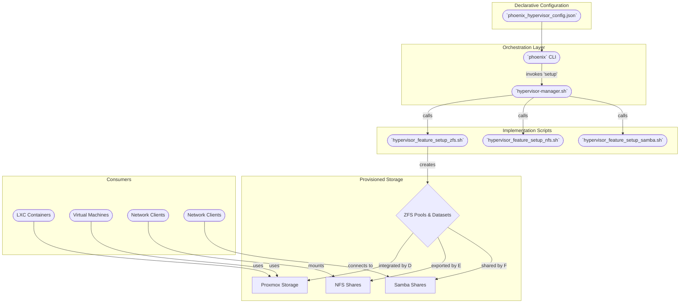

# Phoenix Hypervisor Storage Architecture Guide

This document provides a comprehensive deep dive into the setup, configuration, and operation of the Phoenix Proxmox storage architecture.

## 1. High-Level Architecture Overview

The storage architecture is designed around a **declarative model**, where the desired state of the entire storage subsystem is defined in the `phoenix_hypervisor_config.json` file. This "Infrastructure-as-Code" approach is implemented by a series of idempotent shell scripts, primarily orchestrated by the `hypervisor-manager.sh` script.

The core of the storage is built on **ZFS**, which provides robust, high-performance pools and datasets. These ZFS datasets are then exposed to the Proxmox environment and guest machines (VMs and LXCs) through three primary mechanisms:

1.  **Direct Proxmox Integration:** ZFS datasets are registered directly with Proxmox as storage resources for VM disks (`images`) and LXC root filesystems (`rootdir`).
2.  **NFS Shares:** Certain datasets are exported via an NFS server running on the Proxmox host, providing network-accessible shared storage.
3.  **Samba (SMB/CIFS) Shares:** Other datasets are shared using Samba for easy access from Windows and other SMB-compatible clients.

The entire setup is orchestrated by the `phoenix` CLI, which calls the appropriate manager scripts to bring the system to its declared state.

Here is a diagram illustrating the flow from configuration to provisioned storage:

---

## 2. Deep Dive: ZFS Configuration and Implementation

The foundation of the storage system is ZFS. Its configuration is managed within the `zfs` object in `phoenix_hypervisor_config.json`.

### a. ZFS Pools

-   **Configuration:** Pools are defined in the `zfs.pools` array. Each pool specifies a `name`, a `raid_level` (e.g., `mirror`, `single`), and an array of `disks` using their stable `/dev/disk/by-id/` paths.

-   **Implementation:** The `hypervisor_feature_setup_zfs.sh` script iterates through this array. For each pool, it performs the following actions:
    1.  **Idempotency Check:** It first checks if the pool already exists. If it does, creation is skipped.
    2.  **Safety Checks:** It verifies that the specified disks are available and not already part of another ZFS pool.
    3.  **Disk Wiping:** Based on the `--mode` flag passed to the script, it can wipe existing partitions from the disks using `wipefs -a`. This is a destructive operation and is protected by the `safe` (default), `interactive`, and `force-destructive` modes to prevent accidental data loss.
    4.  **Pool Creation:** It constructs and executes a `zpool create` command with the specified RAID level and disks.

### b. ZFS Datasets

-   **Configuration:** Datasets are defined in the `zfs.datasets` array. Each dataset is configured with properties optimized for its specific purpose.
    -   **`properties`:** This is a critical field. A dataset optimized for synchronous writes (like a database) might use `sync=always` and a small `recordsize=16K`. In contrast, a dataset for backups might use `recordsize=1M` and `compression=zstd` for better throughput and compression ratios.
    -   **`proxmox_storage_type` & `proxmox_content_type`:** These fields tell the script how to integrate the dataset into Proxmox.

-   **Implementation:** The `hypervisor_feature_setup_zfs.sh` script iterates through the datasets:
    1.  **Creation/Update:** If a dataset doesn't exist, it's created with `zfs create`. If it does exist, the script updates its properties using `zfs set` to ensure the state matches the configuration.
    2.  **Proxmox Integration:** It then uses `pvesm add zfspool` or `pvesm add dir` to make the dataset available as a storage resource in Proxmox.

---

## 3. Deep Dive: NFS and Samba Configuration

NFS and Samba provide network access to the ZFS datasets.

### a. NFS

-   **Configuration:** Defined in the `nfs.exports` array in `phoenix_hypervisor_config.json`. Each object specifies the `path` to export, the `clients` allowed to connect, and the NFS `options`.

-   **Implementation:** The `hypervisor_feature_setup_nfs.sh` script automates the entire setup:
    1.  **Installation:** Installs `nfs-kernel-server` and `ufw`.
    2.  **Configuration:** It dynamically generates the `/etc/exports` file from the JSON configuration.
    3.  **Firewall:** It opens the required NFS ports in `ufw` for the specified client subnets.
    4.  **Service Management:** It restarts and enables the `nfs-kernel-server` service.
    5.  **Proxmox Integration:** It uses `pvesm add nfs` to add the share as a Proxmox storage resource.

### b. Samba

-   **Configuration:** Defined in the `samba.shares` array in `phoenix_hypervisor_config.json`. It specifies the share `name`, `path`, and `valid_users`.

-   **Implementation:** The `hypervisor_feature_setup_samba.sh` script handles the setup:
    1.  **Installation:** Installs the `samba` package.
    2.  **User Management:** Creates a Samba user with `smbpasswd`.
    3.  **Configuration:** It dynamically generates the `/etc/samba/smb.conf` file.
    4.  **Firewall:** It opens the necessary Samba ports in `ufw`.
    5.  **Service Management:** It restarts the `smbd` and `nmbd` services.

---

### c. NFS for VM Feature Installation

A key architectural change is the use of NFS for delivering feature scripts to VMs, replacing the old ISO-based method.

- **Implementation:** The `vm-manager.sh` script now creates a dedicated directory for each VM on a designated NFS share (e.g., `/path/to/nfs/vm-features/<vmid>`). It then copies all the necessary feature scripts into this directory.
- **Guest-Side Mounting:** Inside the VM, a `base_setup` feature, executed by `cloud-init` on first boot, is responsible for:
    1. Installing the `nfs-common` package.
    2. Creating a mount point (e.g., `/mnt/nfs/features`).
    3. Mounting the NFS share from the hypervisor.
- **Benefits:** This approach is more robust, flexible, and aligns with the declarative model. It simplifies the `vm-manager.sh` script by removing all ISO management logic and provides a persistent channel for data exchange between the hypervisor and the guest.

### d. ZFS-backed Persistent Storage for LXCs

A significant enhancement to the storage architecture is the introduction of ZFS-backed persistent storage for LXC containers. This provides a unified and robust storage model for both VMs and LXCs.

- **Implementation:** The `lxc-manager.sh` script now supports a `zfs_volumes` array in the `phoenix_lxc_configs.json` file. This allows for the declarative creation and attachment of ZFS volumes to LXC containers.
- **Declarative Configuration:** Each volume is defined with a `name`, `pool`, `size_gb`, and `mount_point`. This allows for fine-grained control over the storage for each container.
- **Benefits:** This new feature provides a more flexible and powerful storage solution for LXC containers, allowing for dedicated storage for applications that require it. It also aligns the LXC storage model with the VM storage model, creating a more consistent and unified architecture.

## 4. Strengths, Concerns, and Recommendations

### Strengths

1.  **Declarative & Idempotent:** The entire storage setup is defined as code, making the system predictable, reproducible, and easy to manage.
2.  **Optimized for Workloads:** The use of ZFS datasets with tailored properties allows storage to be optimized for different use cases.
3.  **Automation:** The end-to-end automation reduces the potential for manual configuration errors.
4.  **Safety:** The `safe` mode in the ZFS setup script prevents accidental data destruction.
5.  **Flexibility:** The combination of direct ZFS integration, NFS, and Samba provides flexible storage access for a wide variety of clients and use cases.

### Concerns

1.  **Password Management:** The Samba password is hardcoded in the `hypervisor_feature_setup_samba.sh` script. This is a significant security risk.
2.  **Complexity:** The multi-layered approach has a learning curve.
3.  **Error Handling:** Complex, multi-stage failures in the `setup` process might leave the system in an inconsistent state.

### Recommendations

1.  **Implement Secret Management:** The hardcoded Samba password should be removed. Integrate a secrets management tool to store sensitive information.
2.  **Develop a Rollback Strategy:** For the `hypervisor-manager.sh` setup process, consider adding more robust transactional logic, such as using ZFS snapshots for rollback.
3.  **Improve Documentation and Diagrams:** Continue to enhance the documentation with detailed diagrams and explanations.

---

## 5. Configured Storage Resources

Here is a detailed breakdown of all the storage resources you have configured to exist in your `phoenix_hypervisor_config.json` file, categorized by the underlying ZFS pool.

### Pool 1: `quickOS` (Mirrored 2TB NVMe Drives)

This pool is designed for high availability and data integrity, making it ideal for operating systems and critical data.

| Proxmox Storage ID | ZFS Dataset | Purpose & Content | Proxmox Type | Shared Via |
| :--- | :--- | :--- | :--- | :--- |
| **`quickOS-vm-disks`** | `quickOS/vm-disks` | **VM Disks:** Stores the virtual hard drives for your VMs. Optimized for block storage with a `128K` record size. | `zfspool` | Not Shared |
| **`quickOS-lxc-disks`** | `quickOS/lxc-disks` | **LXC Disks:** Stores the root filesystems for your LXC containers. Optimized for smaller files with a `16K` record size. | `zfspool` | Not Shared |
| **`quickOS-shared-prod-data`** | `quickOS/shared-prod-data` | **Shared App Data:** General-purpose shared storage for application data, models, etc. Can be used for both VM disks and LXC volumes. | `zfspool` | NFS & Samba |
| **`quickOS-shared-prod-data-sync`** | `quickOS/shared-prod-data-sync` | **Sync-Write Data:** Specifically for databases or services requiring synchronous writes (`sync=always`). | `zfspool` | NFS & Samba |

---

### Pool 2: `fastData` (Single 4TB NVMe Drive)

This pool is designed for high performance and large capacity, suitable for data that is less critical or easily replaced.

| Proxmox Storage ID | ZFS Dataset | Purpose & Content | Proxmox Type | Shared Via |
| :--- | :--- | :--- | :--- | :--- |
| **`fastData-shared-test-data`** | `fastData/shared-test-data` | **Test Data:** A functional copy of `quickOS/shared-prod-data` for testing purposes. | `zfspool` | Samba |
| **`fastData-shared-test-data-sync`** | `fastData/shared-test-data-sync` | **Sync-Write Test Data:** A functional copy of `quickOS/shared-prod-data-sync` for database testing. | `zfspool` | Not Shared |
| **`fastData-shared-backups`** | `fastData/shared-backups` | **Backups:** Dedicated storage for Proxmox backups. Optimized for large files with a `1M` record size and `zstd` compression. | `dir` | Not Shared |
| **`fastData-shared-bulk-data`** | `fastData/shared-bulk-data` | **Bulk Data:** General-purpose "dumping ground" for shared or persistent data that is not production-critical. | `zfspool` | NFS & Samba |