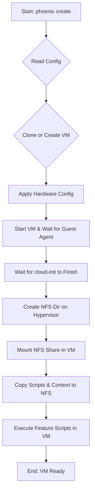

# Comprehensive Guide to VM Creation

This document provides a comprehensive overview of the enhanced Virtual Machine (VM) creation and management workflow within the Phoenix Hypervisor ecosystem. It is intended for developers and system administrators who are responsible for provisioning and maintaining virtualized environments.

## 1. Introduction

The Phoenix Hypervisor's VM management system is designed to be declarative, idempotent, and modular, aligning with the core architectural principles of the project. This guide will walk you through the entire lifecycle of a VM, from its definition in the central configuration file to its deployment and customization.

## 2. The `phoenix_vm_configs.json` File

The `phoenix_vm_configs.json` file is the heart of the VM management system. It provides a declarative, centralized, and version-controllable definition of the desired state for all Virtual Machines. This file is the single source of truth that the `phoenix` CLI uses to create, configure, and manage the entire lifecycle of your VMs.

### 2.1. High-Level Structure

The file is composed of two main sections: `vm_defaults` and `virtual_machines`.

```json
{
  "vm_defaults": {
    "template_name": "ubuntu-22.04-cloud-template-v3",
    "os_type": "l26",
    "cpu_sockets": 1,
    "cpu_cores": 2,
    "memory_mb": 4096,
    "boot_disk_size_gb": 50,
    "boot_disk_storage": "local-zfs",
    "network_bridge": "vmbr0",
    "network_model": "virtio",
    "features": ["base_setup"]
  },
  "virtual_machines": [
    {
      "vm_id": 1000,
      "vm_name": "rumpledev",
      "description": "Development Environment",
      "tags": ["development", "web-server"],
      "features": ["base_setup", "install_docker"],
      "volumes": [
        {
          "type": "nfs",
          "share": "local-nfs",
          "path": "/vm-features/1000",
          "mount_point": "/mnt/nfs/features"
        }
      ]
    }
  ]
}
```

-   **`vm_defaults`**: This section defines the default settings that will be applied to all VMs. This is a powerful feature that allows you to establish a baseline configuration for your entire environment, reducing redundancy and ensuring consistency.
-   **`virtual_machines`**: This is an array of objects, where each object represents a single VM. The settings defined here will override the `vm_defaults`, allowing you to create customized configurations for each machine.

### 2.2. Configuration Options

The following table provides a detailed explanation of each configuration option available in both the `vm_defaults` and the individual VM definitions.

| Key | Type | Description | Default |
| :-- | :--- | :--- | :--- |
| `template_name` | String | The name of the Proxmox template to clone. | `ubuntu-22.04-cloud-template-v3` |
| `os_type` | String | The operating system type. `l26` is for modern Linux kernels. | `l26` |
| `cpu_sockets` | Integer | The number of CPU sockets to allocate to the VM. | `1` |
| `cpu_cores` | Integer | The number of CPU cores to allocate to the VM. | `2` |
| `memory_mb` | Integer | The amount of RAM in megabytes to allocate to the VM. | `4096` |
| `boot_disk_size_gb` | Integer | The size of the boot disk in gigabytes. | `50` |
| `boot_disk_storage` | String | The Proxmox storage pool to use for the boot disk. | `local-zfs` |
| `network_bridge` | String | The Proxmox network bridge to connect the VM to. | `vmbr0` |
| `network_model` | String | The model of the virtual network card. `virtio` is recommended for performance. | `virtio` |
| `features`| Array | A list of feature scripts to execute after the VM is created. | `[]` |
| `volumes` | Array | A list of storage volumes to mount in the VM. | `[]` |
| `vm_id` | Integer | A unique identifier for the VM. | **Required** |
| `vm_name` | String | A unique name for the VM. | **Required** |
| `description` | String | A brief description of the VM's purpose. | `""` |
| `tags` | Array | A list of tags for organizing and filtering VMs. | `[]` |

## 3. The VM Creation Workflow

The `phoenix create <VM_ID>` command initiates a carefully orchestrated sequence of operations to provision and configure a new Virtual Machine. The workflow is designed for resilience, ensuring dependencies like `nfs-common` are installed and storage is mounted before feature scripts are executed.



### 3.1. Workflow Steps Explained

1.  **Initiation**: A user executes the `phoenix create <VM_ID>` command.
2.  **Configuration Reading**: The `phoenix` CLI reads `phoenix_vm_configs.json` to get the VM definition.
3.  **Clone or Create**: The orchestrator either clones a template or creates a new VM from a cloud image.
4.  **Hardware Configuration**: Hardware settings (CPU, memory, etc.) are applied via `qm` commands.
5.  **Boot and Wait**: The VM is started, and the orchestrator waits for the QEMU Guest Agent to become responsive.
6.  **Wait for cloud-init**: The script waits for the `cloud-init` process to fully complete inside the VM. This prevents race conditions with package managers.
7.  **Hypervisor NFS Setup**: The `vm-manager.sh` script creates the VM-specific directory (e.g., `/quickOS/vm-persistent-data/8002`) on the hypervisor. This is the directory that will be exported to the VM.
8.  **Guest NFS Mount**: The `vm-manager.sh` script executes commands inside the guest to install `nfs-common`, add the share to `/etc/fstab`, and mount it at `/persistent-storage`.
9.  **Copy Scripts and Context**: The orchestrator copies the required feature scripts, common utilities, and the VM-specific `vm_context.json` file to the newly mounted NFS share.
10. **Feature Script Execution**: The feature scripts are executed sequentially inside the VM from the `/persistent-storage/.phoenix_scripts` directory, performing tasks like installing Docker.

## 4. Practical Example: A Multi-VM Docker Environment

This section provides a complete, practical example of how to define a multi-VM environment for a typical web application, with each VM having Docker installed. This setup is ideal for creating isolated development, testing, and production environments.

### 4.1. The `phoenix_vm_configs.json` Configuration

The following JSON configuration defines three VMs: `rumpledev`, `rumpletest`, and `rumpleprod`. Each VM will have Docker installed via the new NFS-based feature installation process.

```json
{
  "vm_defaults": {
    "template_name": "ubuntu-22.04-cloud-template-v3",
    "os_type": "l26",
    "cpu_sockets": 1,
    "cpu_cores": 2,
    "memory_mb": 4096,
    "boot_disk_size_gb": 50,
    "boot_disk_storage": "local-zfs",
    "network_bridge": "vmbr0",
    "network_model": "virtio",
    "features": ["base_setup"]
  },
  "virtual_machines": [
    {
      "vm_id": 1000,
      "vm_name": "rumpledev",
      "description": "Development Environment",
      "tags": ["development", "web-server"],
      "features": ["base_setup", "install_docker"]
    },
    {
      "vm_id": 1001,
      "vm_name": "rumpletest",
      "description": "Testing Environment",
      "tags": ["testing", "web-server"],
      "cpu_cores": 4,
      "memory_mb": 8192,
      "features": ["base_setup", "install_docker"]
    },
    {
      "vm_id": 1002,
      "vm_name": "rumpleprod",
      "description": "Production Environment",
      "tags": ["production", "web-server"],
      "cpu_cores": 4,
      "memory_mb": 8192,
      "features": ["base_setup", "install_docker"]
    }
  ]
}
```

### 4.2. Creating the VMs

To create these VMs, you would execute the following commands:

```bash
phoenix create 1000
phoenix create 1001
phoenix create 1002
```

The `phoenix` CLI will process each of these commands, and in a few minutes, you will have three new, fully configured VMs, each with Docker installed and ready to use.
