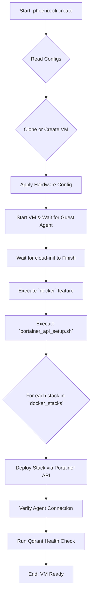

# Comprehensive Guide to VM Creation

This document provides a comprehensive overview of the enhanced Virtual Machine (VM) creation and management workflow within the Phoenix Hypervisor ecosystem. It is intended for developers and system administrators who are responsible for provisioning and maintaining virtualized environments.

## 1. Introduction

The Phoenix Hypervisor's VM management system is designed to be declarative, idempotent, and modular, aligning with the core architectural principles of the project. This guide will walk you through the entire lifecycle of a VM, from its definition in the central configuration file to its deployment and customization.

## 2. The Declarative Configuration Files

The VM management system is driven by a set of declarative JSON files that define the desired state of the entire environment.

*   **`phoenix_vm_configs.json`**: This file is the heart of the VM management system. It defines the configuration for each VM, including its resources, features, and the Docker stacks it should run.
*   **`phoenix_stacks_config.json`**: This new file provides a catalog of reusable Docker stacks. Each stack is defined by a name, a Git repository, and an optional list of environment variables.
*   **`phoenix_hypervisor_config.json`**: This file contains global settings for the hypervisor, including the new `portainer_api` object, which is used to securely store the credentials for the Portainer API.

### 2.1. High-Level Structure

The file is composed of two main sections: `vm_defaults` and `virtual_machines`.

```json
{
  "vm_defaults": {
    "template_name": "ubuntu-22.04-cloud-template-v3",
    "os_type": "l26",
    "cpu_sockets": 1,
    "cpu_cores": 2,
    "memory_mb": 4096,
    "boot_disk_size_gb": 50,
    "boot_disk_storage": "local-zfs",
    "network_bridge": "vmbr0",
    "network_model": "virtio",
    "features": ["base_setup"]
  },
  "virtual_machines": [
    {
      "vm_id": 1000,
      "vm_name": "rumpledev",
      "description": "Development Environment",
      "tags": ["development", "web-server"],
      "features": ["base_setup", "docker"],
      "docker_stacks": ["portainer", "qdrant"]
    }
  ]
}
```

-   **`vm_defaults`**: This section defines the default settings that will be applied to all VMs. This is a powerful feature that allows you to establish a baseline configuration for your entire environment, reducing redundancy and ensuring consistency.
-   **`virtual_machines`**: This is an array of objects, where each object represents a single VM. The settings defined here will override the `vm_defaults`, allowing you to create customized configurations for each machine.

### 2.2. Configuration Options

The following table provides a detailed explanation of each configuration option available in both the `vm_defaults` and the individual VM definitions.

| Key | Type | Description | Default |
| :-- | :--- | :--- | :--- |
| `template_name` | String | The name of the Proxmox template to clone. | `ubuntu-22.04-cloud-template-v3` |
| `os_type` | String | The operating system type. `l26` is for modern Linux kernels. | `l26` |
| `cpu_sockets` | Integer | The number of CPU sockets to allocate to the VM. | `1` |
| `cpu_cores` | Integer | The number of CPU cores to allocate to the VM. | `2` |
| `memory_mb` | Integer | The amount of RAM in megabytes to allocate to the VM. | `4096` |
| `boot_disk_size_gb` | Integer | The size of the boot disk in gigabytes. | `50` |
| `boot_disk_storage` | String | The Proxmox storage pool to use for the boot disk. | `local-zfs` |
| `network_bridge` | String | The Proxmox network bridge to connect the VM to. | `vmbr0` |
| `network_model` | String | The model of the virtual network card. `virtio` is recommended for performance. | `virtio` |
| `features`| Array | A list of feature scripts to execute after the VM is created. | `[]` |
| `docker_stacks` | Array | A list of Docker stack names (from `phoenix_stacks_config.json`) to deploy to the VM. | `[]` |
| `vm_id` | Integer | A unique identifier for the VM. | **Required** |
| `vm_name` | String | A unique name for the VM. | **Required** |
| `description` | String | A brief description of the VM's purpose. | `""` |
| `tags` | Array | A list of tags for organizing and filtering VMs. | `[]` |

## 3. The VM Creation Workflow

The `phoenix-cli create <VM_ID>` command initiates a fully automated, declarative workflow for provisioning VMs and deploying Docker stacks.



### 3.1. Workflow Steps Explained

1.  **Initiation**: A user executes the `phoenix-cli create <VM_ID>` command.
2.  **Configuration Reading**: The `phoenix-cli` CLI reads the `phoenix_vm_configs.json`, `phoenix_stacks_config.json`, and `phoenix_hypervisor_config.json` files.
3.  **Clone or Create**: The orchestrator either clones a template or creates a new VM from a cloud image.
4.  **Hardware Configuration**: Hardware settings (CPU, memory, etc.) are applied via `qm` commands.
5.  **Boot and Wait**: The VM is started, and the orchestrator waits for the QEMU Guest Agent to become responsive.
6.  **Wait for cloud-init**: The script waits for the `cloud-init` process to fully complete inside the VM.
7.  **Docker Installation**: The `docker` feature is executed to install and configure the Docker engine.
8.  **Portainer API Setup**: The `portainer_api_setup.sh` script is executed on the hypervisor. It authenticates with the Portainer API and prepares for stack deployment.
9.  **Stack Deployment**: For each stack listed in the `docker_stacks` array, the script makes a call to the Portainer API to deploy the stack from its Git repository to the target VM.
10. **Agent Connection Verification**: A health check is performed to ensure the Portainer server can communicate with the newly added agent.
11. **Qdrant Health Check**: A final health check is run to verify that the Qdrant service is operational and responsive.

## 4. Practical Example: A Declarative, Multi-Service Environment

This example demonstrates how to use the new declarative stack management system to deploy a multi-service application. We will create two VMs: one for Portainer and one for a Qdrant vector database.

### 4.1. The `phoenix_stacks_config.json` Configuration

First, we define our stacks in `phoenix_stacks_config.json`.

```json
{
  "docker_stacks": {
    "qdrant_service": {
      "name": "qdrant",
      "compose_file_path": "persistent-storage/qdrant/docker-compose.yml"
    }
  }
}
```

### 4.2. The `phoenix_vm_configs.json` Configuration

Next, we define our VMs and assign the stacks to them.

```json
{
  "vm_defaults": {
    "template_name": "ubuntu-22.04-cloud-template-v3",
    "features": ["base_setup", "docker"]
  },
  "virtual_machines": [
    {
      "vm_id": 1001,
      "vm_name": "portainer",
      "docker_stacks": ["portainer"]
    },
    {
      "vm_id": 1002,
      "vm_name": "qdrant-db",
      "docker_stacks": ["qdrant"]
    }
  ]
}
```

### 4.3. Creating the VMs

To create these VMs and deploy the stacks, you would execute:

```bash
phoenix-cli create 1001
phoenix-cli create 1002
```

The `phoenix-cli` CLI will create the VMs, install Docker, and then use the Portainer API to deploy the Portainer and Qdrant stacks from their respective Git repositories. The result is a fully configured, multi-service environment, provisioned from a single, declarative command.
