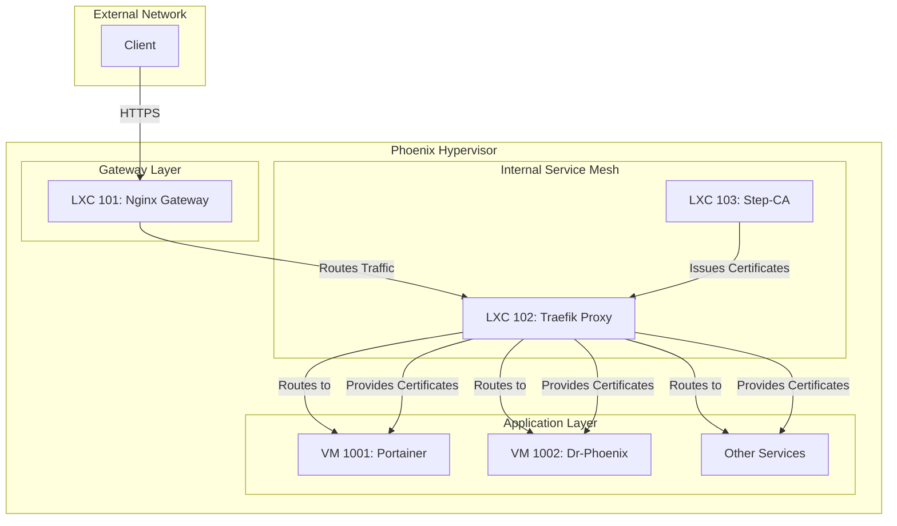

# Centralized SSL Certificate Architecture

This document outlines the new, centralized SSL certificate management architecture for the Phoenix Hypervisor environment. The primary goal of this architecture is to provide a robust, automated, and secure method for issuing and managing SSL certificates for all internal services.

## 1. High-Level Architecture Overview

The new SSL architecture is built around a dedicated Smallstep Step-CA instance running in an LXC container (103). This internal certificate authority is integrated with a Traefik internal proxy (LXC 102) to provide automatic certificate provisioning and renewal for all internal services. An Nginx gateway (LXC 101) serves as the external entry point, routing traffic to the internal Traefik proxy.

Here is a diagram illustrating the new SSL architecture:

## 2. Core Components

### a. Step-CA (LXC 103)

- **Role**: Acts as the internal certificate authority for the entire Phoenix Hypervisor environment.
- **Implementation**: A dedicated LXC container runs a Smallstep Step-CA instance. The CA is initialized with a root certificate and key, and is configured with an ACME provisioner to allow for automated certificate issuance.
- **Benefits**: Provides a single source of truth for all internal certificates, eliminating the need for self-signed certificates and providing a higher level of security.

### b. Traefik Internal Proxy (LXC 102)

- **Role**: Acts as an internal service mesh and reverse proxy.
- **Implementation**: Traefik is configured to automatically discover internal services and route traffic between them. It is also configured to use the Step-CA as an ACME provider, allowing it to automatically request, provision, and renew SSL certificates for all internal services.
- **Benefits**: Simplifies the management of internal services and provides a seamless and automated solution for SSL certificate management.

### c. Nginx Gateway (LXC 101)

- **Role**: Serves as the primary external-facing Nginx reverse proxy and API gateway.
- **Implementation**: The Nginx gateway is configured to route all external traffic to the internal Traefik proxy. It is also configured to use a certificate issued by the Step-CA, ensuring that all external communication is secure.
- **Benefits**: Provides a secure and efficient entry point for all external traffic, and integrates seamlessly with the internal service mesh.

## 3. Workflow

1.  **CA Initialization**: The `phoenix-cli` script provisions the Step-CA container (103) and initializes the CA.
2.  **Traefik and Nginx Provisioning**: The `phoenix-cli` script provisions the Traefik (102) and Nginx (101) containers.
3.  **Certificate Issuance**: Traefik automatically requests a certificate from the Step-CA for itself and for the Nginx gateway.
4.  **Service Discovery**: Traefik automatically discovers all internal services and routes traffic to them.
5.  **Certificate Renewal**: Traefik automatically renews all certificates before they expire.

## 4. Strengths

*   **Automated**: The entire process of certificate issuance, provisioning, and renewal is fully automated.
*   **Secure**: All internal communication is encrypted and secure.
*   **Centralized**: A single source of truth for all internal certificates.
*   **Scalable**: The architecture can easily be extended to support additional services.