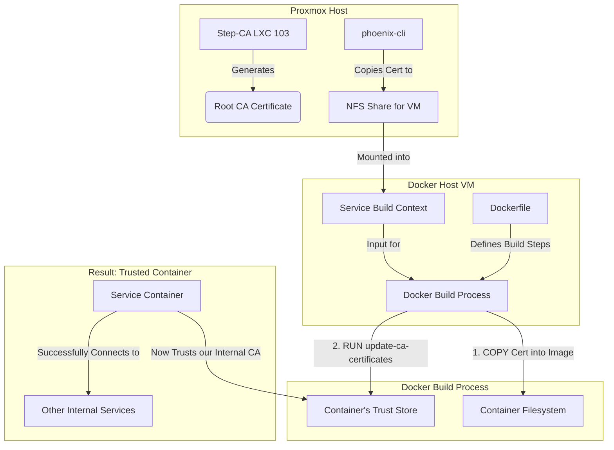

# Automated CA Trust Injection Guide

## 1. Overview

This document outlines the strategic, repeatable pattern for ensuring that containerized services within the Phoenix Hypervisor environment automatically trust our internal Step-CA. This is a critical security practice that allows our services to communicate securely over TLS using certificates issued by our private CA, preventing "man-in-the-middle" attacks and ensuring data integrity.

## 2. The "Chain of Trust" Problem

Standard, public Docker images are built to trust the world's public Certificate Authorities. They have no inherent knowledge of our private, internal Step-CA. When a service running in one of these containers attempts to connect to another internal service over TLS, the connection will fail because the container does not trust the certificate presented by the remote service. This is because the certificate was signed by our unknown internal CA.

This results in TLS handshake failures, which can often be masked by generic error messages from applications, such as "Invalid request" or "Connection failed."

## 3. The Strategic Solution: Automated Trust Injection

Our strategy is to create a repeatable, automated pattern for "teaching" our containerized services to trust our internal CA. This process is managed entirely by the `phoenix-cli` and is integrated into our standard service deployment workflow.

### 3.1. Workflow Diagram



### 3.2. Implementation Pattern

The following steps should be applied to the `Dockerfile` of any service that needs to communicate with other internal services over our private TLS mesh.

1.  **Ensure CA Certificate is in Build Context:** The `phoenix-cli` orchestration scripts are responsible for ensuring that the latest root CA certificate (`phoenix_ca.crt`) is available in the Docker build context for the service. This is typically handled by copying the certificate to a shared NFS volume that is mounted into the VM.

2.  **Modify the Service's Dockerfile:** The `Dockerfile` for the service must be modified to perform two actions:
    *   **Copy the CA Certificate:** Add a `COPY` instruction to place the root CA certificate into the appropriate directory for the container's operating system. For Debian/Ubuntu-based images, this is `/usr/local/share/ca-certificates/`.
    *   **Update the Trust Store:** Add a `RUN` instruction to execute the `update-ca-certificates` command. This command rebuilds the system's list of trusted CAs, incorporating our new certificate.

### 3.3. Example Dockerfile Implementation

This example shows the necessary additions to a standard `Dockerfile` for a service based on a Debian or Ubuntu image.

```Dockerfile
# Base image for the service
FROM some_base_image:latest

# --- BEGIN TRUST INJECTION PATTERN ---

# Copy the root CA certificate from the build context into the container.
# The orchestration script is responsible for placing 'phoenix_ca.crt' in the build context.
COPY phoenix_ca.crt /usr/local/share/ca-certificates/phoenix_ca.crt

# Update the certificate store to include the new CA.
RUN update-ca-certificates

# --- END TRUST INJECTION PATTERN ---

# ... rest of the Dockerfile (e.g., COPY application code, EXPOSE ports, etc.)

CMD ["/path/to/your/application"]
```

## 4. Automation and Idempotency

This pattern is designed to be fully automated by the `phoenix-cli`. The orchestration scripts handle the certificate logistics, and the `docker compose up --build` command ensures that any changes to the `Dockerfile` (or the CA certificate itself) trigger an automatic rebuild of the service's image. This makes the process idempotent and ensures that all deployed services are always in a consistent, trusted state.