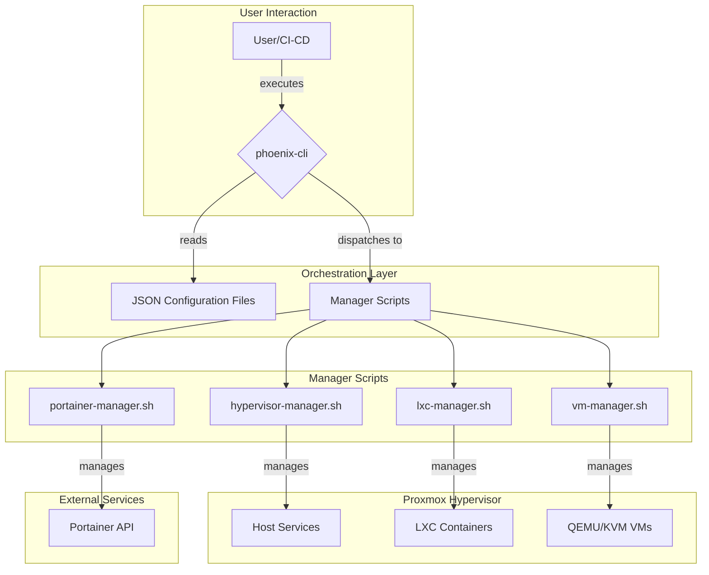

# Phoenix Hypervisor: High-Level Architectural Overview

## 1. Introduction

The Phoenix Hypervisor is a declarative, idempotent, and convergent orchestration system for Proxmox, designed to automate the lifecycle management of LXC containers and QEMU/KVM virtual machines. It is built on a foundation of shell scripts and JSON configuration files, providing a simple yet powerful framework for defining and managing complex virtualized environments.

## 2. Core Principles

The architecture is guided by three core principles:

*   **Declarative State**: The desired state of the system is defined in a set of JSON configuration files. These files are the single source of truth, and the orchestration engine's primary responsibility is to ensure that the live system converges to this state.
*   **Idempotency**: All orchestration scripts are designed to be idempotent, meaning they can be run multiple times without changing the result beyond the initial application. This makes the system resilient and predictable.
*   **Convergent Design**: The system is self-healing. If the live system drifts from the desired state, the orchestrator will detect and correct the drift on its next run.

## 3. System Architecture

The following diagram provides a high-level overview of the Phoenix Hypervisor's architecture:

## 4. Key Components

*   **`phoenix-cli`**: The main entry point for the orchestration system. It parses user commands, resolves dependencies, and dispatches tasks to the appropriate manager scripts.
*   **JSON Configuration Files**: These files define the desired state of the system, including the hypervisor configuration, LXC container definitions, VM definitions, and Docker stack configurations.
*   **Manager Scripts**: A set of specialized scripts that encapsulate the logic for managing different aspects of the system (e.g., `lxc-manager.sh` for LXC containers, `vm-manager.sh` for VMs).
*   **Proxmox Hypervisor**: The underlying virtualization platform that runs the LXC containers and QEMU/KVM VMs.
*   **Portainer API**: Used for declarative management of Docker stacks running within the VMs.

## 5. Next Steps

This high-level overview provides a foundational understanding of the Phoenix Hypervisor's architecture. The next steps in our analysis will be to drill down into the specifics of the `create` and `sync` commands, documenting their workflows and interactions with the various system components.