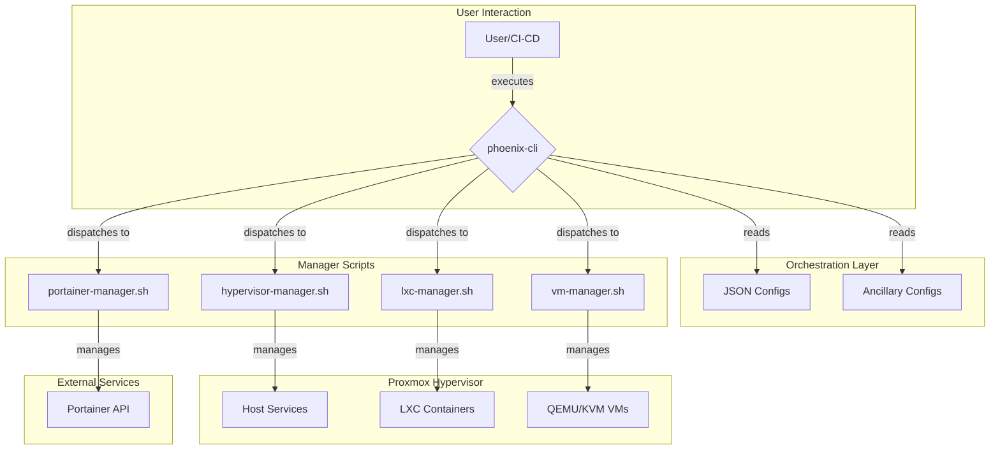
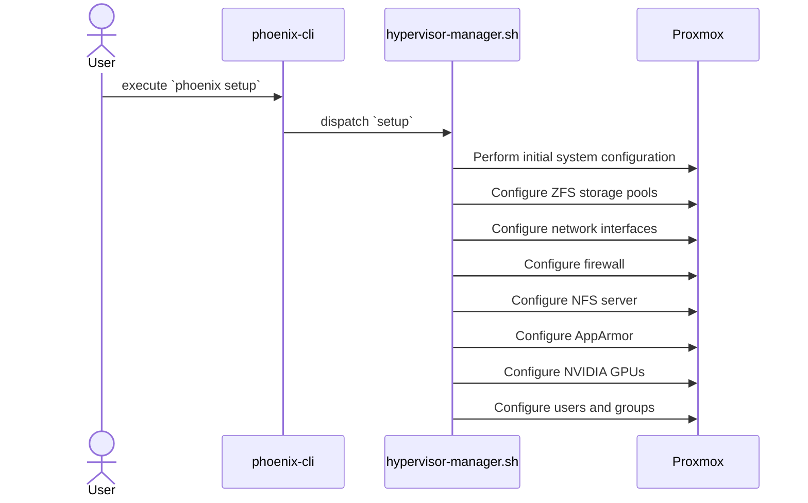
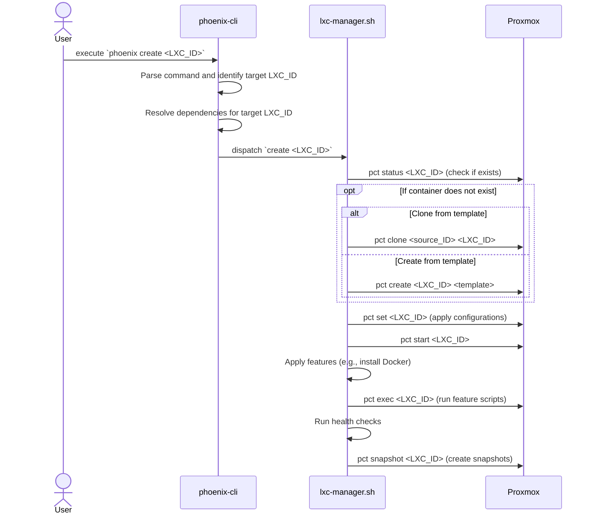
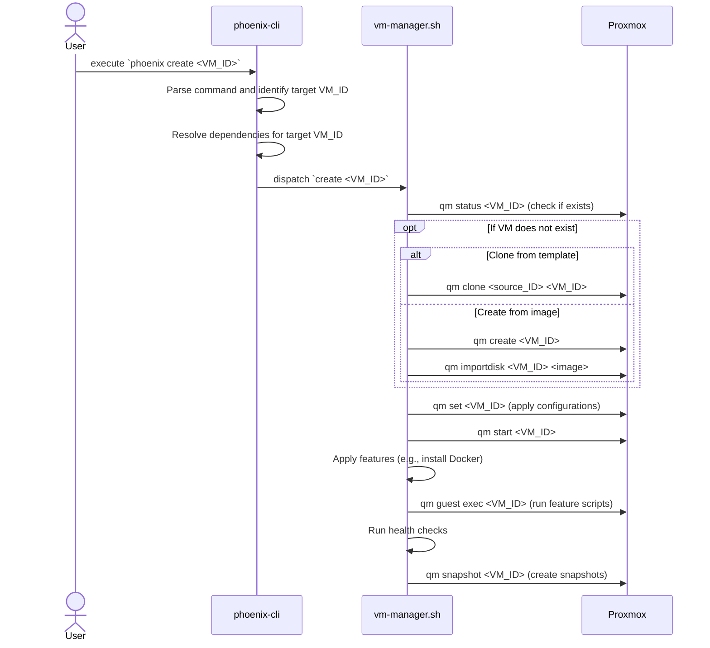
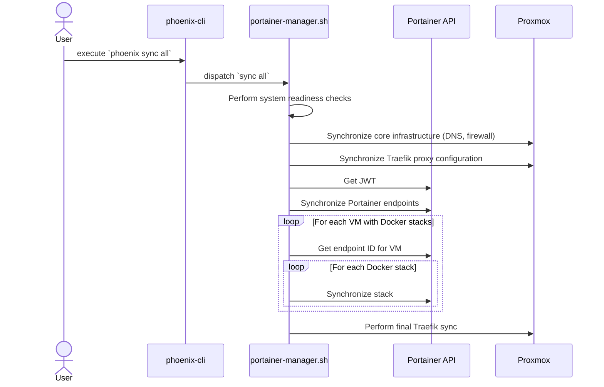
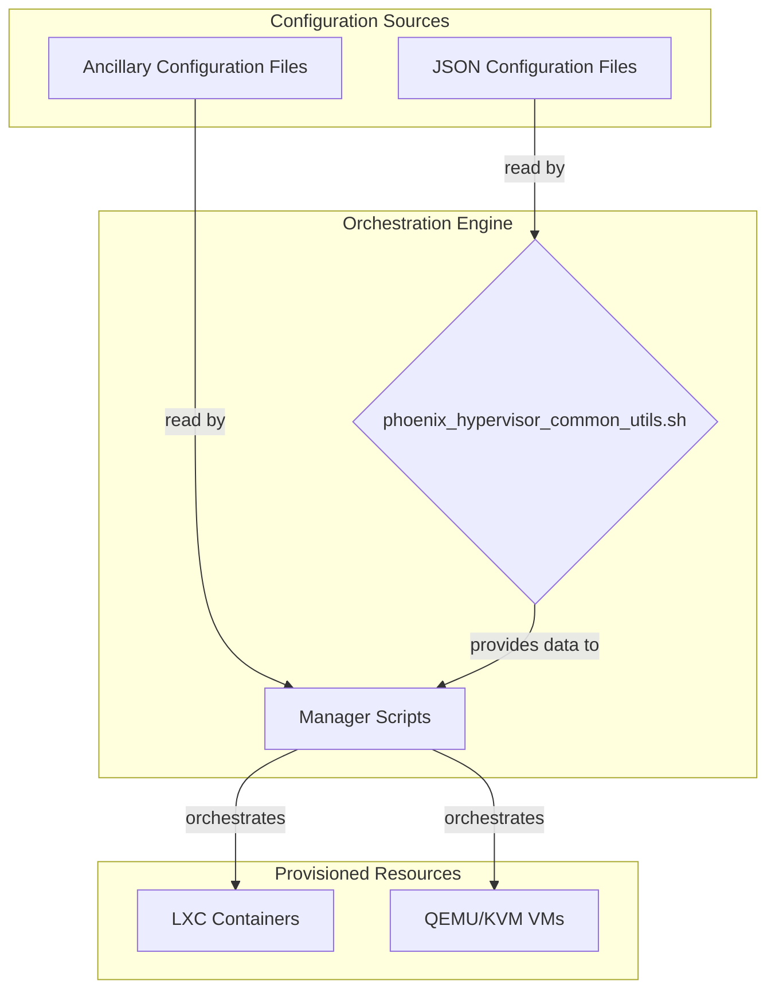
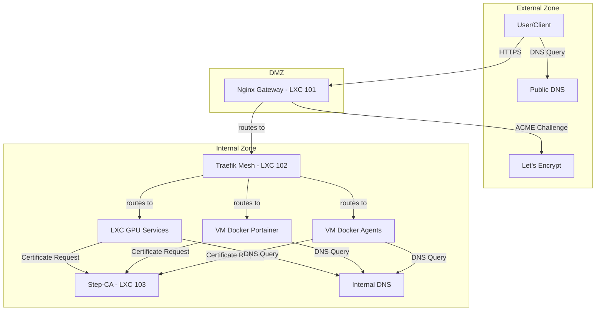
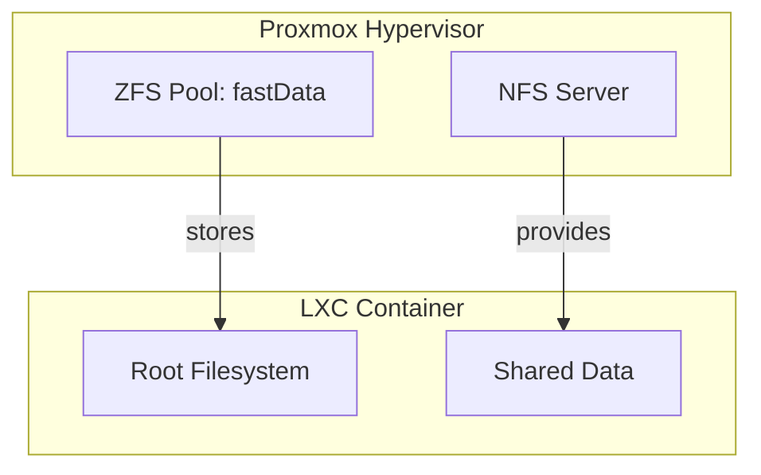
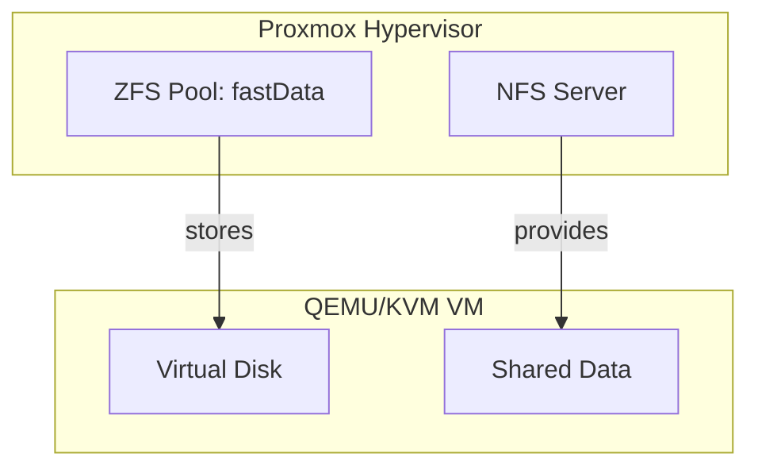

# Phoenix Hypervisor: A Comprehensive Architectural Document

## 1. High-Level Architectural Overview

### 1.1. Introduction

The Phoenix Hypervisor is a declarative, idempotent, and convergent orchestration system for Proxmox, designed to automate the lifecycle management of LXC containers and QEMU/KVM virtual machines. It is built on a foundation of shell scripts and JSON configuration files, providing a simple yet powerful framework for defining and managing complex virtualized environments.

### 1.2. Core Principles

The architecture is guided by three core principles:

*   **Declarative State**: The desired state of the system is defined in a set of JSON configuration files. These files are the single source of truth, and the orchestration engine's primary responsibility is to ensure that the live system converges to this state.
*   **Idempotency**: All orchestration scripts are designed to be idempotent, meaning they can be run multiple times without changing the result beyond the initial application. This makes the system resilient and predictable.
*   **Convergent Design**: The system is self-healing. If the live system drifts from the desired state, the orchestrator will detect and correct the drift on its next run.

### 1.3. System Architecture

The following diagram provides a high-level overview of the Phoenix Hypervisor's architecture:

### 1.4. Key Components

*   **`phoenix-cli`**: The main entry point for the orchestration system. It parses user commands, resolves dependencies, and dispatches tasks to the appropriate manager scripts.
*   **JSON Configuration Files**: These files define the desired state of the system, including the hypervisor configuration, LXC container definitions, VM definitions, and Docker stack configurations.
*   **Manager Scripts**: A set of specialized scripts that encapsulate the logic for managing different aspects of the system (e.g., `lxc-manager.sh` for LXC containers, `vm-manager.sh` for VMs).
*   **Proxmox Hypervisor**: The underlying virtualization platform that runs the LXC containers and QEMU/KVM VMs.
*   **Portainer API**: Used for declarative management of Docker stacks running within the VMs.

## 2. The `phoenix setup` Command: A Deep Dive

### 2.1. Introduction

The `phoenix setup` command is the foundational command of the Phoenix Hypervisor orchestration system. It is responsible for preparing the Proxmox hypervisor for the creation and management of virtualized resources. This command is designed to be idempotent, and it can be run multiple times without causing any issues.

### 2.2. The `setup` Workflow

The `setup` workflow is a comprehensive process that configures all the necessary components of the hypervisor. The following is a high-level overview of the steps involved:

1.  **Parse Command**: The `phoenix-cli` script parses the `setup` command and its arguments.
2.  **Dispatch to Manager**: The `phoenix-cli` script dispatches the setup task to the `hypervisor-manager.sh` script.
3.  **Execute Setup Workflow**: The `hypervisor-manager.sh` script executes the setup workflow, which includes the following steps:
    *   **Initial System Configuration**: The script performs a series of initial system configurations, including updating the package repositories, installing necessary packages, and configuring the system's locale and time zone.
    *   **ZFS Configuration**: The script configures the ZFS storage pools, including creating the necessary datasets and setting the appropriate properties.
    *   **Network Configuration**: The script configures the network interfaces, including the Proxmox bridge and the DNS server.
    *   **Firewall Configuration**: The script configures the firewall, including creating the necessary rules and security groups.
    *   **NFS Configuration**: The script configures the NFS server, including creating the necessary exports and setting the appropriate permissions.
    *   **AppArmor Configuration**: The script configures AppArmor, including loading the necessary profiles and setting the appropriate security policies.
    *   **NVIDIA GPU Configuration**: The script configures the NVIDIA GPUs, including installing the necessary drivers and configuring GPU passthrough.
    *   **User and Group Configuration**: The script creates the necessary users and groups, and it sets the appropriate permissions.

### 2.3. `setup` Command Sequence Diagram

The following sequence diagram illustrates the end-to-end workflow of the `phoenix setup` command:

## 3. The `phoenix create` Command: A Deep Dive

### 3.1. Introduction

The `phoenix create` command is the primary entry point for creating new LXC containers and QEMU/KVM virtual machines. It is a powerful and flexible command that encapsulates the entire lifecycle of a virtualized resource, from creation and configuration to feature application and snapshotting.

### 3.2. The `create` Workflow

The `create` workflow is a stateful, idempotent process that is driven by the JSON configuration files. The following is a high-level overview of the steps involved in creating a new virtualized resource:

1.  **Parse Command**: The `phoenix-cli` script parses the `create` command and its arguments, identifying the target resource to be created.
2.  **Resolve Dependencies**: The script resolves all dependencies for the target resource, building a directed acyclic graph (DAG) of all the resources that need to be created.
3.  **Topological Sort**: The DAG is topologically sorted to determine the correct order of creation.
4.  **Dispatch to Manager**: The `phoenix-cli` script dispatches the creation task to the appropriate manager script (`lxc-manager.sh` or `vm-manager.sh`).
5.  **Execute Creation Workflow**: The manager script executes the creation workflow for the target resource, which includes the following steps:
    *   **Ensure Defined**: The script checks if the resource already exists. If it does, it skips the creation process.
    *   **Create/Clone**: The script creates the resource, either from a template or by cloning an existing resource.
    *   **Apply Configurations**: The script applies all the configurations defined in the JSON configuration file, including CPU, memory, network, and storage settings.
    *   **Start Resource**: The script starts the resource.
    *   **Apply Features**: The script applies all the features defined in the JSON configuration file, such as installing Docker, NVIDIA drivers, or other software.
    *   **Run Health Checks**: The script runs any health checks that are defined for the resource to ensure that it is running correctly.
    *   **Create Snapshots**: The script creates any snapshots that are defined for the resource.

### 3.3. LXC Creation Sequence Diagram

The following sequence diagram illustrates the end-to-end workflow for creating an LXC container:

### 3.4. VM Creation Sequence Diagram

The following sequence diagram illustrates the end-to-end workflow for creating a QEMU/KVM virtual machine:

## 4. The `phoenix sync` Command: A Deep Dive

### 4.1. Introduction

The `phoenix sync` command is a powerful and versatile tool for synchronizing the state of the Phoenix Hypervisor with the declarative configuration files. It is a key component of the system's convergent design, allowing for the automated reconciliation of the live system with the desired state.

### 4.2. The `sync` Workflow

The `sync` workflow is a multi-stage process that is designed to be both idempotent and convergent. The following is a high-level overview of the steps involved in a full system synchronization:

1.  **Parse Command**: The `phoenix-cli` script parses the `sync` command and its arguments, determining the scope of the synchronization (e.g., `all`, `stack <stack_name> to <vmid>`).
2.  **Dispatch to Manager**: The `phoenix-cli` script dispatches the synchronization task to the `portainer-manager.sh` script.
3.  **System Readiness Checks**: The `portainer-manager.sh` script performs a series of health checks to ensure that all the necessary system components are running and available.
4.  **Core Infrastructure Sync**: The script synchronizes the core infrastructure, including DNS and firewall configurations.
5.  **Traefik Proxy Sync**: The script synchronizes the Traefik proxy configuration, ensuring that all the necessary routing rules are in place.
6.  **Portainer and Docker Stacks Sync**: The script synchronizes all the Portainer environments and Docker stacks, ensuring that all the defined services are running and up-to-date.
7.  **Final Traefik Sync**: The script performs a final synchronization of the Traefik proxy to ensure that it picks up any new services that were created during the Portainer and Docker stack synchronization.

### 4.3. `sync` Command Sequence Diagram

The following sequence diagram illustrates the end-to-end workflow of the `phoenix sync` command, from user execution to the final, synchronized state of the system.

## 5. Configuration Management

### 5.1. Introduction

The Phoenix Hypervisor's configuration management strategy is the cornerstone of its declarative, idempotent, and convergent design. It is a simple yet powerful system that uses a set of JSON files to define the desired state of the entire virtualized environment. This document provides a detailed overview of the configuration management strategy, including the structure of the configuration files, the role of the `phoenix_hypervisor_common_utils.sh` script, and the overall data flow.

### 5.2. Configuration File Structure

The configuration is managed through a set of JSON files, each with a specific purpose:

*   **`phoenix_hypervisor_config.json`**: This is the main configuration file for the hypervisor. It defines global settings, such as the domain name, network configuration, and storage pool definitions.
*   **`phoenix_lxc_configs.json`**: This file contains the definitions for all the LXC containers in the system. Each container is defined as a JSON object, with properties for its name, template, resources, network configuration, and features.
*   **`phoenix_vm_configs.json`**: This file contains the definitions for all the QEMU/KVM virtual machines in the system. Each VM is defined as a JSON object, with properties for its name, template, resources, network configuration, and features.
*   **`phoenix_stacks_config.json`**: This file defines the Docker stacks that are deployed to the VMs via the Portainer API. Each stack is defined as a JSON object, with properties for its name, Git repository, and environment variables.

### 5.3. The Role of `phoenix_hypervisor_common_utils.sh`

The `phoenix_hypervisor_common_utils.sh` script is a library of shared shell functions that provides a consistent and reusable interface for accessing the configuration files. It includes a set of `jq`-based functions for querying the JSON files, as well as functions for logging, error handling, and other common tasks.

### 5.4. Ancillary Configuration Files

In addition to the core JSON configuration files, the Phoenix Hypervisor utilizes a set of ancillary configuration files to manage the specific configurations of various services. These files are an integral part of the declarative configuration model, and they are managed in the same idempotent and convergent manner as the core JSON files.

*   **Nginx Templates (`gateway.template`)**: The Nginx gateway configuration is managed through a template file that is dynamically populated with the appropriate values from the JSON configuration files. This allows for a flexible and maintainable configuration that can be easily adapted to different environments.
*   **Traefik Dynamic Configurations (`dynamic_conf.yml`)**: The Traefik mesh is configured through a dynamic configuration file that is automatically generated based on the services defined in the JSON configuration files. This allows for a highly automated and scalable service mesh that can adapt to changes in the environment without manual intervention.
*   **Dockerfiles (`Dockerfile`)**: The Docker images for the various services are defined in a set of Dockerfiles. These files provide a reproducible and version-controlled way to build the Docker images, ensuring that the same image is used in all environments.
*   **Cloud-Init Templates (`user-data.template.yml`)**: The Cloud-Init templates are used to provision the VMs with the necessary configurations and software. These templates are dynamically populated with the appropriate values from the JSON configuration files, allowing for a fully automated and customized VM provisioning process.

### 5.5. Data Flow

The following diagram illustrates the data flow for the configuration management system, including the ancillary configuration files:

## 6. Detailed Networking Architecture

### 6.1. Introduction

The Phoenix Hypervisor's networking architecture is a sophisticated, multi-layered system designed for security, scalability, and ease of management. It seamlessly integrates internal and external services, providing a robust foundation for a wide range of AI/ML/DL workloads. This document provides a detailed overview of the networking architecture, with a focus on the interplay between its core components.

### 6.2. Core Networking Components

The networking architecture is composed of the following core components:

*   **Dual-Horizon DNS**: The system utilizes a dual-horizon DNS setup, with a public-facing DNS for external services and a private, internal DNS for service-to-service communication. This provides a clear separation between public and private traffic, enhancing security and simplifying network management.
*   **Nginx Gateway (LXC 101)**: This is a dedicated LXC container that runs Nginx and acts as a reverse proxy for all external traffic. It is the single point of entry for all public-facing services, and it provides SSL termination, load balancing, and request routing.
*   **Traefik Mesh (LXC 102)**: This is a dedicated LXC container that runs Traefik and provides a service mesh for all internal services. It is responsible for routing traffic between services, and it also provides service discovery, load balancing, and circuit breaking.
*   **Step-CA (LXC 103)**: This is a dedicated LXC container that runs Step-CA and provides a private certificate authority for the entire system. It is used to issue SSL certificates for all the internal services, ensuring that all communication is encrypted.
*   **ACME Certificates**: The Nginx gateway is configured to automatically obtain and renew SSL certificates from Let's Encrypt using the ACME protocol. This ensures that all public-facing services are secured with a valid, trusted SSL certificate.
*   **LXC GPU Services**: These are specialized LXC containers that are configured with GPU passthrough, allowing them to run GPU-accelerated workloads such as machine learning and data processing.
*   **VM Docker Portainer**: This is a dedicated VM that runs Portainer, a centralized container management platform. It is used to manage all the Docker containers running on the hypervisor, and it provides a user-friendly interface for deploying, monitoring, and managing containerized applications.
*   **VM Docker Agents**: These are dedicated VMs that run the Portainer agent, allowing them to be managed by the central Portainer instance. They are used to run a variety of containerized workloads, including AI/ML/DL models and other services.

### 6.3. Detailed Network Data Flow

The following diagram illustrates the detailed network data flow for the Phoenix Hypervisor, highlighting the interactions between the various components:

## 7. Detailed Storage Architecture

### 7.1. Introduction

The Phoenix Hypervisor's storage architecture is a multi-layered system that is designed for performance, scalability, and data integrity. It leverages the power of ZFS for local storage and the flexibility of NFS for shared storage, providing a robust and feature-rich foundation for a wide range of AI/ML/DL workloads.

### 7.2. ZFS Storage Pools

The foundation of the storage architecture is a set of ZFS storage pools that are configured on the Proxmox hypervisor. These pools provide a high-performance, resilient, and feature-rich storage solution for all the virtualized resources.

#### 7.2.1. ZFS Pools and Datasets

The ZFS storage pools are organized into a hierarchical structure of datasets, each with a specific purpose:

*   **`fastData`**: This is the primary storage pool for all the virtualized resources. It is a mirrored pool of high-speed NVMe drives, providing the best possible performance for the LXC containers and VMs.
*   **`slowData`**: This is a secondary storage pool that is used for backups and other less-critical data. It is a RAID-Z2 pool of high-capacity spinning disks, providing a cost-effective solution for long-term data storage.
*   **`fastData/ISOs`**: This dataset is used to store all the ISO images and templates for the LXC containers and VMs.
*   **`fastData/VMs`**: This dataset is used to store the virtual disks for all the QEMU/KVM virtual machines.
*   **`fastData/LXCs`**: This dataset is used to store the root filesystems for all the LXC containers.

#### 7.2.2. ZFS Snapshots and Replication

ZFS provides built-in support for snapshots and replication, which are used to protect the data and provide a simple and efficient way to back up the virtualized resources. Snapshots are taken on a regular basis and are replicated to the `slowData` pool for long-term retention.

### 7.3. NFS Shared Storage

In addition to the local ZFS storage, the Phoenix Hypervisor also utilizes a dedicated NFS server to provide shared storage for the LXC containers and VMs. This allows for a flexible and scalable storage solution that can be easily adapted to different workloads.

#### 7.3.1. NFS Exports

The NFS server is configured with a set of exports that are mounted by the LXC containers and VMs:

*   **`/mnt/pve/quickOS`**: This is the main export for all the shared data. It is mounted by all the LXC containers and VMs, and it is used to store a variety of data, including application configurations, user data, and other shared resources.

### 7.4. Storage Layouts

The following diagrams illustrate the storage layouts for the LXC containers and VMs.

#### 7.4.1. LXC Storage Layout

#### 7.4.2. VM Storage Layout

