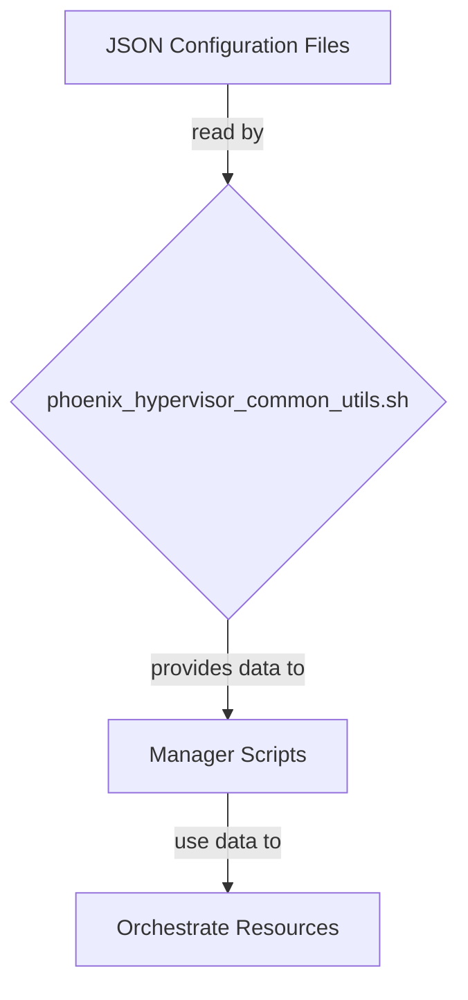

# Phoenix Hypervisor: Configuration Management

## 1. Introduction

The Phoenix Hypervisor's configuration management strategy is the cornerstone of its declarative, idempotent, and convergent design. It is a simple yet powerful system that uses a set of JSON files to define the desired state of the entire virtualized environment. This document provides a detailed overview of the configuration management strategy, including the structure of the configuration files, the role of the `phoenix_hypervisor_common_utils.sh` script, and the overall data flow.

## 2. Configuration File Structure

The configuration is managed through a set of JSON files, each with a specific purpose:

*   **`phoenix_hypervisor_config.json`**: This is the main configuration file for the hypervisor. It defines global settings, such as the domain name, network configuration, and storage pool definitions.
*   **`phoenix_lxc_configs.json`**: This file contains the definitions for all the LXC containers in the system. Each container is defined as a JSON object, with properties for its name, template, resources, network configuration, and features.
*   **`phoenix_vm_configs.json`**: This file contains the definitions for all the QEMU/KVM virtual machines in the system. Each VM is defined as a JSON object, with properties for its name, template, resources, network configuration, and features.
*   **`phoenix_stacks_config.json`**: This file defines the Docker stacks that are deployed to the VMs via the Portainer API. Each stack is defined as a JSON object, with properties for its name, Git repository, and environment variables.

## 3. The Role of `phoenix_hypervisor_common_utils.sh`

The `phoenix_hypervisor_common_utils.sh` script is a library of shared shell functions that provides a consistent and reusable interface for accessing the configuration files. It includes a set of `jq`-based functions for querying the JSON files, as well as functions for logging, error handling, and other common tasks.

## 4. Data Flow

The following diagram illustrates the data flow for the configuration management system:

## 5. Conclusion

The Phoenix Hypervisor's configuration management strategy is a simple yet powerful system that is the key to its declarative, idempotent, and convergent design. By using a set of JSON files as the single source of truth, and by providing a consistent and reusable interface for accessing those files, the system is able to provide a reliable and predictable platform for managing complex virtualized environments.