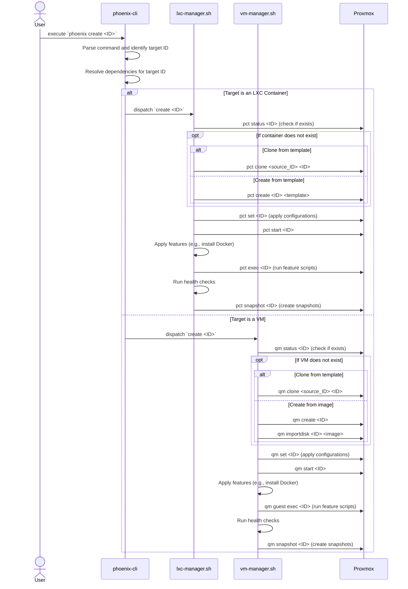

# Phoenix Create Command: A Deep Dive

## 1. Introduction

The `phoenix create` command is the primary entry point for creating new LXC containers and QEMU/KVM virtual machines. It is a powerful and flexible command that encapsulates the entire lifecycle of a virtualized resource, from creation and configuration to feature application and snapshotting.

## 2. The `create` Workflow

The `create` workflow is a stateful, idempotent process that is driven by the JSON configuration files. The following is a high-level overview of the steps involved in creating a new virtualized resource:

1.  **Parse Command**: The `phoenix-cli` script parses the `create` command and its arguments, identifying the target resource to be created.
2.  **Resolve Dependencies**: The script resolves all dependencies for the target resource, building a directed acyclic graph (DAG) of all the resources that need to be created.
3.  **Topological Sort**: The DAG is topologically sorted to determine the correct order of creation.
4.  **Dispatch to Manager**: The `phoenix-cli` script dispatches the creation task to the appropriate manager script (`lxc-manager.sh` or `vm-manager.sh`).
5.  **Execute Creation Workflow**: The manager script executes the creation workflow for the target resource, which includes the following steps:
    *   **Ensure Defined**: The script checks if the resource already exists. If it does, it skips the creation process.
    *   **Create/Clone**: The script creates the resource, either from a template or by cloning an existing resource.
    *   **Apply Configurations**: The script applies all the configurations defined in the JSON configuration file, including CPU, memory, network, and storage settings.
    *   **Start Resource**: The script starts the resource.
    *   **Apply Features**: The script applies all the features defined in the JSON configuration file, such as installing Docker, NVIDIA drivers, or other software.
    *   **Run Health Checks**: The script runs any health checks that are defined for the resource to ensure that it is running correctly.
    *   **Create Snapshots**: The script creates any snapshots that are defined for the resource.

## 3. Next Steps

This document provides a high-level overview of the `phoenix create` command. The next step is to create a detailed sequence diagram that visualizes the interactions between the various components of the system during the creation process.
## 4. `create` Command Sequence Diagram

The following sequence diagram illustrates the end-to-end workflow of the `phoenix create` command, from user execution to the final, provisioned state of the virtualized resource.

