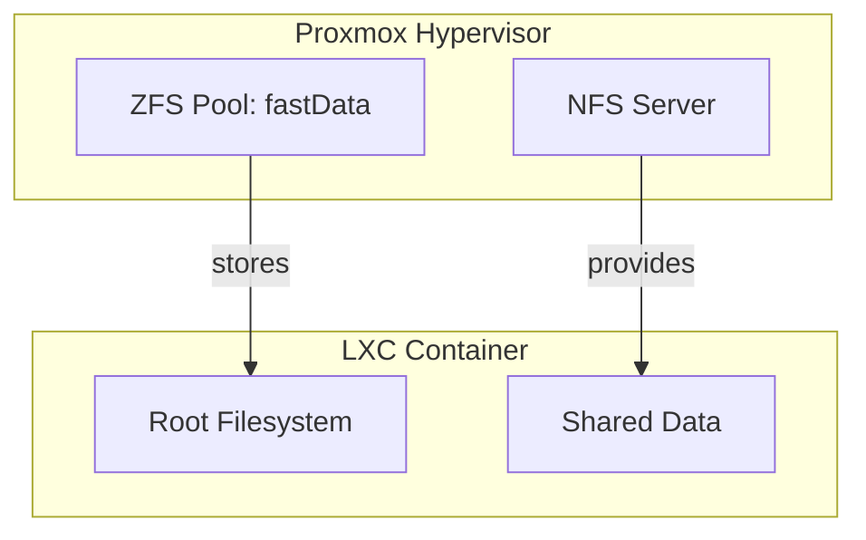
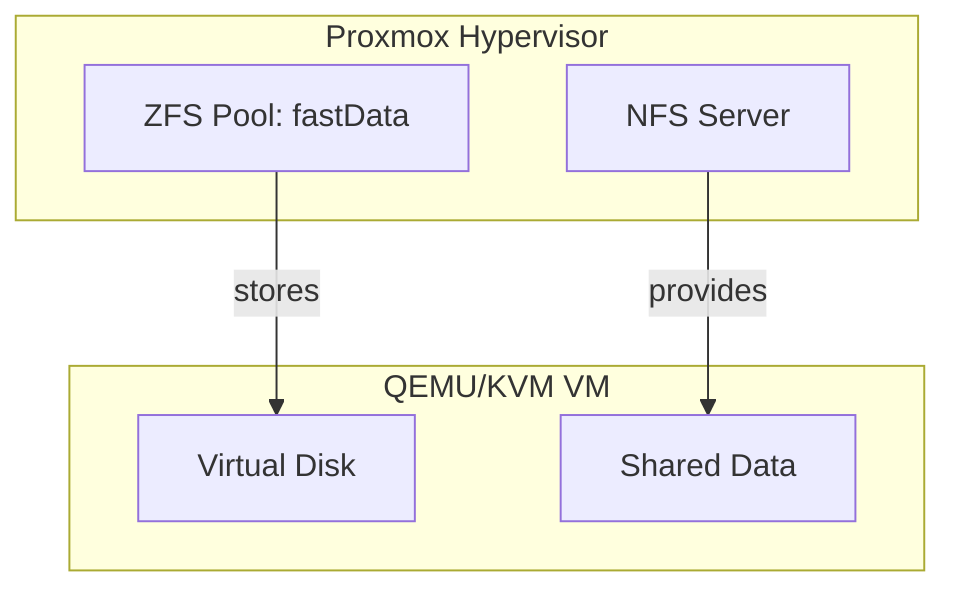

# Phoenix Hypervisor: Detailed Storage Architecture

## 1. Introduction

The Phoenix Hypervisor's storage architecture is a multi-layered system that is designed for performance, scalability, and data integrity. It leverages the power of ZFS for local storage and the flexibility of NFS for shared storage, providing a robust and feature-rich foundation for a wide range of AI/ML/DL workloads.

## 2. ZFS Storage Pools

The foundation of the storage architecture is a set of ZFS storage pools that are configured on the Proxmox hypervisor. These pools provide a high-performance, resilient, and feature-rich storage solution for all the virtualized resources.

### 2.1. ZFS Pools and Datasets

The ZFS storage pools are organized into a hierarchical structure of datasets, each with a specific purpose:

*   **`fastData`**: This is the primary storage pool for all the virtualized resources. It is a mirrored pool of high-speed NVMe drives, providing the best possible performance for the LXC containers and VMs.
*   **`slowData`**: This is a secondary storage pool that is used for backups and other less-critical data. It is a RAID-Z2 pool of high-capacity spinning disks, providing a cost-effective solution for long-term data storage.
*   **`fastData/ISOs`**: This dataset is used to store all the ISO images and templates for the LXC containers and VMs.
*   **`fastData/VMs`**: This dataset is used to store the virtual disks for all the QEMU/KVM virtual machines.
*   **`fastData/LXCs`**: This dataset is used to store the root filesystems for all the LXC containers.

### 2.2. ZFS Snapshots and Replication

ZFS provides built-in support for snapshots and replication, which are used to protect the data and provide a simple and efficient way to back up the virtualized resources. Snapshots are taken on a regular basis and are replicated to the `slowData` pool for long-term retention.

## 3. NFS Shared Storage

In addition to the local ZFS storage, the Phoenix Hypervisor also utilizes a dedicated NFS server to provide shared storage for the LXC containers and VMs. This allows for a flexible and scalable storage solution that can be easily adapted to different workloads.

### 3.1. NFS Exports

The NFS server is configured with a set of exports that are mounted by the LXC containers and VMs:

*   **`/mnt/pve/quickOS`**: This is the main export for all the shared data. It is mounted by all the LXC containers and VMs, and it is used to store a variety of data, including application configurations, user data, and other shared resources.

## 4. Storage Layouts

The following diagrams illustrate the storage layouts for the LXC containers and VMs.

### 4.1. LXC Storage Layout

### 4.2. VM Storage Layout

## 5. Conclusion

The Phoenix Hypervisor's storage architecture is a well-designed and robust system that provides a solid foundation for a wide range of AI/ML/DL workloads. By leveraging the power of ZFS for local storage and the flexibility of NFS for shared storage, the Phoenix Hypervisor is able to provide a high-performance, scalable, and resilient storage environment.