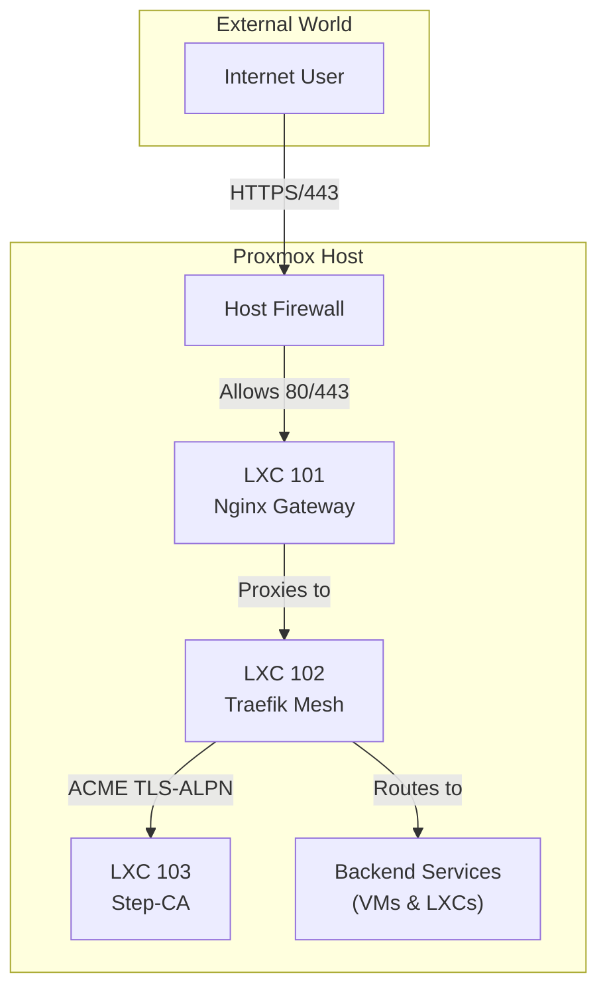

# Phoenix Hypervisor Networking Architecture Guide

This guide details the networking architecture of the Phoenix Hypervisor environment, covering traffic flow, DNS, firewall management, and the service mesh.

## 1. Networking Philosophy

The networking in the Phoenix Hypervisor environment is designed to be:
-   **Declarative:** All network configurations, including DNS records and firewall rules, are defined as code in the central `phoenix_hypervisor_config.json` file.
-   **Secure by Default:** The firewall has a default `DROP` policy for incoming traffic, and rules are explicitly defined for each service.
-   **Automated:** The `phoenix-cli` automates the application of all networking rules, ensuring consistency and reducing manual error.

## 2. Traffic Flow

The system uses a two-tiered proxy model to handle internal and external traffic securely and efficiently.

1.  **External Traffic** hits the Proxmox host's firewall.
2.  **Nginx (LXC 101)** acts as the sole external gateway, terminating public TLS and forwarding traffic to the internal service mesh.
3.  **Traefik (LXC 102)** is the internal service mesh. It routes traffic to the appropriate backend service based on the hostname. Traefik automatically discovers services and manages internal TLS certificates, which it obtains from Step-CA.
4.  **Step-CA (LXC 103)** is the internal Certificate Authority, providing TLS certificates for all internal services.

## 3. Dual-Horizon DNS

The system uses a dual-horizon DNS setup to resolve hostnames differently for internal and external requests. This is all managed declaratively in `phoenix_hypervisor_config.json`.

-   **External Zone (`phoenix.thinkheads.ai`):** This zone resolves to the public-facing IP of the Nginx gateway. For example, `portainer.phoenix.thinkheads.ai` points to `10.0.0.153`.
-   **Internal Zone (`internal.thinkheads.ai`):** This zone resolves to the direct internal IPs of the services. For example, `portainer.internal.thinkheads.ai` points to `10.0.0.101`. This allows services to communicate with each other directly and securely within the mesh.

## 4. Declarative Firewall Management

Firewall rules are managed centrally and declaratively.

-   **Global Rules:** The `phoenix_hypervisor_config.json` file defines global firewall rules that are applied to the Proxmox host.
-   **Guest-Specific Rules:** Each guest's definition in `phoenix_lxc_configs.json` and `phoenix_vm_configs.json` contains a `firewall` section, allowing for granular, per-service rule definitions. The `phoenix-cli` automatically applies these rules when the guest is created or converged.