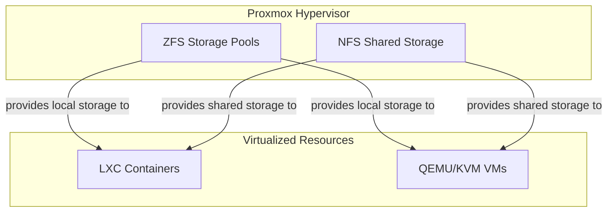

# Phoenix Hypervisor: Storage Architecture

## 1. Introduction

The Phoenix Hypervisor's storage architecture is designed to be both flexible and scalable, providing a solid foundation for a wide range of AI/ML/DL workloads. It is a multi-layered system that includes a combination of local and shared storage, all managed through the declarative configuration files.

## 2. Core Storage Components

The storage architecture is composed of the following core components:

*   **ZFS Storage Pools**: The hypervisor uses ZFS for all its local storage, providing a robust and feature-rich foundation for the virtualized resources. ZFS provides features such as data integrity, snapshots, and compression, which are essential for managing large and complex virtualized environments.
*   **NFS Shared Storage**: The hypervisor uses NFS for all its shared storage, providing a simple and reliable way to share data between the LXC containers and VMs. NFS is a mature and well-supported protocol that is ideal for a wide range of use cases.
*   **Persistent Storage**: The `persistent-storage/` directory in the project's root is used to store all the persistent data for the various services running on the hypervisor. This includes the Portainer database, the Qdrant vector database, and the configuration files for the Thinkheads.AI services.

## 3. Storage Data Flow

The following diagram illustrates the storage data flow for the Phoenix Hypervisor:

## 4. Conclusion

The Phoenix Hypervisor's storage architecture is a well-designed and robust system that provides a solid foundation for a wide range of AI/ML/DL workloads. By using a combination of local and shared storage, and by managing the entire system through the declarative configuration files, the Phoenix Hypervisor is able to provide a flexible, scalable, and reliable storage environment.