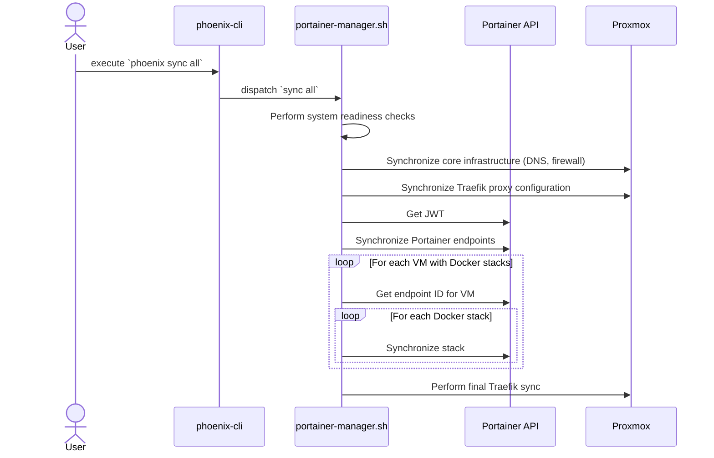

# Phoenix Sync Command: A Deep Dive

## 1. Introduction

The `phoenix sync` command is a powerful and versatile tool for synchronizing the state of the Phoenix Hypervisor with the declarative configuration files. It is a key component of the system's convergent design, allowing for the automated reconciliation of the live system with the desired state.

## 2. The `sync` Workflow

The `sync` workflow is a multi-stage process that is designed to be both idempotent and convergent. The following is a high-level overview of the steps involved in a full system synchronization:

1.  **Parse Command**: The `phoenix-cli` script parses the `sync` command and its arguments, determining the scope of the synchronization (e.g., `all`, `stack <stack_name> to <vmid>`).
2.  **Dispatch to Manager**: The `phoenix-cli` script dispatches the synchronization task to the `portainer-manager.sh` script.
3.  **System Readiness Checks**: The `portainer-manager.sh` script performs a series of health checks to ensure that all the necessary system components are running and available.
4.  **Core Infrastructure Sync**: The script synchronizes the core infrastructure, including DNS and firewall configurations.
5.  **Traefik Proxy Sync**: The script synchronizes the Traefik proxy configuration, ensuring that all the necessary routing rules are in place.
6.  **Portainer and Docker Stacks Sync**: The script synchronizes all the Portainer environments and Docker stacks, ensuring that all the defined services are running and up-to-date.
7.  **Final Traefik Sync**: The script performs a final synchronization of the Traefik proxy to ensure that it picks up any new services that were created during the Portainer and Docker stack synchronization.

## 3. Next Steps

This document provides a high-level overview of the `phoenix sync` command. The next step is to create a detailed sequence diagram that visualizes the interactions between the various components of the system during the synchronization process.
## 4. `sync` Command Sequence Diagram

The following sequence diagram illustrates the end-to-end workflow of the `phoenix sync` command, from user execution to the final, synchronized state of the system.

