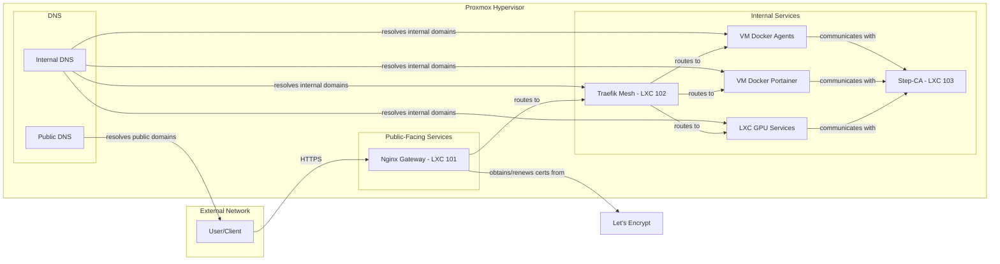
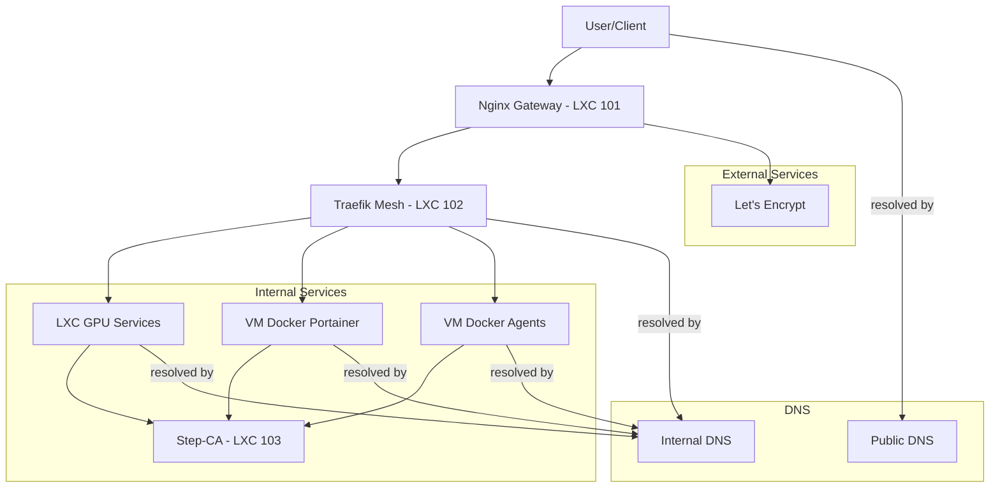
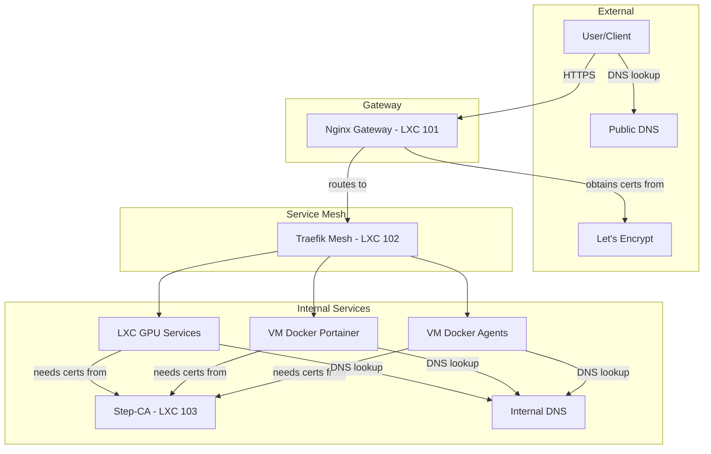
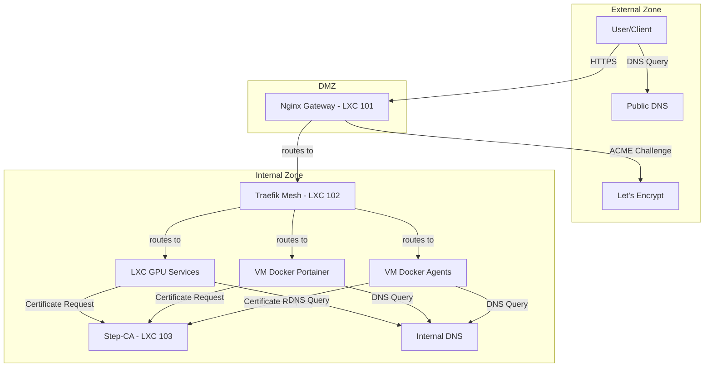

# Network Data Flow Diagram Options

Here are four different structural options for the network data flow diagram, as requested.

## Option 1: Left-to-Right Flow

This option uses a left-to-right flow, which is a common convention for process diagrams.



## Option 2: Top-to-Bottom Flow with Grouped Internal Services

This option uses a top-to-bottom flow and groups the internal services together for a more compact representation.



## Option 3: Hub-and-Spoke Model

This option uses a hub-and-spoke model to emphasize the central role of the Traefik mesh in routing internal traffic.



## Option 4: Swimlane Diagram

This option uses a swimlane diagram to clearly delineate the different network zones and the services that reside within them.

```mermaid
graph TD
    subgraph External Zone
        A[User/Client]
        L[Let's Encrypt]
        H[Public DNS]
    end

    subgraph DMZ
        B[Nginx Gateway - LXC 101]
    end

    subgraph Internal Zone
        C[Traefik Mesh - LXC 102]
        D[Step-CA - LXC 103]
        E[LXC GPU Services]
        F[VM Docker Portainer]
        G[VM Docker Agents]
        I[Internal DNS]
    end

    A -- HTTPS --> B;
    B -- routes to --> C;
    B -- ACME Challenge --> L;
    A -- DNS Query --> H;

    C -- routes to --> E;
    C -- routes to --> F;
    C -- routes to --> G;

    E -- Certificate Request --> D;
    F -- Certificate Request --> D;
    G -- Certificate Request --> D;

    E -- DNS Query --> I;
    F -- DNS Query --> I;
    G -- DNS Query -- > I;
```

## Option 5: Vertical Swimlane Diagram

This option uses a vertical swimlane diagram to clearly delineate the different network zones and the services that reside within them.

